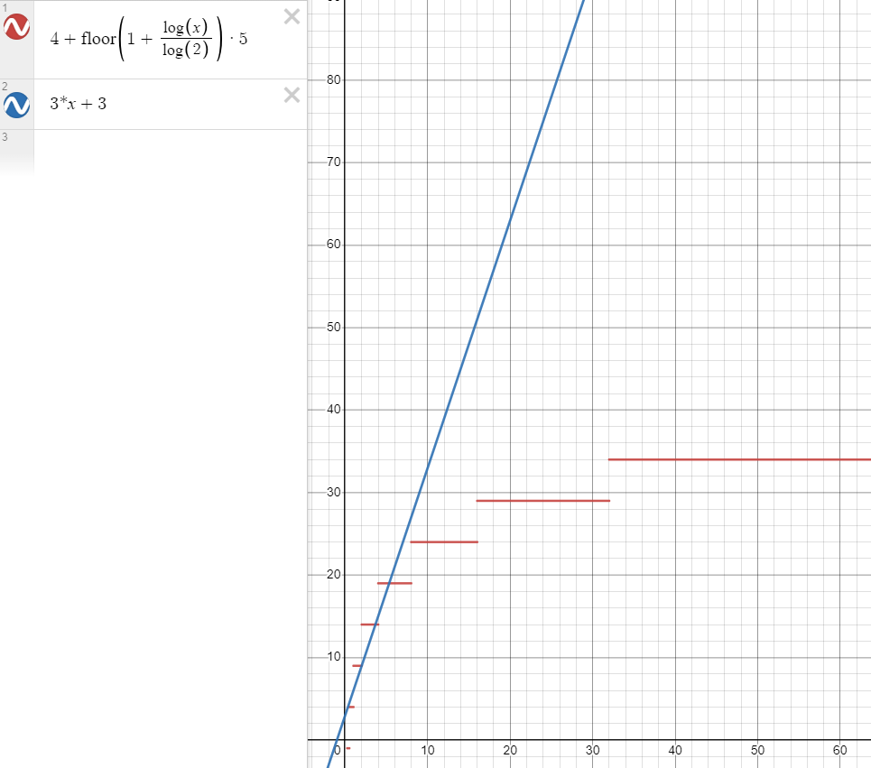
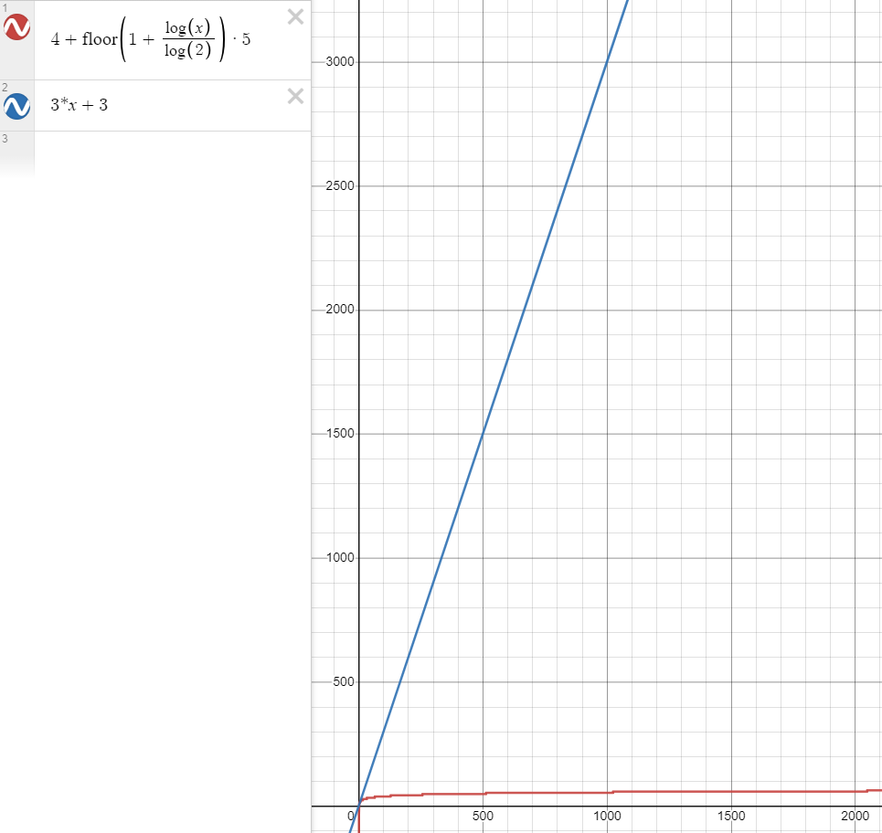
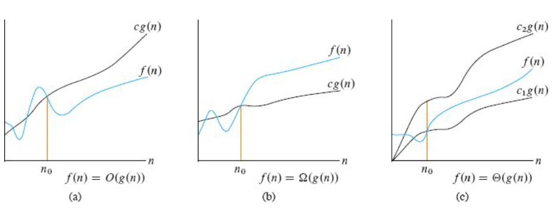
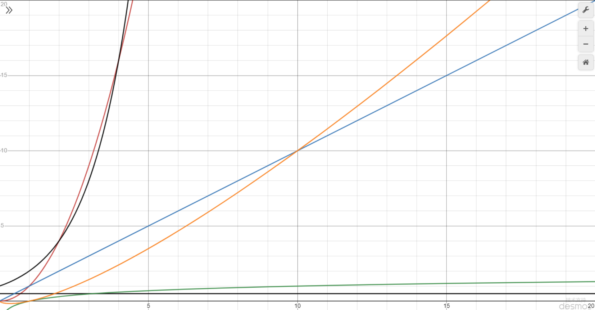

# 時間複雜度

下面的線性查找算法也能得出与之前二分查找一样的结果，那你能说出它差在哪里吗？

```java
/**
 * 线性查找
 *
 * @param a      待查找的升序数组 (可以不是有序数组)
 * @param target 待查找的目标值
 * @return 找到则返回索引 找不到返回 -1
 */
public static int linearSearch(int[] a, int target) {
    for (int i = 0; i < a.length; i++) {
        if (a[i] == target) {
            return i;
        }
    }
    return -1;
}
```

考虑最坏情况下（没找到）例如 `[1, 2, 3, 4]` 查找 5

- `int i = 0` 只执行一次
- `i < a.length` 受数组元素个数 `n` 的影响，比较 `n+1` 次
- `i++` 受数组元素个数 `n` 的影响，自增 `n` 次
- `a[i] == target` 受元素个数 `n` 的影响，比较 `n` 次
- `return i` 因為每次比較都不成立，所以不會進入到 `if`
- `return -1`，执行一次

粗略认为每行代码执行时间是 t，假设 $n = 4$ 那么

- 总执行时间是 $(1+4+1+4+4+1) \times t = 15t$
- 可以推导出更一般地公式为，$T = (3 \times n + 3) t$

如果套用二分查找算法，还是 `[1, 2, 3, 4]` 查找 5（右侧没找到更差）

```java
/**
 * 二分查找基础版
 * 
 * @param a      待查找的升序数组
 * @param target 待查找的目标值
 * @return 找到则返回索引 找不到返回 -1
 */
public static int binarySearchBasic(int[] a, int target) {
    int i = 0, j = a.length - 1; // 设置指针和初值
    while (i <= j) { // i~j 范围内有东西
        int m = (i + j) / 2;
        if (target < a[m]) { // 目标在左边
            j = m - 1;
        } else if (a[m] < target) { // 目标在右边
            i = m + 1;
        } else { // 找到了
            return m;
        }
    }
    return -1;
}
```

- `int i = 0, j = a.length - 1` 各执行 1 次

- 計算循環次數

    | 元素个数 | 循环次数 | 公式 |
    | --- | --- | --- |
    | 4 ~ 7 | 3 | `floor(log_2(4)) = 2+1` |
    | 8 ~ 15 | 4 | `floor(log_2(8)) = 3+1` |
    | 16 ~ 31 | 5 | `floor(log_2(16)) = 4+1` |
    | 32 ~ 63 | 6 | `floor(log_2(32)) = 5+1` |
    
    - 將循環次數計為Ｌ ⇒  `循环次数L = floor(log_2(n)) + 1`

    - **什麼是『對數』？**
      - 舉例：$log_2(4)$  ⇒  也就是你把這個 4 一直除以 2，看除以幾次能夠除到 1。
      - 舉例：$log_2(7)$  ⇒  對於求對數求不出整數的，我們就給它向下取整即可，也就是 2。

- `i <= j` 執行 L 加 1 次
- `int m = (i + j) / 2;`  執行 Ｌ 次
- `target < a[m]`  執行 Ｌ 次
- `a[m] < target`  執行 Ｌ 次
- `i = m + 1;`  執行 Ｌ 次
- `return -1`，执行一次
- 總共執行次數為  ⇒  `(floor(log_2(n)) + 1) * 5 + 4`

粗略认为每行代码执行时间是 t，假设 $n = 4$ 那么

- 总执行时间是 $(3) \times 5 + 4 = 19t$
- 更一般地公式为 $T = (4 + 5 \times floor(log2(n) + 1)) \times t$

两个算法比较，可以看到 n 在较小的时候，二者花费的次数差不多



但随着 n 越来越大，比如说 $n=1024$ 时，用二分查找算法（红色）也就是 59t，而線性查找算法（蓝色）则需要 3075t



> 👉画图采用的是 Desmos ｜图形计算器

- 计算机科学中，**时间复杂度**是用来衡量：一个算法的执行，随数据规模增大，而增长的时间成本
  - 不依赖于环境因素


> **❓如何表示时间复杂度呢？**
> - 假设算法要处理的数据规模是 n，代码总的执行行数用函数 $f(n)$ 来表示，例如：
>    - 线性查找算法的函数 $f(n) = 3 \times n + 3$
>    - 二分查找算法的函数 $f(n) = (floor(log_2(n)) + 1) \times 5 + 4$
> - 为了对 $f(n)$ 进行化简，应当抓住主要矛盾，找到一个变化趋势与之相近的表示法。

# 大 O 表示法



其中

- $c、c_1、c_2$ 都为一个常数
- $f(n)$ 是实际执行代码行数与 n 的函数
- $g(n)$ 是经过化简，变化趋势与 $f(n)$ 一致的 n 的函数

## 化简


> **👉已知 `f(n)` 来说，求 `g(n)`**
> - 表达式中相乘的常量，可以省略，如
>     - $f(n) = 100 \times n^2$ 中的 100
> - 多项式中数量规模更小（低次项）的表达式，可以省略，如
>     - $f(n)=n^2+n$ 中的 $n$
>     - $f(n) = n^3 + n^2$ 中的 $n^2$
> - 不同底数的对数，可以用一个对数函数 $\log n$ 表示
>     - $\log n$  ⇒  把 n 一直除以 2，要除幾次才會變成 1。
>         - 在演算法裡 $\log n$ 通常默認底數是 2
>         - $log_2(n)=k ⇔ 2^k=n$  ⇒  意思是：**2 要乘幾次才會得到 n**。
>         - 例子：$2^3 = 8$ 所以 $log_2(8) = 3$
>         - 例子：$2^{10} = 1024$ 所以 $log_2(1024) = 10$
>     - 例如：$log_2(n)$ 和 $log_{10}(n)$ 都可以省略為 $log_n$
> - 类似的，对数的常数次幂可省略
>     - $如：log(n^c) = c * log(n)$

## 渐进上界
> 渐进上界（asymptotic upper bound）：从某个常数 $n_0$ 开始，$c*g(n)$ 总是位于 $f(n)$ 上方，那么记作 $O(g(n))$。

👉**漸進上界的含義：代表算法执行的最差情况，因為它總是在 $f(n)$ 的上方。**

直覺比喻

你在估計通勤時間：

- 你說「最多 60 分鐘到」

  → 這就是 **上界**（不保證一定要 60，可能 20，也可能 50，但不會爆到 3 小時）

## 渐进下界
> 渐进下界（asymptotic lower bound）：从某个常数 $n_0$ 开始，$c \times g(n)$ 总是位于 $f(n)$ 下方，那么记作 $\Omega(g(n))$。

👉**漸進下界的含義：代表算法执行的最佳情况，因為它總是在 $f(n)$ 的下方。**

直覺比喻

通勤你也可以說：

- 「最少也要 15 分鐘」

  → 這是 **下界**

## 渐进紧界
> 渐进紧界（asymptotic tight bounds）：从某个常数 $n_0$ 开始，$f(n)$ 总是在 $c_1g(n)$ *和 $c_2g(n)$* 之间，那么记作 $\Theta(g(n))$。

👉 **渐进紧界的含義：它既能作為上界也能作為下界，也就是說它既能代表算法的最差情況，也能代表算法的最佳情況。**

直覺比喻

你說通勤時間：

- 「大概就是 30 分鐘等級」

  → 不會遠小於 30，也不會遠大於 30

## 用同一個例子把三個符號一次看懂
假設你的程式步數是：

$$f(n)=3n^2 + 5n + 10$$

我們猜它的趨勢像 $n^2$，所以取：

$$g(n)=n^2$$

### (1) 證明是 O(n²)
要找：$f(n) ≤ c \cdot  n²$（n 足夠大後）

因為 $5n ≤ 5n^2$（當 n ≥ 1）

$10 ≤ 10n^2$（當 n ≥ 1）

所以當 n ≥ 1：

$$3n^2 + 5n + 10 ≤ 3n^2 + 5n^2 + 10n^2 = 18n^2$$

這一步的意思是：

> 我把「比較小的項」用「同樣是 $n^2$ 等級」的東西蓋住，
>
>
> 讓整坨變成「$常數 × n^2$」。
>

這樣就直接得到 $c=18, n_0=1$

所以：$f(n) ∈ O(n^2)$

> ❓**為什麼可以把 $5n$ 和 $10$ 都乘以 $n^2$ ？**
> - 要證明 $𝑓(𝑛)=𝑂(𝑛^2)$，你只需要找到某個常數 $c$ 和 $n_0$，使得：
> - $3n^2 + 5n +10 ≤ cn^2$
> - 所以我們做的每一步，都在把左邊「變得更大、但更容易跟 $n^2$ 比」，最後把它變成「某個常數 × $n^2$」。

> ❓**如何理解「渐进上界（asymptotic upper bound）：从某个常数 $n_0$ 开始，$c \times g(n)$ 总是位于 $f(n)$ 上方，那么记作 $O(g(n))$」？**
> 
> 存在 $c > 0, n_0$，使得對所有 $n \ge n_0$ ：
> $$f(n)≤c \cdot g(n)$$
> 套例子：我們在證明時找到了
> - $c = 18$
> - $n_0 = 1$
> 因為對所有 $n \ge 1$：
> $$ 3n^2+5n+10 ≤ 18n^2$$
> 這就對應到：
> - 從 $n_0 = 1$ 開始，曲線 $18n^2$ 永遠在 $f(n)$ 上方
>  → 所以 $f(n)∈O(n^2)$

### (2) 證明是 Ω(n²)
要找：$f(n) ≥ c \cdot n²$

這超簡單：因為 $3n^2 + 5n + 10 ≥ 3n^2$（永遠成立）

取 $c=3, n_0=1$

所以：$f(n) ∈ Ω(n^2)$

> ❓**如何理解「渐进下界（asymptotic lower bound）：从某个常数 $n_0$ 开始，$c*g(n)$ 总是位于 $f(n)$ 下方，那么记作 $\Omega(g(n))$。」？**
> 
> 存在 $c>0,n_0$，使得對所有 $n \ge n_0$：
> $$f(n)≥c \cdot g(n)$$
> 套例子：我們直接就有
> - $c = 3$
> - $n_0 = 1$
> 因為對所有 $n \ge 1$：
> $$3n^2+5n+10 \ge 3n^2$$
> 對應：
> - 從 $n_0 = 1$ 開始，曲線 $3n^2$ 永遠在 $f(n)$ 下方
>   → 所以 $f(n)∈Ω(n^2)$

### (3) 結論是 Θ(n²)
因為同時是 $O(n^2)$ 又是 $Ω(n^2)$

所以：$f(n) ∈ Θ(n^2)$

> ❓**如何理解「渐进紧界（asymptotic tight bounds）：从某个常数 $n_0$ 开始，$f(n)$ 总是在 $c_1g(n)$ *和 $c_2g(n)$* 之间，那么记作 $\Theta(g(n))$。」？**
> 
> 存在 $c_1>0,c_2>0,n_0$，使得對所有 $n\ge n_0$
> $$c_1g(n) ≤ f(n) ≤ c_2g(n)$$
> 套例子：我們其實已經同時找到兩邊了：
> - 下邊界：$3n^2 \le f(n)$（$c_1=3$）
> - 上邊界：$f(n)\le 18n^2$（$c_2=18$）
> - 都在 $n \ge 1$ 成立（$n_0=1$）
> 所以：
> $$3n^2 ≤ 3n^2+5n+10 ≤ 18n^2$$
> 這正是「從某個 $n_0$ 開始，$f(n)$ 永遠被兩條曲線夾住」
> → 所以 $f(n) ∈ Θ(n2)$

# 常见大 O 表示法


按时间复杂度从低到高

- 黑色横线 $O(1)$，常量时间，意味着算法时间并不随数据规模而变化
- 绿色 $O(log(n))$，对数时间
- 蓝色 $O(n)$，线性时间，算法时间与数据规模成正比
- 橙色 $O(n*log(n))$，拟线性时间
- 红色 $O(n^2)$ 平方时间
- 黑色朝上 $O(2^n)$ 指数时间
- 没画出来的 $O(n!)$

# 空间复杂度
> 与时间复杂度类似，一般也使用大 O 表示法来衡量：一个算法执行随数据规模增大，而增长的**额外**空间成本

```java
public static int binarySearchBasic(int[] a, int target) {
    int i = 0, j = a.length - 1;    // 设置指针和初值
    while (i <= j) {                // i~j 范围内有东西
        int m = (i + j) >>> 1;
        if(target < a[m]) {         // 目标在左边
            j = m - 1;
        } else if (a[m] < target) { // 目标在右边
            i = m + 1;
        } else {                    // 找到了
            return m;
        }
    }
    return -1;
}
```

這個算法佔用的額外空間為

- int i  ⇒  4 字節
- int j  ⇒  4 字節
- int m  ⇒  4 字節
- 總共  ⇒  4 + 4 + 4 = 12  ⇒  12 字節
- 大 O 表示法為  ⇒  $O(1)$。

# 二分查找性能

下面分析二分查找算法的性能

时间复杂度

- 最坏情况：$O(\log n)$
- 最好情况：如果待查找元素恰好在数组中央，只需要循环一次 $O(1)$

空间复杂度

- 需要常数个指针 $i、j、m$，因此额外占用的空间是 $O(1)$