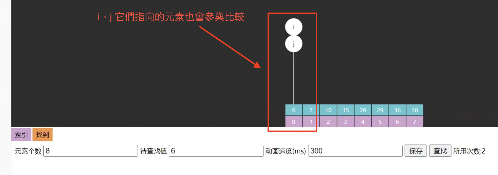
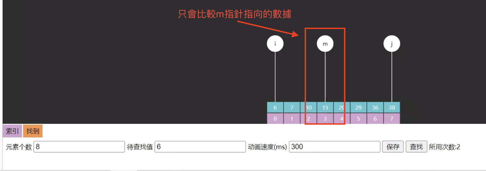

> 👉**二分查找算法也称折半查找，是一种非常高效的工作于有序数组的查找算法。后续的课程中还会学习更多的查找算法，但在此之前，不妨用它作为入门。**

# 二分查找基础版

需求：在 **有序** 数组 *A* 内，查找值 target

- 如果找到返回索引
- 如果找不到返回 `−1`

算法描述

|  |                                                                       |
| --- |-----------------------------------------------------------------------|
| 前提 | 给定一个内含 n 个元素的 **有序** 数组 *A*，满足 `A0 ≤ A1 ≤ A2 ≤ ⋯ ≤ An−1`，一个待查值 target |
| 1 | 设置指針 `i = 0，j = n − 1`                                                |
| 2 | 如果 `i > j`，结束查找，没找到                                                   |
| 3 | 设置 `m = floor(i + j / 2)`，m 为中间索引，floor 是向下取整（`≤ i + j / 2` 的最小整数）    |
| 4 | 如果 `target < A[m]` 设置 `j = m − 1`，跳到第 2 步                             |
| 5 | 如果 `A[m] < target` 设置 `i = m + 1`，跳到第 2 步                             |
| 6 | 如果 `A[m] = target`，结束查找，找到了                                           |

> ✏️**P.S.**
> - 对于一个算法来讲，都有较为严谨的描述，上面是一个例子
> - 后续讲解时，以简明直白为目标，不会总以上面的方式来描述算法

```java
/**
 * 二分查找基础版
 * 
 * @param a      待查找的升序数组
 * @param target 待查找的目标值
 * @return 找到则返回索引 找不到返回 -1
 */
public static int binarySearchBasic(int[] a, int target) {
    int i = 0, j = a.length - 1; // 设置指针和初值
    while (i <= j) { // i~j 范围内有东西
        int m = (i + j) / 2;
        if (target < a[m]) { // 目标在左边
            j = m - 1;
        } else if (a[m] < target) { // 目标在右边
            i = m + 1;
        } else { // 找到了
            return m;
        }
    }
    return -1;
}
```

> 👉**重點整理：**
> - `i`, `j`, `m`指針均可能為查找目標。
> - 當 `i > j` 時表示區域內沒有目標值。
> - 每次改變 `i`, `j` 邊界時，`m` 已經比較過且不是目標值，因此需將 `m` 分別調整為 `m+1` 或 `m-1`。
> - 向左查找時比較次數較少；向右查找時比較次數較多。

```java
@Test
@DisplayName("测试 binarySearchBasic")
public void test1() {
	int[] a = { 7, 13, 21, 30, 38, 44, 52, 53 };
	assertEquals(0, binarySearchBasic(a, 7));
	assertEquals(1, binarySearchBasic(a, 13));
	assertEquals(2, binarySearchBasic(a, 21));
	assertEquals(3, binarySearchBasic(a, 30));
	assertEquals(4, binarySearchBasic(a, 38));
	assertEquals(5, binarySearchBasic(a, 44));
	assertEquals(6, binarySearchBasic(a, 52));
	assertEquals(7, binarySearchBasic(a, 53));

	assertEquals(-1, binarySearchBasic(a, 0));
	assertEquals(-1, binarySearchBasic(a, 15));
	assertEquals(-1, binarySearchBasic(a, 60));
}
```

### 问题 1：为什么是 i <= j 意味着区间内有未比较的元素，而不是 i < j ?

```java
public static int binarySearchQ1(int[] a, int target) {
    int i = 0, j = a.length - 1; // 设置指针和初值
    while (i < j) {
        int m = (i + j) / 2;
        if (target < a[m]) { // 目标在左边
            j = m - 1;
        } else if (a[m] < target) { // 目标在右边
            i = m + 1;
        } else { // 找到了
            return m;
        }
    }
    return -1;
}
```

```java
@Test
@DisplayName("问题 1：为什么是 i <= j 意味着区间内有未比较的元素，而不是 i < j")
public void test2(){
    // 範例一
    // int[] a = { 5 };
    // assertEquals(0, binarySearchQ1(a, 5));

    // 範例二
    int[] a = { 1, 3 };
    assertEquals(1, binarySearchQ1(a, 3));

    // 範例三
    // int[] a = { 6, 7, 10, 15, 20, 29, 36, 38 };
    // assertEquals(0, binarySearchQ1(a, 6));
}
```

`i == j` 意味着 i、j 它们指向的元素也会参与比较（如下圖）



`i < j` 只意味着 m 指向的元素参与比较（如下圖）



> **👉因為這個二分查找採用的是閉區間 i、 𝑗：**
> - 只要 i <= j，就代表區間內仍然至少有一個候選元素尚未被排除，因此必須繼續迴圈做比較。
> - 當 i == j 時，區間 i、j 其實還剩下 1 個元素（也就是 a[i]），這一輪計算出來的 m 會等於 i（也等於 j），因此這個最後元素會被比較到。
> - 如果改成 i < j，當區間縮到只剩一個元素（i == j）時就會直接跳出迴圈，導致最後那個候選元素沒有機會成為 m 被比較，因此可能漏掉答案。

###  问题 2: (i + j) / 2 有没有问题 ?

```java
    @Test
@DisplayName("问题 2: (i + j) / 2 有没有问题 ?")
public void test3(){
    // 第一次
    int i = 0;
    int j = Integer.MAX_VALUE - 1; // 我們假設這個數組非常的大，它的數組長度是整數的最大值
    int m = (i + j) / 2;
    System.out.println(m);

    // 第二次(目標值大於中間值)
    i = m + 1;
    m = (i + j) / 2;
    System.out.println(m);
    // 為什麼是負數？
    // 因為 i + j 的值超過了 int 的最大值，所以 m 的值是負數
}
```

使用無符號右移運算符解決 `test()` 的問題

```java
@Test
public void test() {
	// 第一次
	int i = 0;
	int j = Integer.MAX_VALUE - 1;
	int m = (i + j) >>> 1;
	System.out.println(m);

	// 第二次(目標值大於中間值)
	i = m + 1;
	m = (i + j) >>> 1;
	System.out.println(m);
}
```

使用無符號右移運算符 `>>>` 可以避免整數溢出，在這裡可以用來安全計算中間值 `m`。當使用 `(i + j) >>> 1` 時，這個操作會將 `i + j` 右移一位，以便計算兩數的中間值，而不會產生溢出。這是因為 `>>>` 是無符號右移運算符，不會因為最高位是 `1` 而被當作負數。

這樣寫可以避免溢出：

```java
int m = (i + j) >>> 1;
```

工作原理：當 `i + j` 超出 `int` 的最大值時，會發生整數溢出並變成負數，但 `>>> 1` 不會保留符號位。因此，即使溢出，它還是會進行無符號位移，結果就會得到正確的中間值。

效果：使用 `>>>` 運算符和 `i + (j - i) / 2` 方法都能有效避免溢出。兩種方法的結果相同，但 `(i + j) >>> 1` 更簡潔。

### 问题 3：都写成小于号有啥好处 ?

> 👉 **这是一种习惯问题，人们会把小的默认放左边，大的放右边。**
> - 我們的數組是升序排列的，寫成小於符號就跟數組的升序排列是一致的。

# 二分查找改动版
> 👉 **j 只是作為一個標界，「一定不是指向我們的目標」**
> - 基礎版： `i` 跟 `j` 不光作為邊界，它們指向的元素也有可能是我們查找的目標。
> - 改變版：`i` 除了作為邊界，也指向我們要查找的目標；但是 `j` 只是作為邊界，<mark>它指向的一定不是查找目標</mark>。

```java
/**
 * 二分查找改动版
 *
 * @param a      待查找的升序数组
 * @param target 待查找的目标值
 * @return 找到则返回索引 找不到返回 -1
 */
public static int binarySearchAlternative(int[] a, int target) {
    int i = 0, j = a.length; // 第一处
    while (i < j) { // 第二处
        int m = (i + j) >>> 1;
        if (target < a[m]) {
            j = m; // 第三处
        } else if (a[m] < target) {
            i = m + 1;
        } else {
            return m;
        }
    }
    return -1;
}
```

> 👉 **重點整理：**
> - `i`、`j` 对应着搜索区间 `[0, a.length)`（注意是左闭右开的区间）
> - `i` 和 `m` 指針可能是查找目標。
> - `j` 指向的 **一定不是** 查找目标
> - 當 `i >= j` 時，表示區域內已無目標值（`i < j` 意味着搜索区间内还有未比较的元素）。
> - 如果某次要放大左边界：改變 `i` 邊界時，`m` 已經比較過且不是目標，因此將 `i` 設為 `m + 1`。
> - 如果某次要缩小右边界：改變 `j` 邊界時，`m` 已經比較過不是目標，且根據第 2 點，設 `j` 為 `m`。
> - 這種「左閉右開」的範圍設置在很多情況下更加直觀，因為可以避免一些臨界條件的錯誤，同時保證範圍操作的一致性，使代碼更簡潔。

> **思考：为啥这次不加 `i == j` 的条件了？**
> - 回答：这回 j 指向的不是查找目标，如果还加 `i == j` 条件，就意味着 j 指向的还会再次比较，找不到时，会死循环

### 問題：如果 while (i <= j){ … } 會陷入死循環。

```java
public static int binarySearchAlternative(int[] a, int target) {
    int i = 0, j = a.length; // 第一处
    while (i <= j) { // 第二处
        int m = (i + j) >>> 1;
        if (target < a[m]) {
            j = m; // 第三处
        } else if (a[m] < target) {
            i = m + 1;
        } else {
            return m;
        }
    }
    return -1;
}
```

當我們查找不存在的元素時，會發生死循環

```java
@Test
@DisplayName("問題：如果 while (i < j){ … } 會陷入死循環")
public void test5(){
    int[] a = { 7, 13, 21, 30, 38, 44, 52, 53 };
    // 示範：死循環
    assertEquals(-1, binarySearchAlternative(a, 35));
}
```

# 二分查找平衡版
將循環次數計為 L 次時：

元素在最左边  ⇒  只需要比較 L 次，即 `target < a[m]` 要執行 L 次。

元素在最右边   ⇒  需要比較 $2 \times L$ 次，即需要執行 `target < a[m]`  和 `a[m] < target` 各Ｌ次。

```java
/**
 * 二分查找基础版
 * 
 * @param a      待查找的升序数组
 * @param target 待查找的目标值
 * @return 找到则返回索引 找不到返回 -1
 */
public static int binarySearchBasic(int[] a, int target) {
    int i = 0, j = a.length - 1; // 设置指针和初值
    while (i <= j) { // i~j 范围内有东西
        int m = (i + j) / 2;
        if (target < a[m]) { // 目标在左边
            j = m - 1;
        } else if (a[m] < target) { // 目标在右边
            i = m + 1;
        } else { // 找到了
            return m;
        }
    }
    return -1;
}
```
在上述基础版二分查找算法中，如果待查找元素在最左侧的位置，则需要执行 L 次，即每次只需要执行 `if(target < arr[m])` 分支，而待查找元素在最右侧的位置时候，则需要执行 2L 次，即每次既需要执行 `if(target < arr[m])` 分支，又需要执行 `if(arr[m] < target)`。

元素在左侧和右侧的执行效率不一样，在左侧时查找速率更快，在右侧时查找速率要慢点，平衡版二分查找可以让左侧右侧的效率都保持一样，下面给出左右查找效率一样平衡版二分查找的实现思路：

1. 左闭右开的区间，`i` 指向的可能是目标，而 `j` 指向的不是目标
2. 不奢望循环内通过 `m` 找出目标，缩小区间直至剩 `1` 个，剩下的这个可能就是要找的（通过 `i`）
    - `1 < j - i` 的含义是，在范围内待比较的元素个数 > 1
3. 改变 `i` 边界时，它指向的可能是目标，因此不能 `m + 1`
4. 循环内的平均比较次数减少了
5. 时间复杂度 $\Theta(log(n))$

```java
/**
 * 二分查找平衡版
 * 
 * @param a      待查找的升序数组
 * @param target 待查找的目标值
 * @return 找到则返回索引 找不到返回 -1
 */
public static int binarySearchBalance(int[] a, int target) {
    int i = 0, j = a.length;
    while (1 < j - i) { // 表示的是「范围内待查找的元素个数 > 1」 时，當範圍內只剩下一個元素的時候就退出循環
        int m = (i + j) >>> 1;
        if (target < a[m]) { // 目标在左边
            j = m;
        } else { // 目标在 m 或右边
            i = m;
        }
    }
    return (target == a[i]) ? i : -1;
}
```

# 二分查找 Java 版

```java
private static int binarySearch0(long[] a, int fromIndex, int toIndex, long key) {
    int low = fromIndex; 
    int high = toIndex - 1; 

    while (low <= high) {
        int mid = (low + high) >>> 1;
        long midVal = a[mid];

        if (midVal < key)
            low = mid + 1;
        else if (midVal > key)
            high = mid - 1;
        else
            return mid; // key found
    }
    return -(low + 1);  // key not found.
}
```

### return -(low + 1)  有什麼含義？
```java
@Test
@DisplayName("测试 binarySearch java 版")
public void test5() {
    int[] a = {2, 5, 8};
    int target = 4;
    int i = Arrays.binarySearch(a, target);
    // 沒找到返回的是 => -插入点 - 1
    // -2 = -插入点 - 1
    // -2 + 1 = -插入点
    // -1 = -插入点
    // 1 = 插入點
    System.out.println(i);
    // i = -插入点 - 1  因此有 插入点 = abs(i+1)
    int insertIndex = Math.abs(i + 1); // 插入点索引
    int[] b = new int[a.length + 1];
    // System.arraycopy 參數意思：
    // src：來源陣列
    // srcPos：從來源陣列哪個 index 開始複製（含）
    // dest：目標陣列
    // destPos：貼到目標陣列哪個 index 開始（含）
    // length：複製幾個元素
    System.arraycopy(a, 0, b, 0, insertIndex);
    b[insertIndex] = target;
    System.arraycopy(a, insertIndex, b, insertIndex + 1, a.length - insertIndex);
    for (int e : b) {
        System.out.print(e + "\t");
    }
}
```

- 例如 `[1,3,5,6]` 要插入 `2` 那么就是找到一个位置，这个位置左侧元素都比它小
    - 等循环结束，若没找到，`low` 左侧元素肯定都比 `target` 小，因此 `low` 即插入点
- 插入点取负是为了与找到情况区分
- `-1` 是为了把索引 `0` 位置的插入点与找到的情况进行区分

# Leftmost 与 Rightmost
有时我们希望返回的是最左侧的重复元素，如果用 Basic 二分查找

- 对于数组 `[1, 2, 4, 4, 4, 5, 6, 7]`，查找元素 `4`，结果是索引 `3`
- 对于数组 `[1, 2, 4, 4, 4, 5, 6, 7]`，查找元素 `4`，结果也是索引 `3`，并不是最左侧的元素

```java
/**
 * 二分查找 Leftmost
 *
 * @param a      待查找的升序数组
 * @param target 待查找的目标值
 * @return
 *         找到则返回最靠左索引
 *         找不到返回 -1
 */
public static int binarySearchLeftmost1(int[] a, int target) {
    int i = 0, j = a.length - 1;
    int candidate = -1;
    while (i <= j) {
        int m = (i + j) >>> 1;
        if (target < a[m]) {
            j = m - 1;
        } else if (a[m] < target) {
            i = m + 1;
        } else {
            candidate = m; // 记录候选位置
            j = m - 1; // 继续向左
        }
    }
    return candidate;
}
```

測試如下：

```java
@Test
@DisplayName("测试 binarySearchLeftmost 返回 -1")
public void test() {
    int[] a = { 1, 2, 4, 4, 4, 5, 6, 7 };
    assertEquals(0, binarySearchLeftmost1(a, 1));
    assertEquals(1, binarySearchLeftmost1(a, 2));
    assertEquals(2, binarySearchLeftmost1(a, 4));
    assertEquals(5, binarySearchLeftmost1(a, 5));
    assertEquals(6, binarySearchLeftmost1(a, 6));
    assertEquals(7, binarySearchLeftmost1(a, 7));

    assertEquals(-1, binarySearchLeftmost1(a, 0));
    assertEquals(-1, binarySearchLeftmost1(a, 3));
    assertEquals(-1, binarySearchLeftmost1(a, 8));
}
```

如果希望返回的是最右侧元素

```java
/**
 * 二分查找 Rightmost
 *
 * @param a      待查找的升序数组
 * @param target 待查找的目标值
 * @return
 *         找到则返回最靠右索引
 *         找不到返回 -1
 */
public static int binarySearchRightmost1(int[] a, int target) {
    int i = 0, j = a.length - 1;
    int candidate = -1;
    while (i <= j) {
        int m = (i + j) >>> 1;
        if (target < a[m]) {
            j = m - 1;
        } else if (a[m] < target) {
            i = m + 1;
        } else {
            candidate = m; // 记录候选位置
            i = m + 1; // 继续向右
        }
    }
    return candidate;
}
```

測試如下：

```java
@Test
@DisplayName("测试 binarySearchRightmost 返回 -1")
public void test() {
    int[] a = { 1, 2, 4, 4, 4, 5, 6, 7 };
    assertEquals(0, binarySearchRightmost1(a, 1));
    assertEquals(1, binarySearchRightmost1(a, 2));
    assertEquals(4, binarySearchRightmost1(a, 4));
    assertEquals(5, binarySearchRightmost1(a, 5));
    assertEquals(6, binarySearchRightmost1(a, 6));
    assertEquals(7, binarySearchRightmost1(a, 7));

    assertEquals(-1, binarySearchRightmost1(a, 0));
    assertEquals(-1, binarySearchRightmost1(a, 3));
    assertEquals(-1, binarySearchRightmost1(a, 8));
}
```

### 應用
> 对于 Leftmost 与 Rightmost，可以返回一个比 `-1` 更有用的值

###### Leftmost 改为
```java
public static int binarySearchLeftmost(int[] a, int target) {
    int i = 0, j = a.length - 1;
    while (i <= j) {
        int m = (i + j) >>> 1;
        // 當目標小于等于中间值，都要向左找
        if (target <= a[m]) {
            j = m - 1; 
        } else {
            i = m + 1;
        }
    }
    return i;
}
```

- leftmost 返回值的另一层含义：返回  ≥ target 的最靠左索引。
- 小于等于中间值，都要向左找。

###### Rightmost 改为
```java
public static int binarySearchRightmost(int[] a, int target) {
    int i = 0, j = a.length - 1;
    while (i <= j) {
        int m = (i + j) >>> 1;
        if (target < a[m]) {
            j = m - 1;
        } else {
            i = m + 1;
        }
    }
    // 迴圈結束後 i 會停在「第一個 > target 的位置」，所以回傳 i - 1 等於「最後一個 <= target 的位置（最靠右）」。
    return i - 1;
}
```

- rightmost 返回值的另一层含义：返回 ≤ target 的最靠右索引
- 大于等于中间值，都要向右找。

###### 几个名词


> **求排名**：$leftmost(target) + 1$
> - **排名**：我有一個 target 值，我想知道這個 target 值在這個數組排名第幾。
> - target 可以不存在，如：$leftmost(5)+1 = 6$
> - target 也可以存在，如：$leftmost(4)+1 = 3$

> **求前任（predecessor）**：$leftmost(target) - 1$
> - **前任**：就是比 target 小並且更靠右的。
> - $leftmost(3) - 1 = 1$，前任 $a_1 = 2$
> - $leftmost(4) - 1 = 1$，前任 $a_1 = 2$

> **求后任（successor）**：$rightmost(target)+1$
> - **後任**：比 target 大並且更靠左的。
> - $rightmost(5) + 1 = 5$，后任 $a_5 = 7$
> - $rightmost(4) + 1 = 5$，后任 $a_5 = 7$

> **求最近邻居**：
> - 前任和后任距离更近者
> - 比如 4 跟 5 中間距離了一個位置、7 跟 5 中間距離了兩個位置；所以我們說 4 是 5 的最近鄰居。

> **范围查询**：
> - 查询所有小於 4 的元素：$x \lt 4$，$0 \sim leftmost(4) - 1$
> - 查询所有小於等於 4 的元素： $x \leq 4$，$0 \sim rightmost(4)$
> - 查询所有大於 4 的元素： $4 \lt x$，$rightmost(4) + 1 \sim \infty$
> - 查询所有大於等於 4 的元素： $4 \leq x$， $leftmost(4) \sim \infty$
> - 查询所有大於等於 4 並且小於等於 7 的元素： $4 \leq x \leq 7$，$leftmost(4) \sim rightmost(7)$
> - 查询查询所有大於 4 並且小於 7 的元素： $4 \lt x \lt 7$，$rightmost(4)+1 \sim leftmost(7)-1$

# 习题
### E01. 二分查找-Leetcode 704

**略**

> 使用我們之前學到的 **二分查找的任意版本都可以**

### E02. 搜索插入位置-Leetcode 35

**要点**：理解谁代表插入位置

给定一个排序数组和一个目标值

- 在数组中找到目标值，并返回其索引
- 如果目标值不存在于数组中，返回它将会被按顺序插入的位置

例如

```text
输入: nums = [1,3,5,6], target = 5
输出: 2

输入: nums = [1,3,5,6], target = 2
输出: 1

输入: nums = [1,3,5,6], target = 7
输出: 4
```

使用我們之前學到的**二分查找Leftmost版：**

```java
public static int binarySearchLeftmost(int[] a, int target) {
    int i = 0, j = a.length - 1;
    while (i <= j) {
        int m = (i + j) >>> 1;
        if (target <= a[m]) {
            j = m - 1;
        } else {
            i = m + 1;
        }
    }
    return i;
}
```

### E03. 搜索开始结束位置-Leetcode 34

给你一个按照非递减顺序排列的整数数组 nums，和一个目标值 target。请你找出给定目标值在数组中的开始位置和结束位置。

如果数组中不存在目标值 target，返回 [-1, -1]。

你必须设计并实现时间复杂度为 O(log n) 的算法解决此问题

例如

```text
输入：nums = [5,7,7,8,8,10], target = 8
输出：[3,4]

输入：nums = [5,7,7,8,8,10], target = 6
输出：[-1,-1]

输入：nums = [], target = 0
输出：[-1,-1]
```

**使用Leftmost 与 Rightmost 即可：**

```java
public static int left(int[] a, int target) {
    int i = 0, j = a.length - 1;
    int candidate = -1;
    while (i <= j) {
        int m = (i + j) >>> 1;
        if (target < a[m]) {
            j = m - 1;
        } else if (a[m] < target) {
            i = m + 1;
        } else {
            candidate = m;
            j = m - 1;
        }
    }
    return candidate;
}

public static int right(int[] a, int target) {
    int i = 0, j = a.length - 1;
    int candidate = -1;
    while (i <= j) {
        int m = (i + j) >>> 1;
        if (target < a[m]) {
            j = m - 1;
        } else if (a[m] < target) {
            i = m + 1;
        } else {
            candidate = m;
            i = m + 1;
        }
    }
    return candidate;
}

public static int[] searchRange(int[] nums, int target) {
    int x = left(nums, target);
    if(x == -1) {
        return new int[] {-1, -1};
    } else {
        return new int[] {x, right(nums, target)};
    }
}
```