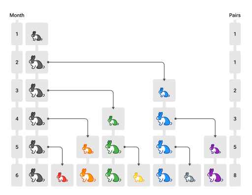
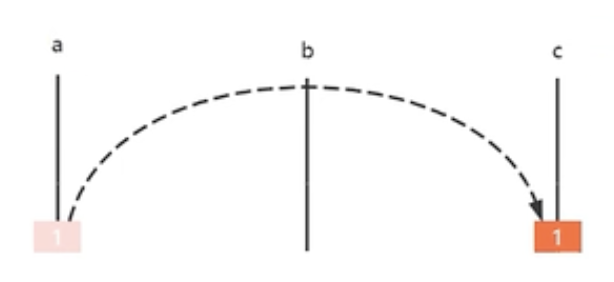
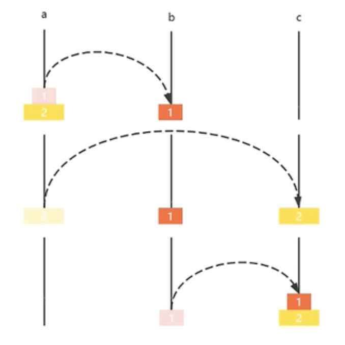
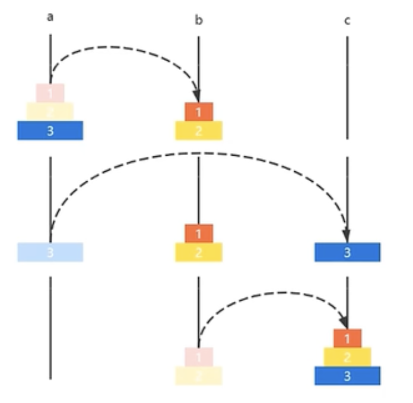
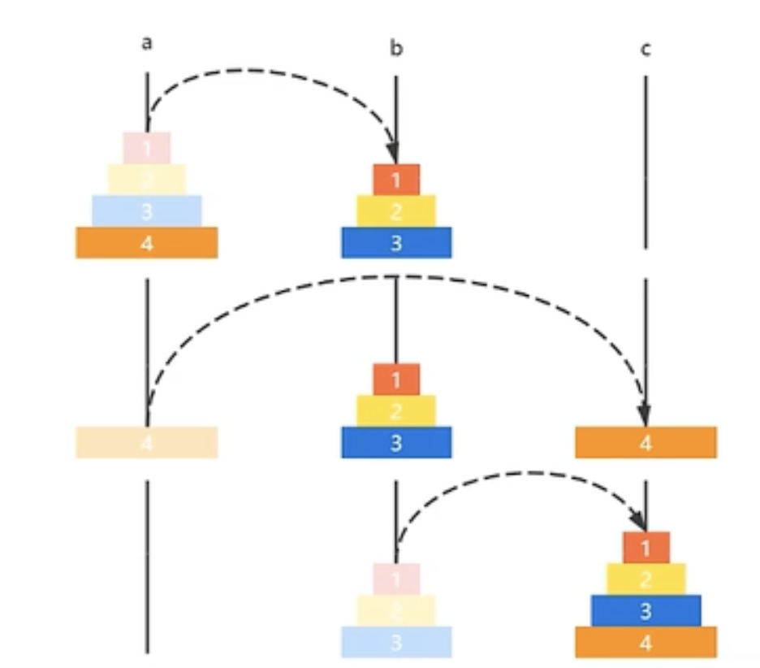
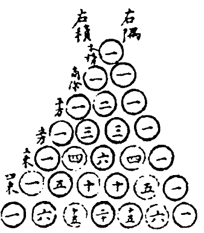
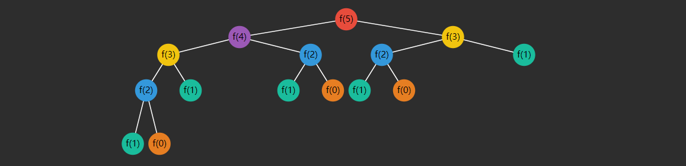
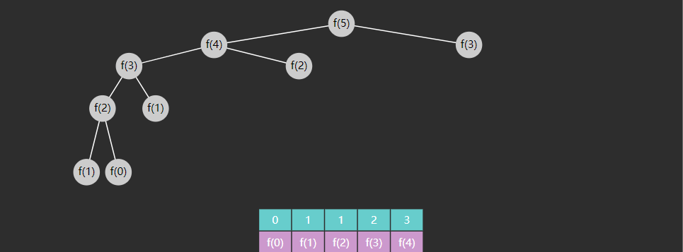
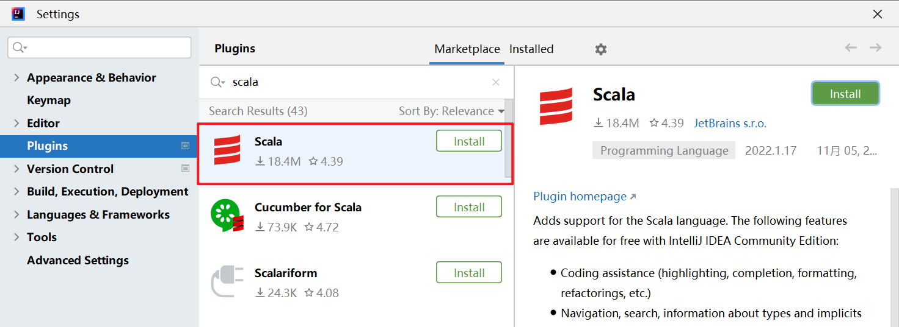

# 概述
## 定义

计算机科学中，递归是一种解决计算问题的方法，其中解决方案取决于 **同一类** 问题的更小子集

> In computer science, recursion is a method of solving a computational problem where the solution depends on solutions to smaller instances of the same problem.

比如单链表递归遍历的例子：

```java
void f(Node node) {
    if(node == null) {
        return;
    }
    println("before:" + node.value);
    f(node.next);
    println("after:" + node.value);
}
```

> 💡 **说明：**
> 1. 自己调用自己，如果说每个函数对应着一种解决方案，自己调用自己意味着解决方案是一样的（有规律的）
> 2. 每次调用，函数处理的数据会较上次缩减（子集），而且最后会缩减至无需继续递归
>    - 以鏈表遞歸為例：外層 `f(node)` 處理從 `node` 開始的鏈表；遞歸呼叫 `f(node.next)` 則改為處理從下一個節點開始的鏈表，等於少處理一個節點，規模逐步縮小，最後到 `node == null` 就停止。
> 3. 内层函数调用（子集处理）完成，外层函数才能算调用完成

## 原理

假设链表中有 3 个节点，value 分别为 1，2，3，以上代码的执行流程就类似于下面的 **伪码**

```java
// 1 -> 2 -> 3 -> null  f(1)

void f(Node node = 1) {
    println("before:" + node.value) // 1
    void f(Node node = 2) {
        println("before:" + node.value) // 2
        void f(Node node = 3) {
            println("before:" + node.value) // 3
            void f(Node node = null) {
                if(node == null) {
                    return;
                }
            }
            println("after:" + node.value) // 3
        }
        println("after:" + node.value) // 2
    }
    println("after:" + node.value) // 1
}
```

## 思路

1. 确定能否使用递归求解
   - 如果問題可以拆解成父問題和子問題，並且這個父問題和子問題可以使用同種解決方案解決，這樣就可以使用遞歸來解決問題。
   - 問題是否具有自相似結構：可以拆成「同一類型」的子問題 
   - 是否存在明確的終止條件（base case）：到某種狀態可直接返回，不再遞迴 
   - 每次遞迴是否能讓問題更接近終止條件，避免無限遞迴

2. 推导出递推关系，即父问题与子问题的关系，以及递归的结束条件

例如之前遍历链表的递推关系为

$$
f(n) =
\begin{cases}
停止& n = null \\
f(n.next) & n \neq null
\end{cases}
$$

- 深入到最里层叫做**递**
- 从最里层出来叫做**归**
- 在**递**的过程中，外层函数内的局部变量（以及方法参数）并未消失，**归**的时候还可以用到

# 单路递归 Single Recursion
## E01. 阶乘
用递归方法求阶乘

- 阶乘的定义 $n != 1⋅2⋅3⋯(n-2)⋅(n-1)⋅n$，其中 $n$ 为自然数，当然 $0! = 1$
- 递推关系

  $$
  f(n) =
  \begin{cases}
  1 & n = 1\\
  n * f(n-1) & n > 1
  \end{cases}
  $$

代码

```java
private static int f(int n) {
    if (n == 1) {
        return 1;
    }
    return n * f(n - 1);
}
```

拆解**伪码**如下，假设 n 初始值为 3

```java
f(int n = 3) { // 解决不了,继续递
    return 3 * f(int n = 2) { // 解决不了,继续递
        return 2 * f(int n = 1) {
            if (n == 1) { // 可以解决, 开始归
                return 1;
            }
        }
    }
}
```

## E02. 反向打印字符串

用递归反向打印字符串，n 为字符在整个字符串 str 中的索引位置

- **递**：n 从 0 开始，每次 n + 1，一直递到 `n == str.length() - 1`
- **归**：从 `n == str.length()` 开始归，从归打印，自然是逆序的
- 递推关系

  $$
  f(n) =
  \begin{cases}
  停止 & n = str.length() \\
  f(n+1) & 0 \leq n \leq str.length() - 1
  \end{cases}
  $$


代码为

```java
public static void reversePrint(String str, int index) {
    if (index == str.length()) {
        return;
    }
    reversePrint(str, index + 1);
    System.out.println(str.charAt(index));
}
```

拆解**伪码**如下，假设字符串为 "abc"

```java
void reversePrint(String str, int index = 0) {
    void reversePrint(String str, int index = 1) {
        void reversePrint(String str, int index = 2) {
            void reversePrint(String str, int index = 3) {
                if (index == str.length()) {
                    return; // 开始归
                }
            }
            System.out.println(str.charAt(index)); // 打印 c
        }
        System.out.println(str.charAt(index)); // 打印 b
    }
    System.out.println(str.charAt(index)); // 打印 a
}
```

## E03. 二分查找（单路递归）

### 核心想法

在有序陣列 `a` 中，維護搜尋區間 `[i, j]`。每次取中點 `m` 與 `target` 比較：

* 若 `a[m] == target`：找到，回傳 `m`
* 若 `target < a[m]`：答案只可能在左半區間 `[i, m-1]`
* 若 `a[m] < target`：答案只可能在右半區間 `[m+1, j]`

### 為什麼可以用遞迴？

在左半或右半繼續找，做的事情與原問題完全同型：
「在**更小的有序區間** `[i, j]` 內找 `target`」。
因此它具有**自相似結構**，適合用遞迴描述。

### 程式碼

* **函式意義**：`recursion(a, target, i, j)` 表示：在有序陣列 `a` 的區間 `[i, j]` 中尋找 `target`，找到回傳索引，找不到回傳 `-1`。
* **Base case**：`i > j` 代表區間為空（搜尋失敗）→ 回傳 `-1`。
* **Recursive step**：取 `m`，依比較結果縮小區間到左半或右半。

```java
public static int binarySearch(int[] a, int target) {
    return recursion(a, target, 0, a.length - 1);
}

public static int recursion(int[] a, int target, int i, int j) {
    if (i > j) {
        return -1;
    }
    // 中點（無號右移避免溢位符號問題）
    int m = (i + j) >>> 1;
    if (target < a[m]) {
        // 縮小到左半區間
        return recursion(a, target, i, m - 1);
    } else if (a[m] < target) {
        // 縮小到右半區間
        return recursion(a, target, m + 1, j);
    } else {
        return m;
    }
}
```

## E04. 冒泡排序（单路递归）

> 看影片理解。

> **递归冒泡排序：**
> * 将数组划分成两部分 `[0 .. j]`、`[j+1 .. a.length-1]`
> * 左边 `[0 .. j]` 是未排序部分
> * 右边 `[j+1 .. a.length-1]` 是已排序部分
> * 未排序区间内, 相邻的两个元素比较, 如果前一个大于后一个, 则交换位置

```java
public static void main(String[] args) {
	int[] a = { 6, 5, 4, 3, 2, 1 };
	System.out.println(Arrays.toString(a));
	bubble(a, a.length - 1);
	System.out.println(Arrays.toString(a));
}

// 讓使用者不用關注邊界問題
public static void sort(int[] a) {
	bubble(a, a.length - 1);
}

// j 代表未排序區域右邊界
private static void bubble(int[] a, int j) {
	if (j == 0) {
		// 只有一個元素，不需排序
		// 排序結束 
		return;
	}
	
	// 將最大的元素移到最右邊
    // 這裡不能將 i < j 改成 i <= j
    // 若寫成 i <= j：當 i == j 時會存取 a[i+1] = a[j+1]
    // 例如 j = 5（陣列長度 6），i 走到 5 時就會讀 a[6]，造成 IndexOutOfBounds
	for (int i = 0; i < j; i++) {
		if(a[i] > a[i+1]) {
            swap(a, i, i + 1);
		}
	}
 
	// 縮小排序區域
	bubble(a, j - 1);
}

// 交換 a[i] 和 a[j]	
private static void swap(int[] a, int i, int j) {
    int temp = a[i];
    a[i] = a[j];
    a[j] = temp;
}
```

### 優化冒泡排序

> 看影片理解

一般冒泡排序每一輪都會把「未排序區間」的最大值推到右邊界 `j`，
因此常見做法是每做完一輪，就把右邊界固定縮成 `j - 1`。

但這種做法不一定高效。因為在某些情況下，右邊已經不只是最後一個元素排好，
而是一整段都已經有序；若下一輪仍然掃描到 `j - 1`，就會產生許多不必要的比較。

為了避免這種浪費，可以在每一輪掃描時記錄「最後一次交換的位置」`x`：

- `x` 表示最後一次發生 `a[i] > a[i+1]` 並完成交換時的索引 `i`
- 若最後一次交換發生在 `x`，表示在該輪結束後，區間 `(x, j]` 已可視為有序
- 因此下一輪不必再處理整個 `[0, j]`，只需處理 `[0, x]`

換句話說，優化後的核心不是「每輪固定縮一格」，
而是「根據最後一次交換的位置，動態決定下一輪的右邊界」。

若某一整輪都沒有發生交換，代表目前未排序區間本身已經有序，
此時便可直接結束遞迴，不需要再進行後續輪次。

#### 範例說明

假設陣列初始狀態為：

```java
[3, 2, 6, 1, 5, 4, 7]
```

第一輪掃描時，`j = 6`，表示目前未排序區間為 `[0, 6]`。

從左到右依序比較：

- 比較 `3` 與 `2`，發生交換  
  陣列變為：

```java
[2, 3, 6, 1, 5, 4, 7]
```

  此時最後交換位置 `x = 0`

- 比較 `3` 與 `6`，不交換

- 比較 `6` 與 `1`，發生交換  
  陣列變為：

```java
[2, 3, 1, 6, 5, 4, 7]
```

  此時 `x = 2`

- 比較 `6` 與 `5`，發生交換  
  陣列變為：

```java
[2, 3, 1, 5, 6, 4, 7]
```

  此時 `x = 3`

- 比較 `6` 與 `4`，發生交換  
  陣列變為：

```java
[2, 3, 1, 5, 4, 6, 7]
```

  此時 `x = 4`

- 比較 `6` 與 `7`，不交換

第一輪結束後，陣列為：

```java
[2, 3, 1, 5, 4, 6, 7]
```

此時最後一次交換發生在索引 `4`，也就是 `x = 4`。
這表示區間 `(4, 6]`，即索引 `5` 到 `6` 的部分，已經不需要再處理；
因此下一輪只需處理 `[0, 4]`，而不必再掃描到原本的右邊界 `6`。

由此可見，記錄最後交換位置 `x` 的目的，
就是讓遞迴範圍能根據實際交換情況更快縮小。
當陣列本身越接近有序時，這種優化的效果就越明顯。

```java
public static void main(String[] args) {
	int[] a = { 3, 2, 6, 1, 5, 4, 7 };
	System.out.println(Arrays.toString(a));
    sort(a);
	System.out.println(Arrays.toString(a));
}

public static void sort(int[] a) {
	bubble(a, a.length - 1);
}

private static void bubble(int[] a, int j) {
	if (j == 0) {
		return;
	}
	int x = 0;
	for (int i = 0; i < j; i++) {
		if(a[i] > a[i+1]) {
              swap(a, i, i + 1);
              x = i;
		}
	}
	bubble(a, x);
}

private static void swap(int[] a, int i, int j) {
    int temp = a[i];
    a[i] = a[j];
    a[j] = temp;
}
```

## E05. 插入排序（单路递归）

插入排序的核心想法是：

將陣列分成兩部分：

- 左邊 `[0 .. low-1]`：已排序區間
- 右邊 `[low .. a.length-1]`：未排序區間

每一輪要做的事，就是從未排序區間取出第一個元素 `a[low]`，
然後把它插入到左邊已排序區間中的正確位置。

由於每做完一輪，未排序區間的邊界 `low` 都會往右移一格，
因此這個過程很適合用遞迴表示。

### 核心思路

假設目前要處理的位置是 `low`：

1. 先取出 `a[low]`，記作 `temp`
2. 從左側已排序區間的最右端開始往左比較
3. 只要遇到比 `temp` 大的元素，就將它向右挪一格
4. 當找到第一個 `<= temp` 的元素時，`temp` 就應插入在它右邊
5. 完成本輪後，遞迴處理下一個位置 `low + 1`

### 為什麼可以用遞迴？

因為每一輪做完後，問題都會變成同樣形式：

- 原本是「把 `a[low]` 插入到左側已排序區間」
- 下一輪則是「把 `a[low + 1]` 插入到更大的已排序區間」

也就是說，每次都在處理同一類型的子問題，只是 `low` 不斷往右推進。

### 程式碼

```java
public static void main(String[] args) {
	int[] a = { 5, 2, 4, 6, 1, 3 };
	System.out.println("Before sort: " + Arrays.toString(a));
	sort(a);
	System.out.println("After sort: " + Arrays.toString(a));
}

public static void sort(int[] a) {
	insertion(a, 1);
}
// a: 待排序數組
// low: 未排序區域的邊界
private static void insertion(int[] a, int low) {
	if (low == a.length) {
		return;
	}

	int temp = a[low];
	int i = low - 1; // 已排序區域指針

	while (i >= 0 && a[i] > temp) { // 沒有找到插入位置
		a[i + 1] = a[i]; // 空出插入位置
		i--;
	}

	a[i + 1] = temp; // 找到插入位置，插入元素

	insertion(a, low + 1); // 插入下一個元素
}
```

### 範例說明

假設初始陣列為：

```java
[5, 2, 4, 6, 1, 3]
```

一開始呼叫 `insertion(a, 1)`，表示：

- 左邊 `[0 .. 0]` 是已排序區間
- 右邊 `[1 .. 5]` 是未排序區間

#### 第 1 輪：`low = 1`

此時要插入的元素是 `2`。

左邊已排序區間只有 `[5]`，因為 `5 > 2`，
所以要把 `5` 向右移一格，再把 `2` 放到前面。

結果變成：

```java
[2, 5, 4, 6, 1, 3]
```

#### 第 2 輪：`low = 2`

此時要插入的元素是 `4`。

左邊已排序區間為 `[2, 5]`：

- `5 > 4`，所以 `5` 右移
- `2 <= 4`，停止比較

因此 `4` 應插入在 `2` 和 `5` 之間。

結果變成：

```java
[2, 4, 5, 6, 1, 3]
```

#### 第 3 輪：`low = 3`

此時要插入的元素是 `6`。

左邊已排序區間為 `[2, 4, 5]`，因為 `6` 比它們都大，
所以不需要移動，仍然保持原位。

結果不變：

```java
[2, 4, 5, 6, 1, 3]
```

#### 第 4 輪：`low = 4`

此時要插入的元素是 `1`。

左邊已排序區間為 `[2, 4, 5, 6]`，其中所有元素都比 `1` 大，
所以它們都要向右移動一格，最後把 `1` 插入到最前面。

結果變成：

```java
[1, 2, 4, 5, 6, 3]
```

#### 第 5 輪：`low = 5`

此時要插入的元素是 `3`。

左邊已排序區間為 `[1, 2, 4, 5, 6]`：

- `6 > 3`，右移
- `5 > 3`，右移
- `4 > 3`，右移
- `2 <= 3`，停止

因此 `3` 應插入在 `2` 的右邊。

結果變成：

```java
[1, 2, 3, 4, 5, 6]
```

當 `low == a.length` 時，表示所有元素都已處理完成，遞迴結束。

### 小結

插入排序的每一輪，本質上就是：

- 從未排序區間取出第一個元素
- 在左側已排序區間中找到正確位置
- 透過元素右移，為它空出插入位置

而遞迴版本只是把「處理下一個 `low`」這件事交給下一層函式去完成。

### 優化：插入位置不變時跳過回寫

在插入排序中，第 `low` 輪要做的事是：
把 `temp = a[low]` 插入到左側已排序區間 `[0 .. low-1]` 的正確位置。

`while (i >= 0 && a[i] > temp)` 這段迴圈會把所有比 `temp` 大的元素向右挪一格，
直到找到第一個 `<= temp` 的元素為止。

迴圈結束後：

- `i` 會指向最後一個 `<= temp` 的位置
- 因此 `temp` 的插入位置一定是 `i + 1`

這裡會出現兩種情況：

1. `i + 1 == low`  
   表示 `temp` 原本就在正確位置上，根本不需要移動。

2. `i + 1 != low`  
   表示中間確實有元素被右移，這時才需要把 `temp` 寫回 `a[i + 1]`。

也就是說，如果插入位置根本沒有改變，
那麼最後這次回寫其實是多餘的，可以省略。

```java
// 若插入位置就是 low，代表 temp 不需移動，省略回寫
if (i + 1 != low) {
    a[i + 1] = temp;
}
```

### 優化後的程式碼

```java
public static void main(String[] args) {
	int[] a = { 5, 2, 4, 6, 1, 3 };
	System.out.println("Before sort: " + Arrays.toString(a));
	sort(a);
	System.out.println("After sort: " + Arrays.toString(a));
}

public static void sort(int[] a) {
	insertion(a, 1);
}
// a: 待排序數組
// low: 未排序區域的邊界
private static void insertion(int[] a, int low) {
	if (low == a.length) {
		return;
	}

	int temp = a[low];
	int i = low - 1; // 已排序區域指針

	while (i >= 0 && a[i] > temp) { // 沒有找到插入位置
		a[i + 1] = a[i]; // 空出插入位置
		i--;
	}

    // 若插入位置就是 low，代表 temp 不需移動，省略回寫
    if (i + 1 != low) {
        a[i + 1] = temp;
    }

	insertion(a, low + 1); // 插入下一個元素
}
```

###

# 多路递归 Multi Recursion

多路遞歸（Multi Recursion）指的是：

在一次函式呼叫中，會產生**兩個或以上的子遞歸呼叫**。  
也就是說，函式在解決當前問題時，不是只把問題縮小成一個子問題，
而是會同時拆成多個更小的子問題，再把它們的結果組合起來。

### 和單路遞歸的差別

前面學到的單路遞歸（Single Recursion）通常只有一條遞進路線：

- 每次呼叫最多只會再呼叫一次自己
- 呼叫過程像一條鏈，一層接一層往下走
- 例如：階乘、反向列印字串、二分查找、單路遞歸版的冒泡排序與插入排序

而多路遞歸的特徵是：

- 每次呼叫可能再分成多個子呼叫
- 呼叫結構不再像一條鏈，而比較像一棵樹
- 每個節點都可能再向下分叉

因此在理解多路遞歸時，最重要的不是只看「往下呼叫」，
而是要學會用「遞歸呼叫樹」的角度來看整個過程。

### 多路遞歸的思考方式

遇到多路遞歸時，可以先問自己三個問題：

1. 目前這個問題，會拆成幾個子問題？
2. 每個子問題是否和原問題屬於同一種類型？
3. 子問題的結果要如何合併，才能得到原問題的答案？

如果答案是：

- 可以拆成多個更小的同類問題
- 每個子問題都可以再用同樣方式處理
- 最後再把子問題結果組合起來

那這類問題通常就適合用多路遞歸來描述。

## E01. 斐波那契数列-Leetcode 70
### 為什麼 Fibonacci 是典型例子？

以 Fibonacci 為例，要求 `f(n)` 時：

- 不是只依賴一個更小的子問題
- 而是同時依賴 `f(n-1)` 和 `f(n-2)` 兩個子問題

也就是說，一次呼叫會再分出兩條遞歸路線。  
因此它是一個典型的「二路遞歸」例子，也可以把它看成一棵二叉遞歸樹。

接下來就用 Fibonacci 來觀察多路遞歸的寫法、呼叫過程，以及它在時間複雜度上的特徵。

- 之前的例子是每个递归函数只包含一个自身的调用，这称之为 single recursion
- 如果每个递归函数例包含多个自身调用，称之为 multi recursion
- **递推关系**

  $$
  f(n) =
  \begin{cases}
  0 & n=0 \\
  1 & n=1 \\
  f(n-1) + f(n-2) & n>1
  \end{cases}
  $$


下面的表格列出了数列的前几项

| *F*0 | *F*1 | *F*2 | *F*3 | *F*4 | *F*5 | *F*6 | *F*7 | *F*8 | *F*9 | *F*10 | *F*11 | *F*12 | *F*13 |
| --- | --- | --- | --- | --- | --- | --- | --- | --- | --- | --- | --- | --- | --- |
| 0 | 1 | 1 | 2 | 3 | 5 | 8 | 13 | 21 | 34 | 55 | 89 | 144 | 233 |

### 实现

```java
public static void main(String[] args) {
	System.out.println(f(8));
}

public static int f(int n) {
	if (n == 0) {
		return 0;
	}

	if (n == 1) {
		return 1;
	}

	int x = f(n - 1);
	int y = f(n - 2);

	return x + y;
}
```


- 绿色代表正在执行（对应递），灰色代表执行结束（对应归）
- 递不到头，不能归，对应着深度优先搜索

> **根據 Fibonacci 的例子可以理解「多路遞歸」：**
> * 在一次遞歸呼叫中，函式內又產生了多次遞歸呼叫（例如 `f(n-1)` 與 `f(n-2)`），因此呼叫流程可以用樹來看（遞歸呼叫樹）。
>   * 每個呼叫是一個節點，呼叫出的子遞歸是子節點。
>   * Fibonacci 這種就是典型的「二叉遞歸樹」。
>   * 若每個節點最多產生 2 個子呼叫，就像二叉呼叫樹；若最多產生 3 個子呼叫，就像三叉呼叫樹，以此類推。
> * 相對地，「單路遞歸」每次最多只產生 1 個子呼叫，呼叫樹不分叉，形狀像一條鏈（深度優先一路到底再回來）。
>   * 例如階乘、二分查找（單路版）、鏈表遍歷等（每次只往下一個子問題走）。

### 时间复杂度

我們可以用「遞歸呼叫樹」估算遞歸的時間複雜度。

比如對於我們這個斐波那契數列來講，怎麼看出調用多少次？

我們可以根據下圖看出函數被調用了幾次


對 Fibonacci 的遞歸呼叫樹來說，「呼叫次數」就是樹的節點數。由圖可觀察：

* 當 (n=3) 時，呼叫次數 (=5)
* 當 (n=4) 時，呼叫次數 (=9)
* 當 (n=5) 時，呼叫次數 (=15)

> 递归的次数也符合斐波那契规律，$2 * f(n+1)-1$

- 时间复杂度推导过程（這邊跳過，未來再補）
  - 斐波那契通项公式 $f(n) = \frac{1}{\sqrt{5}}*({\frac{1+\sqrt{5}}{2}}^n - {\frac{1-\sqrt{5}}{2}}^n)$
  - 简化为：$f(n) = \frac{1}{2.236}*({1.618}^n - {(-0.618)}^n)$
  - 带入递归次数公式 $2*\frac{1}{2.236}*({1.618}^{n+1} - {(-0.618)}^{n+1})-1$
  - 时间复杂度为 $\Theta(1.618^n)$

> 更多 Fibonacci 参考以上时间复杂度分析，未考虑大数相加的因素

### 变体1 - 兔子问题



斐波那契兔子問題是 1202 年義大利數學家斐波那契在《計算之書》中提出的著名數列問題。

假設兔子繁殖規則為：

* 初生小兔需一個月長成大兔
* 第二個月開始每對大兔每月生一對小兔
* 且兔子永不死亡。
* 從一對初生小兔開始，第 $n$ 個月的兔子總對數即為「斐波那契數列」：

**分析**

兔子问题如何与斐波那契联系起来呢？设第 n 个月兔子数为 $f(n)$

* $f(n)$ = 上个月兔子数 + 新生的小兔子数
* 而【新生的小兔子数】实际就是【上个月成熟的兔子数】
* 因为需要一个月兔子就成熟，所以【上个月成熟的兔子数】也就是【上上个月的兔子数】
* 上个月兔子数，即 $f(n-1)$
* 上上个月的兔子数，即 $f(n-2)$

* 初始條件：
  * 第 1 個月：剛出生的一對小兔（1對）
  * 第 2 個月：小兔長大成成熟的大兔（1對）

* 繁殖規律：
  * 第 3 個月：大兔生下一對小兔，共有 1 對大兔 + 1 對小兔（2對）。
  * 第 4 個月：成熟大兔再生下一對小兔，且上個月的小兔長大，共有 2 對大兔 + 1 對小兔（3對）。
  * 第 5 個月：2 對大兔再生子，且上個月小兔變大兔，共有 3 對大兔 + 2 對小兔（5對）

* 規律：
  * 第一個月：$1$
  * 第二個月：$1$
  * 第三個月：$1 + 1 = 2$
  * 第四個月：$1 + 2 = 3$
  * 第五個月：$2 + 3 = 5$
  * ...
  * 第 $n$ 個月：$F_n = F_{n - 1} + F_{n -2}$

> 因此本质还是斐波那契数列，只是从其第一项开始

### 变体2 - 青蛙爬楼梯

* 樓梯有 `n` 階（從第 0 階出發，到第 n 階算到頂）
* 青蛙每次只能往上跳
  * 可跳 `1` 階
  * 或跳 `2` 階
* 問：共有多少種不同跳法？

**分析**

把「跳法」看成由 `1` 和 `2` 組成的序列，序列總和為 `n`。

| n | 所有跳法（序列總和為 n）                               | f(n) |
| - | ------------------------------------------- | ---: |
| 1 | (1)                                         |    1 |
| 2 | (1,1), (2)                                  |    2 |
| 3 | (1,1,1), (1,2), (2,1)                       |    3 |
| 4 | (1,1,1,1), (1,1,2), (1,2,1), (2,1,1), (2,2) |    5 |
| 5 | （不必全列）                                      |    8 |

* 這時候你大概已經看到：`1, 2, 3, 5, 8...` 很像 Fibonacci。

> 因此本质上还是斐波那契数列，只是从其第二项开始

* 对应 leetcode 题目 [70. 爬楼梯 - 力扣（LeetCode）](https://leetcode.cn/problems/climbing-stairs/)

## E02. 汉诺塔

Ｔower of Hanoi 是一個源於印度古老傳說：大梵天創建世界時做了三根金剛石柱，在一根柱子從下往上按大小順序摞著 64 片黃金圓盤，大梵天命令婆羅門把圓盤重新擺放在另一根柱子上，並且規定

* 一次只能移動一個圓盤
* 小圓盤上不能放大圓盤

使用程序代碼模擬圓盤的移動過程，並估算出時間複雜度

### 思路

* 假設每根柱子標號 a、b、c，每個圓盤用 1, 2, 3 ... 表示其他大小，圓盤初始在 a，要移動到的目標是 c。
* 如果只有一個圓盤，此時是最小問題，可以直接求解
  * 移動圓盤 1：$a \mapsto c$
  * 

* 如果有兩個圓盤，那麼
  * 圓盤 1：$a \mapsto b$
  * 圓盤 2：$a \mapsto c$
  * 圓盤 1：$b \mapsto c$
  * 

* 如果有三個圓盤，那麼
  * 圓盤 1、2：$a \mapsto b$
  * 圓盤 3：$a \mapsto c$
  * 圓盤 1、2：$b \mapsto c$
  * 
  * 中間兩個圓盤怎麼從 a 移動到 b、怎麼從 b 移動到 c 的過程，它們的移動方法都和兩個圓盤的方式是類似的，中間過程我們暫時不考慮。

* 如果有四個圓盤，那麼
  * 圓盤 1、2、3：$a \mapsto b$
  * 圓盤 4：$a \mapsto c$
  * 圓盤 1、2、3：$b \mapsto c$
  * 

### 我覺得比較好理解的程式碼

```java
public class HanoiTower {
    public static void main(String[] args) {
        int n = 3; // 汉诺塔的层数
        char A = 'A'; // 柱子A
        char B = 'B'; // 柱子B
        char C = 'C'; // 柱子C
        hanoi(n, A, B, C);
    }

    public static void hanoi(int n, char A, char B, char C) {
        if (n == 1) {
            System.out.println("移动盘子 " + n + " 从 " + A + " 到 " + C);
        } else {
            hanoi(n - 1, A, C, B); // 将n-1个盘子从A移动到B
            System.out.println("移动盘子 " + n + " 从 " + A + " 到 " + C);
            hanoi(n - 1, B, A, C); // 将n-1个盘子从B移动到C
        }
    }
}
```

### 影片中的程式碼

```java
public class E02HanoiTower {
    static LinkedList<Integer> a = new LinkedList<>();
    static LinkedList<Integer> b = new LinkedList<>();
    static LinkedList<Integer> c = new LinkedList<>();

    static void init(int n) {
        for (int i = n; i >= 1; i--) {
            a.addLast(i);
        }
    }

    /**
     * <h3>移动圆盘</h3>
     *
     * @param n 圆盘个数
     * @param a 由
     * @param b 借
     * @param c 至
     */
    static void move(
            int n, 
            LinkedList<Integer> a,
            LinkedList<Integer> b,
            LinkedList<Integer> c) {
        if (n == 0) {
            return;
        }
        move(n - 1, a, c, b);   // 把 n-1 个盘子由a,借c,移至b
        c.addLast(a.removeLast()); // 把最后的盘子由 a 移至 c
        print();
        move(n - 1, b, a, c);   // 把 n-1 个盘子由b,借a,移至c
    }
    
    public static void main(String[] args) {
        StopWatch sw = new StopWatch();
        int n = 1;
        init(n);
        print();
        sw.start("n=1");
        move(n, a, b, c);
        sw.stop();
        print();
        System.out.println(sw.prettyPrint());
    }

    private static void print() {
        System.out.println("----------------");
        System.out.println(a);
        System.out.println(b);
        System.out.println(c);
    }
}
```

## E03. 杨辉三角



### 分析

把它斜著看

```text
1
1   1
1   2   1
1   3   3   1
1   4   6   4   1
```

* 行 $i$、列 $j$，那麼 $[i][j]$ 的取值應為 $[i - 1][j- 1] + [i - 1][j]$
* 當 $j = 0$ 或 $i = j$ 時，$[i][j]$ 取值為 $1$。

```java
public class E03PascalTriangle {
  /**
   * <h3>直接递归(未优化)</h3>
   *
   * @param i 行坐标
   * @param j 列坐标
   * @return 该坐标元素值
   */
  private static int element(int i, int j) {
    if (j == 0 || i == j) {
      return 1;
    }
    return element(i - 1, j - 1) + element(i - 1, j);
  }

  // 輸出格式優化（排版/置中）
  public static void print(int n) {
    for (int i = 0; i < n; i++) {
      printSpace(n, i);
      for (int j = 0; j <= i; j++) {
        System.out.printf("%-4d", element(i, j));
      }
      System.out.println();
    }
  }


  private static void printSpace(int n, int i) {
    int num = (n - 1 - i) * 2;
    for (int j = 0; j < num; j++) {
      System.out.print(" ");
    }
  }

  public static void main(String[] args) {
    print(5);
  }
}
```

### 记忆法：使用二维数组缓存

回想斐波那契数列：我们用一维数组缓存每一项 `a[k]`；而杨辉三角天然是「行 i、列 j」的二维结构，因此使用 **二维数组作为缓存表** 最合适：

* `triangle[i][j]` 表示第 `i` 行第 `j` 列的值
* 若 `triangle[i][j]` 已经有值（> 0），直接返回，避免重复递归
* 边界条件：`j == 0` 或 `i == j` 时必为 `1`，顺便写入缓存
* 递推关系：`triangle[i][j] = triangle[i-1][j-1] + triangle[i-1][j]`

```java
public class E03PascalTriangle {
  /**
   * <h3>记忆化递归：使用二维数组缓存</h3>
   *
   * @param triangle 缓存表：triangle[i][j] 表示第 i 行第 j 列的值
   * @param i        行坐标
   * @param j        列坐标
   * @return 该坐标元素值
   */
  private static int element(int[][] triangle, int i, int j) {
    // 命中缓存：该位置已经计算过
    if (triangle[i][j] > 0) {
      return triangle[i][j];
    }

    // 边界：两侧都是 1
    if (j == 0 || i == j) {
      triangle[i][j] = 1;
      return 1;
    }

    // 递归 + 写入缓存
    triangle[i][j] = element(triangle, i - 1, j - 1) + element(triangle, i - 1, j);
    return triangle[i][j];
  }

  public static void print(int n) {
    int[][] triangle = new int[n][];
    for (int i = 0; i < n; i++) {
      triangle[i] = new int[i + 1];
      for (int j = 0; j <= i; j++) {
        System.out.printf("%-4d", element(triangle, i, j));
      }
      System.out.println();
    }
  }

  public static void main(String[] args) {
    print(6);
  }
}
```

### 记忆法：使用一维数组缓存

上一版我们用 **二维数组** 做记忆化缓存，把每个 `(i, j)` 的结果都保存下来，确实能把重复计算消掉，时间复杂度降到 `O(n^2)`。
但它的代价也很明确：需要额外的 `O(n^2)` 空间来存整张三角表。

进一步思考：**打印杨辉三角时，我们真的需要保留所有行吗？**
其实不需要。因为计算第 `i` 行只依赖第 `i-1` 行——当某一行已经用于生成下一行并打印完成后，旧行就没有继续保留的价值了。

因此我们可以把二维表压缩成 **一维数组** `row`：

* `row[j]` 表示“当前正在维护的那一行”的第 `j` 个值
* 每生成下一行，就在同一个数组上原地更新（滚动复用空间）
* 关键点：更新必须 **从右往左**，避免覆盖掉还没用到的旧值

**思路：**

```text
0   0   0   0   0   0   初始状态
1   0   0   0   0   0   i=0
1   1   0   0   0   0   i=1
1   2   1   0   0   0   i=2
1   3   3   1   0   0   i=3
1   4   6   4   1   0   i=4
```

从第 `i-1` 行更新到第 `i` 行时，核心递推仍然是：

* `row[j] = row[j] + row[j - 1]`

但必须从 `j = i` 递减到 `1`，这样 `row[j-1]` 仍然是上一行的值，不会被本轮更新污染。

```java
public class E03PascalTriangle {

  private static void createRow(int[] row, int i) { // i 行号 [0..n-1]
    if (row[i] > 0) { // 此行数据计算过,无需继续递归
      return;
    }
    if (i == 0) {
      row[0] = 1;
      return;
    }
    createRow(row, i - 1); // 计算上一行, 结果存入 row
    // 1   3   3   1   0   0   i = 4
    for (int j = i; j > 0; j--) {
      row[j] = row[j] + row[j - 1];
    }
  }

  public static void print(int n) {
    int[] row = new int[n];
    for (int i = 0; i < n; i++) {
      createRow(row, i);
      for (int j = 0; j <= i; j++) {
        System.out.printf("%-4d", row[j]);
      }
      System.out.println();
    }
  }
  
  public static void main(String[] args) {
    print(6);
  }
}
```


# 递归优化-记忆法

上述代码存在很多重复的计算，例如求 $f(5)$ 递归分解过程



可以看到（颜色相同的是重复的）：

- $f(3)$ 重复了 2 次
- $f(2)$ 重复了 3 次
- $f(1)$ 重复了 5 次
- $f(0)$ 重复了 3 次

随着 n 的增大，重复次数非常可观，如何优化呢？

> **Memoization** 记忆法（也称备忘录）是一种优化技术，通过存储函数调用结果（通常比较昂贵），当再次出现相同的输入（子问题）时，就能实现加速效果，改进后的代码

做法：

1. 建立一個一維陣列 `cache`，`cache[k]` 對應 `f(k)`。
2. 初始時把 `cache` 填成 `-1`（代表「尚未計算」），並設定已知的基底值：`f(0)=0`、`f(1)=1`。
3. 每次計算 `f(n)` 前先檢查：

  * 若 `cache[n] != -1`，表示算過了，直接回傳 `cache[n]`。
  * 否則才遞迴計算 `f(n-1) + f(n-2)`，並把結果寫回 `cache[n]`。

這樣每個 `f(k)` 最多只會計算一次，時間複雜度可降為 `O(n)`，空間 `O(n)`。

```java
public static void main(String[] args) {
	System.out.println(fibonacci(10)); // 55
}

// 使用記憶法（也稱備忘綠）改進
public static int fibonacci(int n) {
	int[] cache = new int[n + 1];
	Arrays.fill(cache, -1); // [-1, -1, -1, -1, -1]
	cache[0] = 0;
	cache[1] = 1; // [0, 1, -1, -1, -1]
	return f(n, cache);
}

public static int f(int n, int[] cache) {
	if (cache[n] != -1) {
        return cache[n];
    }
	
	int x = f(n - 1, cache);
	int y = f(n - 2, cache);
	cache[n] = x + y; // 將計算結果存入 cache
	return cache[n];
}
```

优化后的图示，只要结果被缓存，就**不会执行其子问题**



- 改进后的时间复杂度为 $O(n)$
- 请自行验证改进后的效果
- 请自行分析改进后的空间复杂度

> ⚠️ **注意：**
> 1. 记忆法是动态规划的一种情况，强调的是自顶向下的解决
> 2. 记忆法的本质是空间换时间

# 递归优化-尾递归
## 爆栈

用递归做 $n + (n-1) + (n-2) ... + 1$

```java
public static long sum(long n) {
    if (n == 1) {
        return 1;
    }
    return n + sum(n - 1);
} 
```

在我的机器上  $n = 12000$ 时，爆栈了

```bash
Exception in thread "main" java.lang.StackOverflowError
	at Test.sum(Test.java:10)
	at Test.sum(Test.java:10)
	at Test.sum(Test.java:10)
	at Test.sum(Test.java:10)
	at Test.sum(Test.java:10)
	...
```

为什么呢？

- 每次方法调用是需要消耗一定的栈内存的，这些内存用来存储方法参数、方法内局部变量、返回地址等等
- 方法调用占用的内存需要等到**方法结束时**才会释放
- 而递归调用我们之前讲过，不到最深不会回头，最内层方法没完成之前，外层方法都结束不了
  - 例如，`sum(3)` 这个方法内有个需要执行 $3 + sum(2)$，$sum(2)$ 没返回前，加号前面的 3 不能释放
  - 看下面伪码

      ```java
      long sum(long n = 3) {
          return 3 + long sum(long n = 2) {
              return 2 + long sum(long n = 1) {
                  return 1;
              }
          }
      }
      ```


## 尾调用

如果函数的最后一步是调用一个函数，那么称为尾调用，例如

```java
function a() {
    return b();
}
```

下面三段代码**不能**叫做尾调用

- 因为最后一步并非调用函数

    ```java
    function a() {
        const c = b();
        return c;
    }
    ```

- 最后一步雖然調用了函數，但又用到了外層函數的數值 1。

    ```java
    function a() {
        return b() + 1;
    }
    ```

- 最后一步雖然調用了函數，但又用到了外層函數的變量 x。

    ```java
    function a(x) {
        return b() + x;
    }
    ```

**一些语言**的编译器能够对尾调用做优化，例如：

```java
function a() {
    // 做前面的事
    return b();
}

function b() {
    // 做前面的事
    return c();
}

function c() {
    return 1000;
}

a();
```

没优化之前的**伪码：**

```java
function a() {
    return function b() {
        return function c() {
            return 1000;
        }
    }
}
```

优化后**伪码**如下 (攤平)：

```java
a();
b();
c();
```

为何尾递归才能优化？

调用 a 时

- a 返回时发现：没什么可留给 b 的，将来返回的结果 b 提供就可以了，用不着我 a 了，我的内存就可以释放

调用 b 时

- b 返回时发现：没什么可留给 c 的，将来返回的结果 c 提供就可以了，用不着我 b 了，我的内存就可以释放

如果调用 a 时

- 不是尾调用，例如 `return b() + 1`，那么 a 就不能提前结束，因为它还得利用 b 的结果做加法

## 尾递归

尾递归是尾调用的一种特例，也就是最后一步执行的是同一个函数

**尾递归避免爆栈**

安装 Scala



Scala 入门

```scala
object Main {
  def main(args: Array[String]): Unit = {
    println("Hello Scala")
  }
}
```

- Scala 是 java 的近亲，java 中的类都可以拿来重用
- 类型是放在变量后面的
- Unit 表示无返回值，类似于 void
- 不需要以分号作为结尾，当然加上也对

还是先写一个会爆栈的函数

```scala
def sum(n: Long): Long = {
    if (n == 1) {
        return 1
    }
    return n + sum(n - 1)
}
```

- Scala 最后一行代码若作为返回值，可以省略 return

不出所料，在 `n = 11000` 时，还是出了异常

```scala
println(sum(11000))

Exception in thread "main" java.lang.StackOverflowError
	at Main$.sum(Main.scala:25)
	at Main$.sum(Main.scala:25)
	at Main$.sum(Main.scala:25)
	at Main$.sum(Main.scala:25)
	...
```

这是因为以上代码，还不是尾调用，要想成为尾调用，那么：

1. 最后一行代码，必须是一次函数调用
2. 内层函数必须**摆脱**与外层函数的关系，内层函数**执行后**不依赖于外层的变量或常量

```scala
def sum(n: Long): Long = {
    if (n == 1) {
        return 1
    }
    return n + sum(n - 1)  // 依赖于外层函数的 n 变量
}
```

如何让它执行后就摆脱对 n 的依赖呢？

- 不能等递归回来再做加法，那样就必须保留外层的 n
- 把 n 当做内层函数的一个参数传进去，这时 n 就属于内层函数了
- 传参时就完成累加, 不必等回来时累加

```scala
sum(n - 1, n + 累加器)
```

改写后代码如下

```scala
@tailrec
def sum(n: Long, accumulator: Long): Long = {
    if (n == 1) {
        return 1 + accumulator
    }
    return sum(n - 1, n + accumulator)
}
```

- accumulator 作为累加器
- `@tailrec` 注解是 scala 提供的，用来检查方法是否符合尾递归
- 这回 `sum(10000000, 0)` 也没有问题，打印 `50000005000000`

执行流程如下，以**伪码**表示 $sum(4, 0)$

```scala
// 首次调用
def sum(n = 4, accumulator = 0): Long = {
    return sum(4 - 1, 4 + accumulator)
}

// 接下来调用内层 sum, 传参时就完成了累加, 不必等回来时累加，当内层 sum 调用后，外层 sum 空间没必要保留
def sum(n = 3, accumulator = 4): Long = {
    return sum(3 - 1, 3 + accumulator)
}

// 继续调用内层 sum
def sum(n = 2, accumulator = 7): Long = {
    return sum(2 - 1, 2 + accumulator)
}

// 继续调用内层 sum, 这是最后的 sum 调用完就返回最后结果 10, 前面所有其它 sum 的空间早已释放
def sum(n = 1, accumulator = 9): Long = {
    if (1 == 1) {
        return 1 + accumulator
    }
}
```

本质上，尾递归优化是将函数的**递归**调用，变成了函数的**循环**调用

**改循环避免爆栈**

```java
public static void main(String[] args) {
    long n = 100000000;
    long sum = 0;
    for (long i = n; i >= 1; i--) {
        sum += i;
    }
    System.out.println(sum);
}
```

# 递归时间复杂度-Master theorem（跳過）

若有递归式
$$
T(n) = aT(\frac{n}{b}) + f(n)
$$
其中

* $T(n)$ 是问题的运行时间，$n$ 是数据规模
* $a$ 是子问题个数
* $T(\frac{n}{b})$ 是子问题运行时间，每个子问题被拆成原问题数据规模的 $\frac{n}{b}$
* $f(n)$ 是除递归外执行的计算

令 $x = \log_{b}{a}$，即 $x = \log_{子问题缩小倍数}{子问题个数}$

那么
$$
T(n) =
\begin{cases}
\Theta(n^x) & f(n) = O(n^c) 并且 c \lt x\\
\Theta(n^x\log{n}) & f(n) = \Theta(n^x)\\
\Theta(n^c) & f(n) = \Omega(n^c) 并且 c \gt x
\end{cases}
$$

**例1**

$T(n) = 2T(\frac{n}{2}) + n^4$

* 此时 $x = 1 < 4$，由后者决定整个时间复杂度 $\Theta(n^4)$
* 如果觉得对数不好算，可以换为求【$b$ 的几次方能等于 $a$】


**例2**

$T(n) = T(\frac{7n}{10}) + n$

* $a=1, b=\frac{10}{7}, x=0, c=1$
* 此时 $x = 0 < 1$，由后者决定整个时间复杂度 $\Theta(n)$


**例3**

$T(n) = 16T(\frac{n}{4}) + n^2$

* $a=16, b=4, x=2, c=2$
* 此时 $x=2 = c$，时间复杂度 $\Theta(n^2 \log{n})$


**例4**

$T(n)=7T(\frac{n}{3}) + n^2$

* $a=7, b=3, x=1.?, c=2$
* 此时 $x = \log_{3}{7} < 2$，由后者决定整个时间复杂度 $\Theta(n^2)$


**例5**

$T(n) = 7T(\frac{n}{2}) + n^2$

* $a=7, b=2, x=2.?, c=2$
* 此时 $x = log_2{7} > 2$，由前者决定整个时间复杂度 $\Theta(n^{\log_2{7}})$


**例6**

$T(n) = 2T(\frac{n}{4}) + \sqrt{n}$

* $a=2, b=4, x = 0.5, c=0.5$
* 此时 $x = 0.5 = c$，时间复杂度 $\Theta(\sqrt{n}\ \log{n})$


**例7. 二分查找递归**

```java
int f(int[] a, int target, int i, int j) {
    if (i > j) {
        return -1;
    }
    int m = (i + j) >>> 1;
    if (target < a[m]) {
        return f(a, target, i, m - 1);
    } else if (a[m] < target) {
        return f(a, target, m + 1, j);
    } else {
        return m;
    }
}
```

* 子问题个数 $a = 1$
* 子问题数据规模缩小倍数 $b = 2$
* 除递归外执行的计算是常数级 $c=0$

$T(n) = T(\frac{n}{2}) + n^0$

* 此时 $x=0 = c$，时间复杂度 $\Theta(\log{n})$


**例8. 归并排序递归**

```python
void split(B[], i, j, A[])
{
    if (j - i <= 1)                    
        return;                                
    m = (i + j) / 2;             
    
    // 递归
    split(A, i, m, B);  
    split(A, m, j, B); 
    
    // 合并
    merge(B, i, m, j, A);
}
```

* 子问题个数 $a=2$
* 子问题数据规模缩小倍数 $b=2$
* 除递归外，主要时间花在合并上，它可以用 $f(n) = n$ 表示

$T(n) = 2T(\frac{n}{2}) + n$

* 此时 $x=1=c$，时间复杂度 $\Theta(n\log{n})$


**例9. 快速排序递归**

```python
algorithm quicksort(A, lo, hi) is 
  if lo >= hi || lo < 0 then 
    return
  
  // 分区
  p := partition(A, lo, hi) 
  
  // 递归
  quicksort(A, lo, p - 1) 
  quicksort(A, p + 1, hi) 
```

* 子问题个数 $a=2$
* 子问题数据规模缩小倍数
  * 如果分区分的好，$b=2$
  * 如果分区没分好，例如分区1 的数据是 0，分区 2 的数据是 $n-1$
* 除递归外，主要时间花在分区上，它可以用 $f(n) = n$ 表示


情况1 - 分区分的好

$T(n) = 2T(\frac{n}{2}) + n$

* 此时 $x=1=c$，时间复杂度 $\Theta(n\log{n})$


情况2 - 分区没分好

$T(n) = T(n-1) + T(1) + n$

* 此时不能用主定理求解

# 递归时间复杂度-展开求解（跳過）

像下面的递归式，都不能用主定理求解

**例1 - 递归求和**

```java
long sum(long n) {
    if (n == 1) {
        return 1;
    }
    return n + sum(n - 1);
}
```

$T(n) = T(n-1) + c$，$T(1) = c$

下面为展开过程

$T(n) = T(n-2) + c + c$

$T(n) = T(n-3) + c + c + c$

...

$T(n) = T(n-(n-1)) + (n-1)c$

* 其中 $T(n-(n-1))$ 即 $T(1)$
* 带入求得 $T(n) = c + (n-1)c = nc$

时间复杂度为 $O(n)$


**例2 - 递归冒泡排序**

```java
void bubble(int[] a, int high) {
    if(0 == high) {
        return;
    }
    for (int i = 0; i < high; i++) {
        if (a[i] > a[i + 1]) {
            swap(a, i, i + 1);
        }
    }
    bubble(a, high - 1);
}
```

$T(n) = T(n-1) + n$，$T(1) = c$

下面为展开过程

$T(n) = T(n-2) + (n-1) + n$

$T(n) = T(n-3) + (n-2) + (n-1) + n$

...

$T(n) = T(1) + 2 + ... + n = T(1) + (n-1)\frac{2+n}{2} = c + \frac{n^2}{2} + \frac{n}{2} -1$

时间复杂度 $O(n^2)$

> 注：
>
> * 等差数列求和为 $个数*\frac{\vert首项-末项\vert}{2}$


**例3 - 递归快排**

快速排序分区没分好的极端情况

$T(n) = T(n-1) + T(1) + n$，$T(1) = c$

$T(n) = T(n-1) + c + n$

下面为展开过程

$T(n) = T(n-2) + c + (n-1) + c + n$

$T(n) = T(n-3) + c + (n-2) + c + (n-1) + c + n$

...

$T(n) = T(n-(n-1)) + (n-1)c + 2+...+n = \frac{n^2}{2} + \frac{2cn+n}{2} -1$

时间复杂度 $O(n^2)$


不会推导的同学可以进入 https://www.wolframalpha.com/

* 例1 输入 f(n) = f(n - 1) + c, f(1) = c
* 例2 输入 f(n) = f(n - 1) + n, f(1) = c
* 例3 输入 f(n) = f(n - 1) + n + c, f(1) = c
