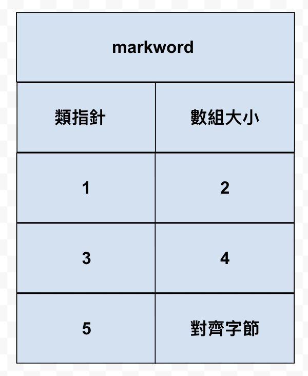

# 概述

> 所属章节：[二、基础数据结构](../README.md) / [數組](./README.md)
> 关键字：數組、連續存儲、索引、地址計算、空間占用、隨機訪問
> 建議回查情境：忘記數組定義、地址計算公式、Java 數組空間結構或隨機訪問為何是 O(1) 時

## 本节导读

這一節先建立數組的核心模型：元素連續存儲、每個元素可由索引定位，並用 Java 數組的內存結構說明空間占用與隨機訪問效率。第一次閱讀時建議先理解「連續存儲」與地址計算，再看 Java 對象頭與對齊字節。

## 你會在這篇學到什麼

- 數組的基本定義與索引模型
- 如何用 BaseAddress、索引與元素大小計算地址
- Java 數組的空間占用組成
- 為什麼按索引查詢是 O(1)

---

## 定義

> In computer science, an array is a data structure consisting of a collection of elements (values or variables), each identified by at least one array index or key
>
> - **定义**：在计算机科学中，数组是由一组元素（值或变量）组成的数据结构，每个元素有至少一个索引或键来标识。

因为数组内的元素是**连续存储**的，所以数组中元素的地址，可以通过其索引计算出来，例如：

```java
int[] array = {1, 2, 3, 4, 5};
```

知道了数组的 **数据** 起始地址 $BaseAddress$，就可以由公式 $BaseAddress + i \times size$ 计算出索引 $i$ 元素的地址

- $i$ 即索引，在 Java、C 等语言都是从 0 开始
- $size$ 是每个元素占用字节，例如 int 占 4，double 占 8

**小测试**

```java
byte[] array = {1, 2, 3, 4, 5};
```

已知 array 的 **数据** 的起始地址是 `0x7138f94c8`，那么元素 3 的地址是什么 ？

> 答：$0x7138f94c8 + 2 \times 1 = 0x7138f94ca$

## 性能

### 空间占用

Java 中数组结构为

- 8 字节 markword
- 4 字节 class 指针（压缩 class 指针的情况）
- 4 字节 数组大小（决定了数组最大容量是 $2^{32}$）
- 数组元素 + 对齐字节（Java 中所有对象大小都是 8 字节的整数倍，不足的要用对齐字节补足）

例如

```java
int[] array = {1, 2, 3, 4, 5};
```



的大小为 40 个字节，组成如下

$$
8 + 4 + 4 + 5 \times 4 + 4(對齊字節)
$$

### 随机访问性能

即根据索引查找元素，时间复杂度是 $O(1)$

---

## 導航

- 上一篇：[二、基础数据结构](../README.md)
- 返回：[數組入口](./README.md)
- 下一篇：[动态数组](./02%20动态数组.md)
