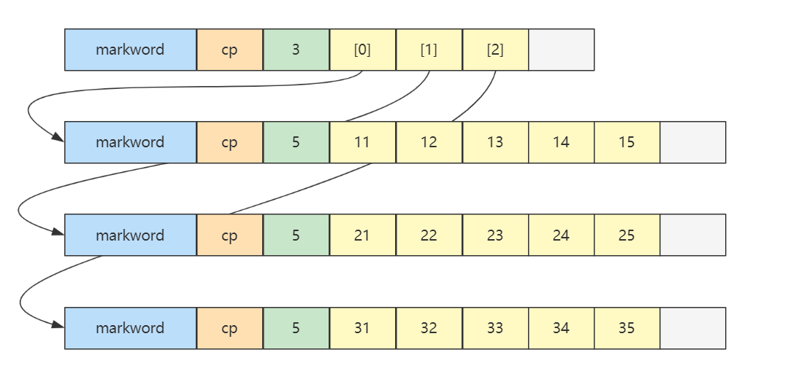

# 二维数组

> 所属章节：[二、基础数据结构](../README.md) / [數組](./README.md)
> 关键字：二維數組、外層數組、內層數組、row、column、地址計算
> 建議回查情境：需要回查 Java 二維數組的內存圖、外層/內層數組關係，或練習二維數組地址計算時

## 本节导读

這一節說明 Java 中二維數組本質上是「外層數組保存多個內層數組引用」，並用 byte[][] 範例推導元素地址。閱讀時要特別注意：Java 二維數組不是單一連續矩陣，而是由多個一維數組組成。

## 你會在這篇學到什麼

- Java 二維數組的外層與內層結構
- row 與 column 在索引中的意義
- 如何根據對象大小與索引推導元素地址

---
```java
byte[][] array = {
        {11, 12, 13, 14, 15},
        {21, 22, 23, 24, 25},
        {31, 32, 33, 34, 35},
};
```

内存图如下：



> 👉 **灰色的部分就是之前提到的對齊字節  ⇒  java 中所有对象大小都是 8 字节的整数倍，不足的要用对齐字节补足。**

- 二维数组占 32 个字节，其中 `array[0]`，`array[1]`，`array[2]` 三个元素分别保存了指向三个一维数组的引用
- 三个一维数组各占 40 个字节
- 它们在内层布局上是 **连续** 的

更一般的，对一个二维数组 `Array[m][n]`

- m 是外层数组的长度，可以看作 row 行
- n 是内层数组的长度，可以看作 column 列
- 当访问 `Array[i][j]`，$0\leq i \lt m, 0\leq j \lt n$ 时，就相当于
  - 先找到第 i 个内层数组（行）
  - 再找到此内层数组中第 j 个元素（列）

**小测试**

Java 环境下（不考虑类指针和引用压缩，此为默认情况），有下面的二维数组

```java
byte[][] array = {
    {11, 12, 13, 14, 15},
    {21, 22, 23, 24, 25},
    {31, 32, 33, 34, 35},
};
```

已知 array **对象**起始地址是 `0x1000`，那么 23 这个元素的地址是什么？

> 答：
>
> - 起始地址 `0x1000`
> - 外层数组大小：$16 字节对象头 + 3元素 \times 每个引用4字节 + 4 对齐字节 = 32 = 0x20$
> - 第一个内层数组大小：$16字节对象头 + 5元素 \times 每个byte1字节 + 3 对齐字节 = 24 = 0x18$
> - 第二个内层数组：$16字节对象头 = 0x10$，待查找元素索引为 2
> - 最后结果：$0x1000 + 0x20 + 0x18 + 0x10 + 2 \times 1 = 0x104a$

---

## 導航

- 上一篇：[动态数组](./02%20动态数组.md)
- 返回：[數組入口](./README.md)
- 下一篇：[局部性原理](./04%20局部性原理.md)
