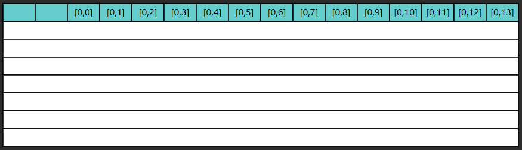
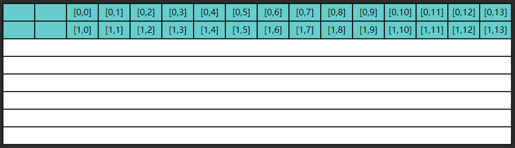
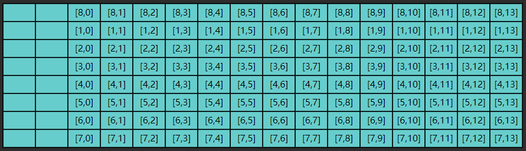

# 局部性原理

> 所属章节：[二、基础数据结构](../README.md) / [數組](./README.md)
> 关键字：空間局部性、CPU cache、cache line、二維數組遍歷、ij、ji
> 建議回查情境：想理解為什麼二維數組按行遍歷通常較快，或需要回查 cache line 與空間局部性的例子時

## 本节导读

這一節用二維數組遍歷順序比較空間局部性對效能的影響。先理解 cache line 會一次載入相鄰資料，再看 ij 與 ji 兩種遍歷順序為什麼會有差異。

## 你會在這篇學到什麼

- 空間局部性的基本意思
- cache line 與相鄰資料讀取的關係
- ij 與 ji 兩種遍歷順序的效率差異
- 為什麼鏈表較難利用空間局部性

---

这里只讨论空间局部性

- cpu 读取内存（速度慢）数据后，会将其放入高速缓存（速度快）当中，如果后来的计算再用到此数据，在缓存中能读到的话，就不必读内存了
- 缓存的最小存储单位是缓存行（cache line），一般是 64 bytes，一次读的数据少了不划算啊，因此最少读 64 bytes 填满一个缓存行，因此读入某个数据时也会读取其**临近的数据**，这就是所谓**空间局部性。**

## 对效率的影响

比较下面 `ij` 和 `ji` 两个方法的执行效率

- 兩者遍歷二維數組的順序不一樣
- `ij`：先行再列
- `ji`：先列再行

```java
public class TestCacheLine {
	public static void main(String[] args) throws Exception {
		int rows = 1000000;
		int columns = 14;
		int[][] a = new int[rows][columns];

		StopWatch sw = new StopWatch();
		sw.start("ij");
		ij(a, rows, columns);
		sw.stop();
		sw.start("ji");
		ji(a, rows, columns);
		sw.stop();
		System.out.println(sw.prettyPrint());
	}

	public static void ij(int[][] a, int rows, int columns) {
		long sum = 0L;
		for (int i = 0; i < rows; i++) {
			for (int j = 0; j < columns; j++) {
				sum += a[i][j];
			}
		}
		System.out.println(sum);
	}

	public static void ji(int[][] a, int rows, int columns) {
		long sum = 0L;
		for (int j = 0; j < columns; j++) {
			for (int i = 0; i < rows; i++) {
				sum += a[i][j];
			}
		}
		System.out.println(sum);
	}
}
```

`StopWatch.java` 如下：

```java
import java.util.ArrayList;
import java.util.List;

public class StopWatch {
	private static class Task {
		String name;
		long startTime;
		long duration;

		Task(String name, long startTime) {
			this.name = name;
			this.startTime = startTime;
		}
	}

	private final List<Task> tasks = new ArrayList<>();
	private long startTime;
	private boolean running = false;
	private long totalTime = 0;

	// 開始計時
	public void start(String taskName) {
		if (running) {
			throw new IllegalStateException("StopWatch is already running");
		}
		startTime = System.nanoTime();
		tasks.add(new Task(taskName, startTime));
		running = true;
	}

	// 停止計時
	public void stop() {
		if (!running) {
			throw new IllegalStateException("StopWatch is not running");
		}
		long endTime = System.nanoTime();
		Task currentTask = tasks.get(tasks.size() - 1);
		currentTask.duration = endTime - currentTask.startTime;
		totalTime += currentTask.duration;
		running = false;
	}

	// 取得格式化的報告
	public String prettyPrint() {
		StringBuilder sb = new StringBuilder();
		sb.append("StopWatch '': running time = ").append(totalTime).append(" ns\n");
		sb.append("---------------------------------------------\n");
		sb.append("ns         %     Task name\n");
		sb.append("---------------------------------------------\n");

		for (Task task : tasks) {
			long percent = (task.duration * 100) / totalTime;
			sb.append(String.format("%09d  %03d%%  %s\n", task.duration, percent, task.name));
		}
		return sb.toString();
	}
}
```

执行结果

```text
0
0
StopWatch '': running time = 96283300 ns
---------------------------------------------
ns         %     Task name
---------------------------------------------
016196200  017%  ij
080087100  083%  ji
```

可以看到 `ij` 的效率比 `ji` 快很多，为什么呢？

- 缓存是有限的，当新数据来了后，一些旧的缓存行数据就会被覆盖
- 如果不能充分利用缓存的数据，就会造成效率低下

以 `ji` 执行为例，第一次内循环要读入 `[0,0]` 这条数据，由于局部性原理，读入 `[0,0]` 的同时也读入了 `[0,1]` ... `[0,13]`，如图所示



但很遗憾，第二次内循环要的是 `[1,0]` 这条数据，缓存中没有，于是再读入了下图的数据



这显然是一种浪费，因为 `[0,1]` ... `[0,13]` 包括 `[1,1]` ... `[1,13]` 这些数据虽然读入了缓存，却没有及时用上，而缓存的大小是有限的，等执行到第九次内循环时



缓存的第一行数据已经被新的数据 `[8,0]` ... `[8,13]` 覆盖掉了，以后如果再想读，比如 `[0,1]`，又得到内存去读了

同理可以分析 `ij` 函数则能充分利用局部性原理加载到的缓存数据

## 举一反三

1. I/O 读写时同样可以体现局部性原理

2. 数组可以充分利用局部性原理，那么链表呢？
   - 答：链表不行，因为链表的元素并非相邻存储

---

## 導航

- 上一篇：[二维数组](./03%20二维数组.md)
- 返回：[數組入口](./README.md)
- 下一篇：[System.arraycopy 的使用](./05%20System.arraycopy%20的使用.md)
