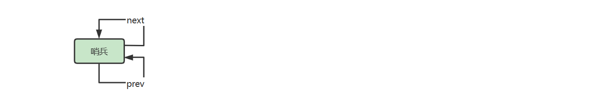
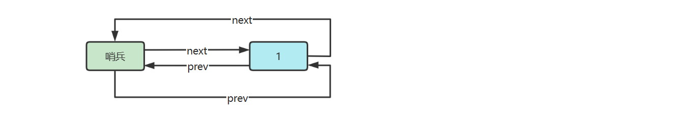
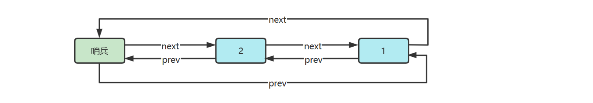
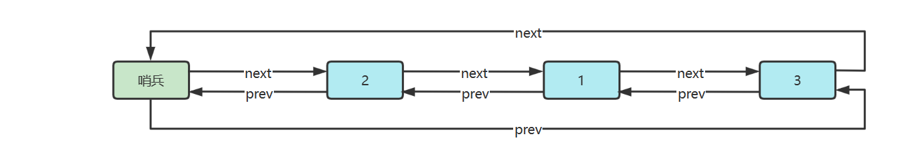

# 概述

### 定義

在计算机科学中，链表是数据元素的线性集合，其每个元素都指向下一个元素，元素存储上并不连续

> In computer science, a linked list is a linear collection of data elements whose order is not given by their physical placement in memory. Instead, each element points to the next.
>

可以分类为

- 单向链表，每个元素只知道其下一个元素是谁
  - 
- 双向链表，每个元素知道其上一个元素和下一个元素
  - 
- 循环链表，通常的链表尾节点 tail 指向的都是 null，而循环链表的 tail 指向的是头节点 head
  - 
- 链表内还有一种特殊的节点称为哨兵（Sentinel）节点，也叫做哑元（ Dummy）节点，它不存储数据，通常用作头尾，用来简化边界判断，如下图所示
  - 

### 随机访问性能

根据 index 查找，时间复杂度 $O(n)$

### 插入或删除性能

- 起始位置：$O(1)$
- 结束位置：如果已知 tail 尾节点是 $O(1)$，不知道 tail 尾节点是 $O(n)$
- 中间位置：根据 index 查找时间 $+ O(1)$

# 单向链表
- 定義節點類和單向鍊表：

    ```java
    public class SinglyLinkedList { // 单向链表
    	Node head = null; // 头节点
    }
    
    class Node { // 节点类
    	int value;
    	Node next;
    
    	public Node(int value, Node next) {
    		this.value = value;
    		this.next = next;
    	}
    }
    ```

  根据单向链表的定义，首先定义一个存储 value 和 next 指针的类 Node，和一个描述头部节点的引用

- 優化：單向鍊表和節點類是屬於 **組合** 的關係，像這種關係就可以設計為內部類和外部類的關係，好處就是 **對外隱藏實現細節**，對於使用者來說他只需要知道外部類就可以了。

    ```java
    public class SinglyLinkedList {
    	private Node head = null; // 头节点
    
    	private static class Node { // 节点类
    		int value;
    		Node next;
    
    		public Node(int value, Node next) {
    			this.value = value;
    			this.next = next;
    		}
    	}
    }
    ```

  - Node 定义为内部类，是为了对外 **隐藏** 实现细节，没必要让类的使用者关心 Node 结构
  - 定义为 static 内部类，是因为 Node **不需要** 与 `SinglyLinkedList` 实例相关，多个 `SinglyLinkedList` 实例能共用 Node 类定义

## 头部添加
- 如果 `this.head == null`，新增节点指向 `null`，并作为新的 `this.head`
- 如果 `this.head != null`，新增节点指向原来的 `this.head`，并作为新的 `this.head`
  - 注意赋值操作执行顺序是从右到左

```java
public void addFirst(int value) {
	// 1. 链表为空时
	if (head == null) {
		head = new Node(value, null);
	} else {
		// 2. 链表非空时
		head = new Node(value, head);
	}
}
```

👉 **優化如下：**

```java
public void addFirst(int value) {
	head = new Node(value, head);
}
```

- 當鏈表為空時 `head == null`
- 寫 `head = new Node(value, head);` 的時候，第二個參數就是把當下的 head（也就是 null）傳進去
- 所以等價於 `head = new Node(value, null);`

## 遍歷
### while 遍历和 for 遍历
- 以下两种遍历都可以把 **要做的事** 以 Consumer 函数的方式传递进来
  - Consumer 的规则是 **一个参数**，**无返回值**，因此像 `System.out::println` 方法等都是 Consumer
  - 调用 Consumer 时，将当前节点 `curr.value` 作为参数传递给它

#### while
```java
/**
 * 遍历链表
 *
 * @param consumer 要执行的操作
 */
public void loop(Consumer<Integer> consumer) {
	Node curr = head;
	while (curr != null) {
		consumer.accept(curr.value);
		curr = curr.next;
	}
}
```

```java
@Test
@DisplayName("测试 loop")
public void test() {
	SinglyLinkedList list = new SinglyLinkedList();
	list.addFirst(1);
	list.addFirst(2);
	list.addFirst(3);
	list.addFirst(4);

	// 使用 loop 方法遍历链表
	list.loop(value -> {
		System.out.println(value);
	});
}
```

#### for 

```java
/**
 * 遍历链表
 *
 * @param consumer 要执行的操作
 */
public void loop(Consumer<Integer> consumer) {
	for (Node curr = this.head; curr != null; curr = curr.next) {
		consumer.accept(curr.value);
	}
}
```

```java
@Test
@DisplayName("测试 loop")
public void test() {
	SinglyLinkedList list = new SinglyLinkedList();
	list.addFirst(1);
	list.addFirst(2);
	list.addFirst(3);
	list.addFirst(4);

	// 使用 loop 方法遍历链表
	list.loop(value -> {
		System.out.println(value);
	});
}
```

### 迭代器遍历
```java
public class SinglyLinkedList implements Iterable<Integer> {
    // ... 其他成員和方法
  
	@Override
	public Iterator<Integer> iterator() {
        // 匿名內部類
		return new Iterator<Integer>() {
            Node curr = head;

			@Override
			public boolean hasNext() { // 有没有下一个元素
              return curr != null;
			}

			@Override
			public Integer next() { // 返回当前元素,并移动到下一个元素
              int value = curr.value;
              curr = curr.next;
              return value;
			}
		};
	}
}
```

匿名內部類 → 具名內部類：可讀性更好、方便擴充 ✅

```java
public class SinglyLinkedList implements Iterable<Integer> {
    // ... 其他成員和方法
    
    private class NodeIterator implements Iterator<Integer> {
        Node curr = head;

        public boolean hasNext() {
            return curr != null;
        }

        public Integer next() {
            int value = curr.value;
            curr = curr.next;
            return value;
        }
    }

    public Iterator<Integer> iterator() {
        return new NodeIterator();
    }
}
```

- hasNext 用来判断是否还有必要调用 next

- next 做两件事
  - 返回当前节点的 value
  - 指向下一个节点

> ⚠️ NodeIterator 要定义为**非 static 内部类**，是因为它与 SinglyLinkedList 实例相关，是对某个 SinglyLinkedList 实例的迭代

測試代碼：

```java
@Test
@DisplayName("测试 loop")
public void test() {
	SinglyLinkedList list = new SinglyLinkedList();
	list.addFirst(1);
	list.addFirst(2);
	list.addFirst(3);
	list.addFirst(4);

	for (Integer value : list) {
		System.out.println(value);
	}
}
```

### 递归遍历

先想一個關鍵問題：

> 如果我手上已經拿到鏈表中的任意一個節點 node，那處理「第一個節點」與處理「第二個節點」的邏輯有差嗎？

答案：**沒有差**。
對於單向鏈表來說，「每個節點要做的事」是一樣的，只是下一個節點不同而已。

因此我們可以定義一個函數 traverse(node)，代表：

- **到達這個節點時要做什麼**（pre-order / before）
- **把剩下的鏈表交給下一次遞迴處理**
- **從遞迴返回後要做什麼**（post-order / after）

這就是遞迴遍歷的本質。

```java
public class SinglyLinkedList implements Iterable<Integer> {
    // ... 其他成員和方法

    public void loop(Consumer<Integer> before, Consumer<Integer> after) {
         recursion(head, before, after);
    }
  
    private void recursion(Node curr, Consumer<Integer> before, Consumer<Integer> after) { // 某个节点要进行的操作
        if (curr == null) {
            return;
        }
        before.accept(curr.value); // 前面做些事
        recursion(curr.next, before, after);
        after.accept(curr.value); // 後面做些事
    }
}
```

測試代碼：

```java
@Test
@DisplayName("测试 recursion loop 方法")
public void test() {
    SinglyLinkedList list = new SinglyLinkedList();
    list.addFirst(1);
    list.addFirst(2);
    list.addFirst(3);
    list.addFirst(4);
    list.addFirst(5);
  
    list.loop(value -> {
      System.out.println("before:" + value);
    }, value -> {
      System.out.println("after:" + value);
    });
}
```

## 尾部添加

```java
public class SinglyLinkedList {
    // ... 其他成員和方法
  
    private Node findLast() {
        if (this.head == null) {
            return null;
        }
        Node curr;
        for (curr = this.head; curr.next != null; ) {
            curr = curr.next;
        }
        return curr;
    }
    
    public void addLast(int value) {
        Node last = findLast();
        if (last == null) {
            addFirst(value);
            return;
        }
        last.next = new Node(value, null);
    }
}
```

- ⚠️ 注意，找最后一个节点，终止条件是 `curr.next == null`
- 分成两个方法是为了代码清晰，而且 `findLast()` 之后还能复用

測試代碼：

```java
@Test
@DisplayName("测试 addLast")
public void test() {
    SinglyLinkedList list = new SinglyLinkedList();
    list.addFirst(1);
    list.addFirst(2);
    list.addFirst(3);
    list.addFirst(4);

    for (Integer value : list) {
        System.out.println(value);
    }
    
    System.out.println("==========");

    SinglyLinkedList list2 = new SinglyLinkedList();
    list2.addLast(1);
    list2.addLast(2);
    list2.addLast(3);
    list2.addLast(4);

    for (Integer value : list2) {
        System.out.println(value);
    }
}
```

## 尾部添加多个
```java
public class SinglyLinkedList {
    // ...其他成員和方法
  
    public void addLast(int first, int... rest) {
        Node sublist = new Node(first, null);
        Node curr = sublist;
        for (int value : rest) {
            curr.next = new Node(value, null);
            curr = curr.next;
        }

        Node last = findLast();
        if (last == null) {
            this.head = sublist;
            return;
        }
        last.next = sublist;
    }
}
```

- 先串成一串 sublist
- 再作为一个整体添加

測試範例：

```java
@Test
@DisplayName("测试 addLast")
public void test() {
	SinglyLinkedList list = new SinglyLinkedList();
	list.addFirst(1);
	list.addLast(2, 3, 4, 5);

	for (Integer value : list) {
		System.out.println(value);
	}
}
```

## 根据索引获取

> **為什麼不在 Node 中添加一個屬性紀錄索引呢？**
> - 链表是一种动态数据结构，节点可以随时被插入或删除。
> - 如果在链表的每个节点中维护一个索引，每次插入或删除节点时，都需要更新该节点后面所有节点的索引。

```java
public class SinglyLinkedList {
    // ... 其他成員和方法
    private Node findNode(int index) {
        int i = 0;
        for (Node curr = this.head; curr != null; curr = curr.next, i++) {
            if (index == i) {
                return curr;
            }
        }
        return null; // 沒找到
    }

    private IllegalArgumentException illegalIndex(int index) {
        return new IllegalArgumentException(String.format("index [%d] 不合法%n", index));
    }

    public int get(int index) {
        Node node = findNode(index);
        if (node != null) {
            return node.value;
        }
        throw illegalIndex(index);
    }
}
```

測試範例：

```java
@Test
@DisplayName("测试 get 方法")
public void test() {
	SinglyLinkedList list = new SinglyLinkedList();
	list.addFirst(1);
	list.addLast(2, 3, 4, 5);

	int num = list.get(2);
	System.out.println(num);
}
```

## 向索引位置插入

```java
public class SinglyLinkedList {
    // ... 其他成員和方法
    public void insert(int index, int value) {
        if (index == 0) {
            addFirst(value);
            return;
        }
        Node prev = findNode(index - 1); // 找到上一个节点
        if (prev == null) { // 找不到
            throw illegalIndex(index);
        }
        prev.next = new Node(value, prev.next);
    }
}
```

插入包括下面的删除，都必须找到上一个节点

測試範例

```java
@Test
@DisplayName("测试 insert 方法")
public void test() {
	SinglyLinkedList list = new SinglyLinkedList();
	list.addLast(1);
	list.addLast(2);
	list.addLast(3); // 2
	list.addLast(4);
	
	list.insert(2, 5);
	for (int i : list) {
		System.out.println(i);
	}
}
```

## 刪除頭部

```java
public class SinglyLinkedList {
    // ... 其他成員和方法
    public void removeFirst() {
        if (this.head == null) {
            throw illegalIndex(0);
        }
        this.head = this.head.next;
    }
}
```

測試範例：

```java
@Test
@DisplayName("测试 removeFirst 方法")
public void test() {
	SinglyLinkedList list = new SinglyLinkedList();
	list.addLast(1);
	list.addLast(2);
	list.addLast(3); 
	list.addLast(4);
	
	list.removeFirst();
	
	for (int i : list) {
		System.out.println(i);
	}
}
```

## 从索引位置删除

```java
public class SinglyLinkedList {
    // ... 其他成員和方法
    public void remove(int index) {
        if (index == 0) {
            removeFirst();
            return;
        }
        Node prev = findNode(index - 1); // 上一个节点
        if (prev == null) {
            throw illegalIndex(index);
        }
        Node removed = prev.next; // 要删除的节点
        if (removed == null) {
            throw illegalIndex(index);
        }
        prev.next = removed.next;
    }
}
```

測試範例：

```java
@Test
@DisplayName("测试 remove 方法")
public void test() {
	SinglyLinkedList list = new SinglyLinkedList();
	list.addLast(1);
	list.addLast(2);
	list.addLast(3); 
	list.addLast(4);
	list.addLast(5);
	
	list.remove(2);
	
	for (int i : list) {
		System.out.println(i);
	}
}
```

# 单向链表（带哨兵）

觀察不帶頭（head 可能為 null）的單向鏈表，很多操作需要對「頭節點」做特判：

- 空表時 `addLast` 要特別處理

- `insert(0, x)`、`remove(0)` 必須走不同流程

為了把這些分支消掉，可以引入一個 **不存放資料的哨兵節點**（sentinel / dummy / header node） 作為固定的頭結點。

在帶頭鏈表中：

- `head` 永遠指向哨兵節點，因此 `head != null` 永遠成立

- 真正的第一個資料節點是 `head.next`

- 插入 / 刪除都可以統一成：「找到前驅節點 prev，改接指標」

這樣 `index=0` 不再需要特判，因為它的前驅就是哨兵 head。

```java
public class SinglyLinkedListSentinel {
    // 用一个不参与数据存储的特殊 Node 作为哨兵，它一般被称为哨兵或哑元，拥有哨兵节点的链表称为带头链表
    private Node head = new Node(Integer.MIN_VALUE, null);
}
```

> 具体存什么值无所谓，因为不会用到它的值

加入哨兵节点后，代码会变得比较简单，先看几个工具方法：

```java
public class SinglyLinkedListSentinel {
    // ... 其他成員和方法

    // 根据索引获取节点
    private Node findNode(int index) {
        int i = -1;
        for (Node curr = this.head; curr != null; curr = curr.next, i++) {
          if (i == index) {
            return curr;
          }
        }
        return null;
    }

    // 获取最后一个节点
    private Node findLast() {
        Node curr;
        for (curr = this.head; curr.next != null; ) {
          curr = curr.next;
        }
        return curr;
    }
}
```

- findNode 与之前类似，只是 i 初始值设置为 -1 对应哨兵，实际传入的 index 也是 $[-1, \infty)$
- findLast 绝不会返回 null 了，就算没有其它节点，也会返回哨兵作为最后一个节点

这样，代码简化为：

```java
public class SinglyLinkedListSentinel implements Iterable<Integer> {

    // 哨兵節點（不參與資料存儲）
    private final Node head = new Node(Integer.MIN_VALUE, null);

    // 節點類
    private static class Node {
        int value;
        Node next;

        Node(int value, Node next) {
            this.value = value;
            this.next = next;
        }
    }

    /* =========================
       迭代器 / foreach 支援
       ========================= */
    private class NodeIterator implements Iterator<Integer> {
        // 注意：從第一個資料節點開始，而不是哨兵
        Node curr = head.next;

        @Override
        public boolean hasNext() {
            return curr != null;
        }

        @Override
        public Integer next() {
            int value = curr.value;
            curr = curr.next;
            return value;
        }
    }

    @Override
    public Iterator<Integer> iterator() {
        return new NodeIterator();
    }

    public void loop(Consumer<Integer> consumer) {
        for (Node curr = head.next; curr != null; curr = curr.next) {
            consumer.accept(curr.value);
        }
    }

    /* =========================
       核心查找方法（哨兵版）
       ========================= */

    /**
     * 根據索引取得節點（包含哨兵語義）：
     * index = -1 -> 回傳哨兵 head
     * index =  0 -> 回傳第一個資料節點
     * index =  1 -> 回傳第二個資料節點
     * ...
     */
    private Node findNode(int index) {
        int i = -1;
        for (Node curr = this.head; curr != null; curr = curr.next, i++) {
            if (i == index) {
                return curr;
            }
        }
        return null;
    }

    /**
     * 取得最後一個節點：
     * - 若鏈表沒有資料節點，最後一個節點就是哨兵 head
     * - 否則回傳最後一個資料節點
     */
    private Node findLast() {
        Node curr = this.head;
        while (curr.next != null) {
            curr = curr.next;
        }
        return curr;
    }

    private IllegalArgumentException illegalIndex(int index) {
        return new IllegalArgumentException(String.format("index [%d] 不合法%n", index));
    }

    /* =========================
       CRUD 操作（哨兵版）
       ========================= */

    public void addFirst(int value) {
        insert(0, value);
    }

    public void addLast(int value) {
        Node last = findLast();          // 永遠不為 null
        last.next = new Node(value, null);
    }

    public void addLast(int first, int... rest) {
        // 建立一段子鏈
        Node sublist = new Node(first, null);
        Node curr = sublist;
        for (int value : rest) {
            curr.next = new Node(value, null);
            curr = curr.next;
        }

        // 接到尾巴
        Node last = findLast();
        last.next = sublist;
    }

    public int get(int index) {
        Node node = findNode(index);
        if (node != null && node != head) { // node != head 等價於 index != -1
            return node.value;
        }
        throw illegalIndex(index);
    }

    public void insert(int index, int value) {
        // 找到 index 的前一個節點（index-1）
        Node prev = findNode(index - 1);
        if (prev == null) {
            throw illegalIndex(index);
        }
        prev.next = new Node(value, prev.next);
    }

    public void removeFirst() {
        remove(0);
    }

    public void remove(int index) {
        Node prev = findNode(index - 1);
        if (prev == null || prev.next == null) {
            throw illegalIndex(index);
        }
        prev.next = prev.next.next;
    }
}
```

# 双向链表（带哨兵）

```java
public class DoublyLinkedListSentinel implements Iterable<Integer> {
  // 節點類（雙向）
  private static class Node {
    int value; // 值
    Node prev; // 上一個節點指針
    Node next; // 下一個節點指針

    Node(Node prev, int value, Node next) {
      this.value = value;
      this.prev = prev;
      this.next = next;
    }
  }

  // 兩個哨兵
  private final Node head = new Node(null, Integer.MIN_VALUE, null);
  private final Node tail = new Node(null, Integer.MIN_VALUE, null);


  public DoublyLinkedListSentinel() {
    head.next = tail;
    tail.prev = head;
  }

  private Node findNode(int index) {
    int i = -1;
    for (Node p = head; p != tail; p = p.next, i++) {
      if (i == index) {
        return p;
      }
    }
    return null;
  }

  public void insert(int index, int value) {
    Node prev = findNode(index - 1);
    if (prev == null) {
      throw illegalIndex(index);
    }
    Node next = prev.next;
    Node inserted = new Node(prev, value, next);
    prev.next = inserted;
    next.prev = inserted;
  }

  public void addFirst(int value) {
    insert(0, value);
  }

  public void addLast(int value) {
    Node prev = tail.prev;
    Node added = new Node(prev, value, tail);
    prev.next = added;
    tail.prev = added;
  }

  public void remove(int index) {
    Node prev = findNode(index - 1);
    if (prev == null) {
      throw illegalIndex(index);
    }
    Node removed = prev.next;
    if (removed == tail) {
      throw illegalIndex(index);
    }
    Node next = removed.next;
    prev.next = next;
    next.prev = prev;
  }

  public void removeFirst() {
    remove(0);
  }

  public void removeLast() {
    Node removed = tail.prev;
    if (removed == head) {
      throw illegalIndex(0);
    }
    Node prev = removed.prev;
    prev.next = tail;
    tail.prev = prev;
  }

  @Override
  public Iterator<Integer> iterator() {
    return new Iterator<Integer>() {
      Node p = head.next;

      @Override
      public boolean hasNext() {
        return p != tail;
      }

      @Override
      public Integer next() {
        int value = p.value;
        p = p.next;
        return value;
      }
    };
  }

  private IllegalArgumentException illegalIndex(int index) {
    return new IllegalArgumentException(
            String.format("index [%d] 不合法%n", index));
  }
}
```

# 环形链表（带哨兵）
双向环形链表带哨兵，这时哨兵**既作为头，也作为尾**









参考实现

```java
public class DoublyCircularLinkedListSentinel implements Iterable<Integer> {
  static class Node {
    Node prev;
    int value;
    Node next;

    public Node(Node prev, int value, Node next) {
      this.prev = prev;
      this.value = value;
      this.next = next;
    }
  }

  private final Node sentinel = new Node(null, Integer.MIN_VALUE, null); // 哨兵

  public DoublyCircularLinkedListSentinel() {
    sentinel.next = sentinel;
    sentinel.prev = sentinel;
  }

  private Node findNode(int index) {
    // 讓 index=-1 回傳哨兵，方便找 prev
    if (index == -1) return sentinel;
    if (index < -1) return null;

    int i = 0;
    for (Node curr = sentinel.next; curr != sentinel; curr = curr.next, i++) {
      if (i == index) return curr;
    }
    return null;
  }

  public void insert(int index, int value) {
    Node prev = findNode(index - 1);
    if (prev == null) {
      throw illegalIndex(index);
    }
    Node next = prev.next;
    Node inserted = new Node(prev, value, next);
    prev.next = inserted;
    next.prev = inserted;
  }

  /**
   * 添加到第一个
   * @param value 待添加值
   */
  public void addFirst(int value) {
    insert(0, value);
  }

  /**
   * 添加到最后一个
   * @param value 待添加值
   */
  public void addLast(int value) {
    Node prev = sentinel.prev;
    Node next = sentinel;
    Node added = new Node(prev, value, next);
    prev.next = added;
    next.prev = added;
  }

  public void remove(int index) {
    Node prev = findNode(index - 1);
    if (prev == null) {
      throw illegalIndex(index);
    }
    Node removed = prev.next;
    if (removed == sentinel) {
      throw illegalIndex(index);
    }
    Node next = removed.next;
    prev.next = next;
    next.prev = prev;
    // 斷開 removed，避免誤用 & 幫助 GC
    removed.prev = null;
    removed.next = null;
  }

  /**
   * 删除第一个
   */
  public void removeFirst() {
    remove(0);
  }

  /**
   * 删除最后一个
   */
  public void removeLast() {
    // 請幫我檢查
    Node removed = sentinel.prev;
    if (removed == sentinel) { // 空表
      throw new IllegalArgumentException("非法");
    }
    Node prev = removed.prev;
    prev.next = sentinel;
    sentinel.prev = prev;
    // 斷開 removed，避免誤用 & 幫助 GC
    removed.prev = null;
    removed.next = null;
  }

  /**
   * 根据值删除节点
   * <p>假定 value 在链表中作为 key, 有唯一性</p>
   * @param value 待删除值
   */
  public void removeByValue(int value) {
    Node removed = findNodeByValue(value);
    if (removed != null) {
      Node prev = removed.prev;
      Node next = removed.next;
      prev.next = next;
      next.prev = prev;
    }
  }

  private Node findNodeByValue(int value) {
    Node p = sentinel.next;
    while (p != sentinel) {
      if (p.value == value) {
        return p;
      }
      p = p.next;
    }
    return null;
  }

  @Override
  public Iterator<Integer> iterator() {
    return new Iterator<>() {
      Node p = sentinel.next;

      @Override
      public boolean hasNext() {
        return p != sentinel;
      }

      @Override
      public Integer next() {
        if (p == sentinel) throw new NoSuchElementException();
        int value = p.value;
        p = p.next;
        return value;
      }
    };
  }

  private IllegalArgumentException illegalIndex(int index) {
    return new IllegalArgumentException(
            String.format("index [%d] 不合法%n", index));
  }
}
```

# 206. 反转链表
> [206. 反转链表](https://leetcode.cn/problems/reverse-linked-list/description/)

## 方法一

### 這個解法的核心思路

這個解法的想法是：

**不在原本鏈表上直接反轉，而是另外建立一條新鏈表。**

做法如下：

1. 從舊鏈表的頭開始，依序遍歷每個節點
2. 每讀到一個節點，就建立一個新的節點
3. 將這個新節點插入到 **新鏈表的頭部**
4. 全部處理完後，新鏈表自然就是反轉後的結果

### 為什麼插入頭部就能反轉？

假設舊鏈表資料依序是：

```text
1, 2, 3, 4, 5
```

我們依次讀取並插入到新鏈表頭部：

#### 讀到 1

新鏈表：

```text
1
```

#### 讀到 2

把 2 插到前面：

```text
2 -> 1
```

#### 讀到 3

把 3 插到前面：

```text
3 -> 2 -> 1
```

#### 讀到 4

```text
4 -> 3 -> 2 -> 1
```

#### 讀到 5

```text
5 -> 4 -> 3 -> 2 -> 1
```

所以最後結果就是倒序。

### 指針角色

這個解法中主要有兩個指針：

* `p`：用來遍歷 **舊鏈表**
* `n1`：指向 **新鏈表的頭節點**

### 流程圖解

#### 初始狀態

* `p` 指向舊鏈表頭
* `n1 = null`，表示新鏈表一開始是空的

```text
舊鏈表：p  -> 1 -> 2 -> 3 -> 4 -> 5 -> null
新鏈表：n1 -> null
```

#### 第 1 輪：讀到 1

建立新節點 `1`，插到新鏈表頭部：

```text
舊鏈表：     1 -> 2 -> 3 -> 4 -> 5 -> null
            p
新鏈表：n1 -> 1 -> null
```

#### 第 2 輪：讀到 2

建立新節點 `2`，插到新鏈表頭部：

```text
舊鏈表：     1 -> 2 -> 3 -> 4 -> 5 -> null
                 p
新鏈表：n1 -> 2 -> 1 -> null
```

#### 第 3 輪：讀到 3

```text
舊鏈表：     1 -> 2 -> 3 -> 4 -> 5 -> null
                      p
新鏈表：n1 -> 3 -> 2 -> 1 -> null
```

#### 第 4 輪：讀到 4

```text
舊鏈表：     1 -> 2 -> 3 -> 4 -> 5 -> null
                           p
新鏈表：n1 -> 4 -> 3 -> 2 -> 1 -> null
```

#### 第 5 輪：讀到 5

```text
舊鏈表：     1 -> 2 -> 3 -> 4 -> 5 -> null
                                p
新鏈表：n1 -> 5 -> 4 -> 3 -> 2 -> 1 -> null
```

遍歷結束後：

```text
p == null
```

回傳 `n1` 即可。

### 程式碼

```java
/**
 * 反转链表
 */
public class E01Leetcode206 {
    public static void main(String[] args) {
        ListNode o5 = new ListNode(5, null);
        ListNode o4 = new ListNode(4, o5);
        ListNode o3 = new ListNode(3, o4);
        ListNode o2 = new ListNode(2, o3);
        ListNode o1 = new ListNode(1, o2);

        System.out.println(o1);

        ListNode n1 = new E01Leetcode206().reverseList(o1);
        System.out.println(n1);
    }

    public ListNode reverseList(ListNode o1) {
        ListNode n1 = null; // 建立新鏈表頭指針，初始為空。
        ListNode p = o1; // 使用 p 來遍歷舊鏈表，從頭節點開始走訪。

        // 只要舊鏈表還有節點，就持續處理。
        while (p != null) {
            n1 = new ListNode(p.val, n1);
            p = p.next; // 繼續處理舊鏈表下一個節點。
        }

        return n1;
    }
}
```

`n1 = new ListNode(p.val, n1);`

這是整題最核心的一行。

意思是：

1. 用 `p.val` 建立一個新節點
2. 讓這個新節點的 `next` 指向目前的新鏈表頭 `n1`
3. 再讓 `n1` 指向這個新節點

也就是把新節點插到新鏈表最前面。

```java
public class ListNode {
    public Integer val; // 節點值
    public ListNode next; // 指向下一個節點

    public ListNode(int val, ListNode next){
        this.val = val;
        this.next = next;
    }

    @Override
    public String toString() {
        StringBuilder sb = new StringBuilder();
        ListNode curr = this;
        while (curr != null) {
            sb.append(curr.val);
            if (curr.next != null) {
                sb.append(" -> ");
            }
            curr = curr.next;
        }
        return sb.toString();
    }
}
```

## 方法二

### 核心思路

這個方法和「建立新鏈表、建立新節點」的思路很像，
但有一個重要差別：

**這一版不是建立新節點**

而是：

* 從 **舊鏈表頭部** 拿出節點
* 直接插入到 **新鏈表頭部**

因此整個過程可以理解成：

> **把舊鏈表的節點一個一個拆下來，搬到新鏈表前面。**

最後新鏈表的順序自然就反過來了。

### 方法二和方法的差別

#### 方法一

* 每讀到一個值，就 `new ListNode(...)`
* 會建立新的節點
* 原鏈表不動

### 方法二

* 不建立新節點
* 直接使用原本的節點
* 從舊鏈表移除後，加到新鏈表頭部

所以這版更接近「真正搬節點」的概念。

### 為什麼需要 List 容器類？

`ListNode`，沒有提供完整的鏈表類別。
但這個解法想做兩個動作：

1. 從鏈表頭部移除節點
2. 在鏈表頭部加入節點

所以這裡額外包了一個 `List` 類別，讓操作更清楚：

* `removeFirst()`：刪除並回傳頭節點
* `addFirst(node)`：把節點插到頭部

這樣整個流程就會變得很直觀。

### 整體流程

準備兩個鏈表：

* `list1`：舊鏈表
* `list2`：新鏈表

一開始：

```text
list1: 1 -> 2 -> 3 -> 4 -> 5 -> null
list2: null
```

接著重複做：

1. 從 `list1` 頭部移除一個節點
2. 把這個節點插入 `list2` 頭部

直到 `list1` 為空。

### 流程圖解

#### 初始狀態

```text
list1: 1 -> 2 -> 3 -> 4 -> 5 -> null
list2: null
```

#### 第 1 輪

從 `list1` 移除頭節點 `1`：

```text
first = 1
list1: 2 -> 3 -> 4 -> 5 -> null
```

把 `1` 插入 `list2` 頭部：

```text
list2: 1 -> null
```

#### 第 2 輪

從 `list1` 移除頭節點 `2`：

```text
first = 2
list1: 3 -> 4 -> 5 -> null
```

插入 `list2` 頭部：

```text
list2: 2 -> 1 -> null
```

#### 第 3 輪

```text
first = 3
list1: 4 -> 5 -> null
list2: 3 -> 2 -> 1 -> null
```

#### 第 4 輪

```text
first = 4
list1: 5 -> null
list2: 4 -> 3 -> 2 -> 1 -> null
```

#### 第 5 輪

```text
first = 5
list1: null
list2: 5 -> 4 -> 3 -> 2 -> 1 -> null
```

#### 結束

當 `list1.removeFirst()` 回傳 `null`，表示舊鏈表已經空了，迴圈結束。

最後回傳：

```java
list2.head
```

### 程式碼

```java
/**
 * 反转链表
 */
public class E01Leetcode206 {
    public static void main(String[] args) {
        ListNode o5 = new ListNode(5, null);
        ListNode o4 = new ListNode(4, o5);
        ListNode o3 = new ListNode(3, o4);
        ListNode o2 = new ListNode(2, o3);
        ListNode o1 = new ListNode(1, o2);

        System.out.println(o1);

        ListNode n1 = new E01Leetcode206().reverseList(o1);
        System.out.println(n1);
    }

    public ListNode reverseList(ListNode o1) {
        List list1 = new List(o1); // 原鏈表
        List list2 = new List(null); // 新鏈表，一開始是空的

        while (true) {
            // 從 list1 取出頭節點
            ListNode first = list1.removeFirst();
            // 判斷是否取完
            // 如果取出的是 null，代表鏈表空了，停止迴圈。
            if (first == null) {
                break;
            }
            list2.addFirst(first);
        }

        return list2.head;
    }

    static class List {
        ListNode head;

        public List(ListNode head) {
            this.head = head;
        }

        /**
         * 讓新節點指向原本頭節點
         * 再把 head 改成這個新節點
         */
        public void addFirst(ListNode first) {
            first.next = head;
            head = first;
        }

        public ListNode removeFirst() {
            // 先記住頭節點
            ListNode first = head;
            if (first != null) {
                // 再讓 head 往後移
                head = first.next;
            }
            // 回傳原本的頭節點
            return first;
        }
    }
}
```

```java
public class ListNode {
    public Integer val; //節點值
    public ListNode next; // 下一個節點

    public ListNode(int val, ListNode next){
        this.val = val;
        this.next = next;
    }

    @Override
    public String toString() {
        StringBuilder sb = new StringBuilder();
        ListNode curr = this;
        while (curr != null) {
            sb.append(curr.val);
            if (curr.next != null) {
                sb.append(" -> ");
            }
            curr = curr.next;
        }
        return sb.toString();
    }
}
```

## 方法三

### 核心思路

這個解法利用了 **遞歸在返回時會倒著處理節點** 的特性。

正常往下遞歸時，節點順序是：

```text
1 -> 2 -> 3 -> 4 -> 5
```

但當遞歸開始返回時，處理順序會變成：

```text
5 -> 4 -> 3 -> 2 -> 1
```

剛好就是我們想要的反轉順序。

所以這題可以這樣想：

1. 一路遞歸到最後一個節點
2. 把最後一個節點當成新鏈表頭
3. 在遞歸返回的過程中，讓後一個節點指回前一個節點
4. 同時把原本的 `next` 斷開，避免形成環

### 第一步：先找到最後一個節點

先寫出最基本的遞歸框架：

```java
public ListNode reverseList(ListNode p) {
    if (p == null || p.next == null) { // 不足兩個節點
        return p; // 最後一個節點
    }
    ListNode last = reverseList(p.next);
    return last;
}
```

這段程式的作用是：

* 不斷往下遞歸
* 直到走到最後一個節點
* 然後把最後一個節點一層一層往上傳回去

### 遞歸終止條件

```java
if (p == null || p.next == null) {
    return p;
}
```

這裡有兩個情況要注意。

#### 1. p == null

代表空鏈表，直接回傳 `null`

#### 2. p.next == null

代表目前已經來到最後一個節點，這時候就停止遞歸，並把這個節點當作反轉後的新頭節點回傳

### 先理解遞歸呼叫過程

假設原鏈表是：

```text
1 -> 2 -> 3 -> 4 -> 5 -> null
```

那麼呼叫過程可以想成：

```java
reverseList(1)
    -> reverseList(2)
        -> reverseList(3)
            -> reverseList(4)
                -> reverseList(5)
```

當 `p = 5` 時：

```java
p.next == null
```

成立，所以回傳 `5`。

接著開始一層一層往回退。

### 回來時才是真正反轉的關鍵

當遞歸從最深層開始返回時：

* `p = 4`，`p.next = 5`
* 我們希望變成 `5 -> 4`

所以要寫：

```java
p.next.next = p;
```

這句話非常重要。

#### p.next.next = p 是什麼意思？

假設現在：

```text
4 -> 5 -> null
```

其中：

* `p = 4`
* `p.next = 5`

那麼：

```java
p.next.next = p;
```

等價於：

```java
5.next = 4;
```

也就是讓 `5` 指回 `4`。

這樣方向就反過來了。

#### 為什麼還要寫 p.next = null？

如果只寫：

```java
p.next.next = p;
```

會得到：

```text
5 -> 4
^    |
|____|
```

因為原本 `4.next` 還是指向 `5`，就會形成環，造成死循環。

所以還必須補上：

```java
p.next = null;
```

把原本的正向連結斷掉。

這樣才會變成：

```text
5 -> 4 -> null
```

### 完整反轉過程圖解

原鏈表：

```text
1 -> 2 -> 3 -> 4 -> 5 -> null
```

#### 第 1 階段：一路遞歸到底

```text
reverseList(1)
    reverseList(2)
        reverseList(3)
            reverseList(4)
                reverseList(5)
```

當走到 `5` 時，回傳 `5`。

#### 第 2 階段：開始回退並反轉

##### 回到 p = 4

原本：

```text
4 -> 5 -> null
```

執行：

```java
p.next.next = p; // 5.next = 4
p.next = null;   // 4.next = null
```

結果：

```text
5 -> 4 -> null
```

##### 回到 p = 3

原本此時概念上變成：

```text
3 -> 4
5 -> 4 -> null
```

執行：

```java
p.next.next = p; // 4.next = 3
p.next = null;   // 3.next = null
```

結果：

```text
5 -> 4 -> 3 -> null
```

##### 回到 p = 2

執行後：

```text
5 -> 4 -> 3 -> 2 -> null
```

##### 回到 p = 1

執行後：

```text
5 -> 4 -> 3 -> 2 -> 1 -> null
```

### 程式碼

```java
/**
 * 反转链表
 */
public class E01Leetcode206 {
    public static void main(String[] args) {
        ListNode o5 = new ListNode(5, null);
        ListNode o4 = new ListNode(4, o5);
        ListNode o3 = new ListNode(3, o4);
        ListNode o2 = new ListNode(2, o3);
        ListNode o1 = new ListNode(1, o2);

        System.out.println(o1);

        ListNode n1 = new E01Leetcode206().reverseList(o1);
        System.out.println(n1);
    }

    public ListNode reverseList(ListNode p) {
        if (p == null || p.next == null) { // 空鏈表或已到最後節點
            return p;
        }

        ListNode last = reverseList(p.next);
        p.next.next = p;
        p.next = null;

        return last;
    }
}
```

```java
public class ListNode {
    public Integer val;
    public ListNode next;

    public ListNode(int val, ListNode next){
        this.val = val;
        this.next = next;
    }

    @Override
    public String toString() {
        StringBuilder sb = new StringBuilder();
        ListNode curr = this;
        while (curr != null) {
            sb.append(curr.val);
            if (curr.next != null) {
                sb.append(" -> ");
            }
            curr = curr.next;
        }
        return sb.toString();
    }
}
```

## 方法四

### 核心思路

每次都從原鏈表中拿出 **第二個節點 `o2`**，
把它從原本位置斷開，再插入到鏈表最前面。
一直做到 `o2 == null` 為止。

### 初始狀態

設定三個指針：

* `o1`：固定指向原本的第一個節點
* `o2`：指向 `o1` 的下一個節點，也就是原本的第二個節點
* `n1`：指向反轉後鏈表的新頭節點，初始時和 `o1` 一樣

初始鏈表：

```text
  n1
  o1
  1 -> 2 -> 3 -> 4 -> 5 -> null
       o2
```

### 每一輪做的事情

#### 第 1 步：先把 o2 從原鏈表中斷開

執行：

```java
o1.next = o2.next;
```

此時變成：

```text
  n1
  o1
  1 -> 3 -> 4 -> 5 -> null

  2
  o2
```

意思是：

* `1` 不再指向 `2`
* `1` 改成直接指向 `3`
* `2` 被單獨拆出來了

#### 第 2 步：把 o2 插到最前面

執行：

```java
o2.next = n1;
```

此時變成：

```text
     n1
     o1
2 -> 1 -> 3 -> 4 -> 5 -> null
o2
```

但這時候要注意：

* 目前真正的新頭其實應該是 `2`
* 所以接下來要更新 `n1`

#### 第 3 步：更新 n1

執行：

```java
n1 = o2;
```

此時變成：

```text
  n1
  2 -> 1 -> 3 -> 4 -> 5 -> null
       o1
            o2
```

注意：

* `n1` 現在指向 `2`
* `o1` 還是指向 `1`
* 下一個要搬的節點，會是 `o1.next`

#### 第 4 步：更新 o2

執行：

```java
o2 = o1.next;
```

此時變成：

```text
  n1
  2 -> 1 -> 3 -> 4 -> 5 -> null
       o1
            o2
```

也就是：

* `n1` 在 `2`
* `o1` 在 `1`
* `o2` 在 `3`

### 第二輪

現在再重複一次同樣操作。

#### 1. 斷開 o2

```java
o1.next = o2.next;
```

```text
  n1
  2 -> 1 -> 4 -> 5 -> null
       o1

  3
  o2
```

#### 2. o2 插到前面

```java
o2.next = n1;
```

```text
       n1
  3 -> 2 -> 1 -> 4 -> 5 -> null
            o1
  o2
```

#### 3. 更新 n1

```java
n1 = o2;
```

```text
  n1
  3 -> 2 -> 1 -> 4 -> 5 -> null
            o1
                 o2
```

#### 4. 更新 o2

```java
o2 = o1.next;
```

此時 `o2` 會指向 `4`。

### 持續重複

照這樣一直做下去：

* 把 `4` 搬到前面
* 再把 `5` 搬到前面

最後得到：

```text
  n1
  5 -> 4 -> 3 -> 2 -> 1 -> null
```

此時：

```java
o2 == null
```

迴圈結束，回傳 `n1`。

### 對應程式碼

```java
/**
 * 反转链表
 */
public class E01Leetcode206 {
    public static void main(String[] args) {
        ListNode o5 = new ListNode(5, null);
        ListNode o4 = new ListNode(4, o5);
        ListNode o3 = new ListNode(3, o4);
        ListNode o2 = new ListNode(2, o3);
        ListNode o1 = new ListNode(1, o2);
        System.out.println(o1);
        ListNode n1 = new E01Leetcode206().reverseList(o1);
        System.out.println(n1);
    }

    public ListNode reverseList(ListNode o1) {
        if (o1 == null || o1.next == null) { // 不足兩個節點
          return o1;
        }
        ListNode o2 = o1.next;
        ListNode n1 = o1;
        while (o2 != null) {
          o1.next = o2.next;  // 2.
          o2.next = n1;       // 3.
          n1 = o2;            // 4.
          o2 = o1.next;       // 5.
        }
        return n1;
    }
}
```

```java
public class ListNode {
    public Integer val;
    public ListNode next;

    public ListNode(int val, ListNode next){
        this.val = val;
        this.next = next;
    }

    @Override
    public String toString() {
        StringBuilder sb = new StringBuilder();
        ListNode curr = this;
        while (curr != null) {
            sb.append(curr.val);
            if (curr.next != null) {
                sb.append(" -> ");
            }
            curr = curr.next;
        }
        return sb.toString();
    }
}
```

## 方法五

### 核心思路

**這個做法的重點是：把鏈表看成兩部分**

* **鏈表 1（新鏈表）**：已經完成反轉的部分
* **鏈表 2（原鏈表）**：還沒處理的部分

一開始：

* 新鏈表是空的
* 原鏈表是完整的原始鏈表

之後每一輪都做同一件事：

> **從原鏈表的頭取出一個節點，搬到新鏈表的頭部**

直到原鏈表為 `null`，代表所有節點都搬完了。

### 指針角色

在這個解法中有三個重要指針：

* `n1`：指向 **新鏈表** 的頭節點
* `o1`：指向 **原鏈表** 的頭節點
* `o2`：暫存 `o1.next`，避免搬移時鏈表斷掉後找不到後續節點

### 初始狀態

一開始：

* `n1 = null`，表示新鏈表還沒有任何元素
* `o1` 指向原鏈表的第一個節點

```text
n1 -> null

o1 -> 1 -> 2 -> 3 -> 4 -> 5 -> null
```

也可以理解成：

* 新鏈表：`null`
* 原鏈表：`1 -> 2 -> 3 -> 4 -> 5 -> null`

### 每一輪做什麼

每一輪都分成 3 個動作：

#### 1. 先保存原鏈表下一個節點

```java
ListNode o2 = o1.next;
```

因為等一下要改變 `o1.next`，所以要先把下一個節點記住。

#### 2. 把目前節點搬到新鏈表頭部

```java
o1.next = n1;
```

意思是：

* 讓目前的 `o1` 指向新鏈表頭
* 這樣 `o1` 就接到新鏈表前面了

#### 3. 更新指針位置

```java
n1 = o1;
o1 = o2;
```

意思是：

* `n1` 改成新的頭節點
* `o1` 往後移，繼續處理原鏈表下一個節點

### 流程圖解

#### 第 0 輪：初始狀態

```text
n1 -> null

o1 -> 1 -> 2 -> 3 -> 4 -> 5 -> null
```

#### 第 1 輪

先保存 `o2`

```text
n1 -> null

o1 -> 1 -> 2 -> 3 -> 4 -> 5 -> null
           o2
```

執行搬移：

```java
o1.next = n1;
```

變成：

```text
1 -> null

2 -> 3 -> 4 -> 5 -> null
```

更新指針：

```java
n1 = o1;
o1 = o2;
```

結果：

```text
n1 -> 1 -> null

o1 -> 2 -> 3 -> 4 -> 5 -> null
```

#### 第 2 輪

先保存 `o2`

```text
n1 -> 1 -> null

o1 -> 2 -> 3 -> 4 -> 5 -> null
           o2
```

執行搬移：

```java
o1.next = n1;
```

變成：

```text
2 -> 1 -> null

3 -> 4 -> 5 -> null
```

更新指針：

```text
n1 -> 2 -> 1 -> null

o1 -> 3 -> 4 -> 5 -> null
```

#### 第 3 輪

```text
n1 -> 2 -> 1 -> null

o1 -> 3 -> 4 -> 5 -> null
           o2
```

搬移後：

```text
n1 -> 3 -> 2 -> 1 -> null

o1 -> 4 -> 5 -> null
```

#### 第 4 輪

搬移後：

```text
n1 -> 4 -> 3 -> 2 -> 1 -> null

o1 -> 5 -> null
```

#### 第 5 輪

搬移後：

```text
n1 -> 5 -> 4 -> 3 -> 2 -> 1 -> null

o1 -> null
```

### 結束條件

當：

```java
o1 == null
```

表示原鏈表已經搬空，迴圈結束。

最後回傳 `n1`。


### 程式碼

```java
/**
 * 反转链表
 */
public class E01Leetcode206 {
    public static void main(String[] args) {
        ListNode o5 = new ListNode(5, null);
        ListNode o4 = new ListNode(4, o5);
        ListNode o3 = new ListNode(3, o4);
        ListNode o2 = new ListNode(2, o3);
        ListNode o1 = new ListNode(1, o2);
        System.out.println(o1);
        ListNode n1 = new E01Leetcode206().reverseList(o1);
        System.out.println(n1);
    }

    public ListNode reverseList(ListNode o1) {
        if (o1 == null || o1.next == null) { // 不足兩個節點
            return o1;
        }
        ListNode n1 = null;
        while (o1 != null) {
            ListNode o2 = o1.next; // 2.
            o1.next = n1; // 3.
            n1 = o1;      // 4.
            o1 = o2;      // 4.
        }
        return n1;
    }
}
```

```java
public class ListNode {
    public Integer val;
    public ListNode next;

    public ListNode(int val, ListNode next){
        this.val = val;
        this.next = next;
    }

    @Override
    public String toString() {
        StringBuilder sb = new StringBuilder();
        ListNode curr = this;
        while (curr != null) {
            sb.append(curr.val);
            if (curr.next != null) {
                sb.append(" -> ");
            }
            curr = curr.next;
        }
        return sb.toString();
    }
}
```

# 203. 移除链表元素
- [203. 移除链表元素](https://leetcode.cn/problems/remove-linked-list-elements/description/)

## 方法一
圖中 s 代表 sentinel 哨兵（如果不加哨兵，則刪除第一個節點要特殊處理），例如要刪除 6

```text
p1     p2
s  ->  1  ->  2  ->  6  ->  3 ->  6  ->  null
```

如果 p2 不等於目標，則 p1、p2 不斷後移
```text
       p1     p2
s  ->  1  ->  2  ->  6  ->  3 ->  6  ->  null

              p1     p2
s  ->  1  ->  2  ->  6  ->  3 ->  6  ->  null
```

`p2 == p6` 刪除它，注意 p1 此時保持不變
```text
              p1     p2
s  ->  1  ->  2  ->  3 ->  6  ->  null
```

p2 不等於目標，則 p1、p2 不斷後移
```text
                     p1    p2
s  ->  1  ->  2  ->  3 ->  6  ->  null
```

`p2 == p6` 刪除它，注意 p1 此時保持不變
```text
                     p1     p2
s  ->  1  ->  2  ->  3  ->  null
```

`p2 == null` 退出循環

```java
public class Leetcode203 {
    public static void main(String[] args) {
        ListNode head = ListNode.of(1, 2, 6, 3, 6);
        // ListNode head = ListNode.of(7, 7, 7, 7);
        System.out.println(head);
        System.out.println(new Leetcode203()
                .removeElements(head, 6));
    }

    /**
     * @param head 链表头
     * @param val  目标值
     * @return 删除后的链表头
     */
    public ListNode removeElements(ListNode head, int val) {
        ListNode s = new ListNode(-1, head);
        ListNode p1 = s;
        ListNode p2 = s.next;
        while (p2 != null) {
            if (p2.val == val) {
                // 删除, p2 向后平移
                p1.next = p2.next;
                p2 = p2.next;
            } else {
                // p1 p2 向后平移
                p1 = p1.next;
                p2 = p2.next;
            }
        }
        return s.next;
    }
}
```

```java
public class ListNode {
    public Integer val;
    public ListNode next;

    public ListNode(int val, ListNode next){
        this.val = val;
        this.next = next;
    }

    public static ListNode of(int... elements) {
        if (elements.length == 0) {
            return null;
        }
        ListNode p = null;
        for (int i = elements.length - 1; i >= 0; i--) {
            p = new ListNode(elements[i], p);
        }
        return p;
    }

    @Override
    public String toString() {
        StringBuilder sb = new StringBuilder();
        ListNode curr = this;
        while (curr != null) {
            sb.append(curr.val);
            if (curr.next != null) {
                sb.append(" -> ");
            }
            curr = curr.next;
        }
        return sb.toString();
    }
}
```

### 優化一：讓 p2 始終跟隨 p1.next

```java
public ListNode removeElements(ListNode head, int val) {
    ListNode s = new ListNode(-1, head);
    ListNode p1 = s;
    ListNode p2 = s.next;
    while (p2 != null) {
        if (p2.val == val) {
            p1.next = p2.next;
            p2 = p1.next;
        } else {
            p1 = p1.next;
            p2 = p1.next;
        }
    }
    return s.next;
}
```

**為什麼要這樣改？**

原始版本中，在兩個分支裡都是寫：

```java
p2 = p2.next;
```

這樣雖然也對，但它隱含了一件事：
你必須一直思考「目前的 `p2` 移動完之後，是否還和 `p1.next` 保持同步？」
而改成：

```java
p2 = p1.next;
```

之後，意思就更明確了：

> 每輪處理完後，重新讓 p2 指向 p1 的下一個節點。

這樣做的好處是：

* p2 的語意更清楚：它不是獨立亂跑的指標，而是 p1 的觀察視角
* 刪除節點後，不容易因為鏈結改變而搞混 p2 應該往哪裡走

### 優化二：抽出共同的 p2 更新邏輯

```java
public ListNode removeElements(ListNode head, int val) {
    ListNode s = new ListNode(-1, head);
    ListNode p1 = s;
    ListNode p2 = s.next;
    while (p2 != null) {
        if (p2.val == val) {
            p1.next = p2.next;
        } else {
            p1 = p1.next;
        }
        p2 = p1.next;
    }
    return s.next;
}
```

**為什麼要這樣改？**

你會發現上一版的兩個分支最後都做了同一件事：

```java
p2 = p1.next;
```

既然這是共同邏輯，就應該抽出來。

### 優化三：刪除多餘的初始賦值

```java
public ListNode removeElements(ListNode head, int val) {
    ListNode s = new ListNode(-1, head);
    ListNode p1 = s;
    ListNode p2 = p1.next;
    while (p2 != null) {
        if (p2.val == val) {
            p1.next = p2.next;
        } else {
            p1 = p1.next;
        }
        p2 = p1.next;
    }
    return s.next;
}
```

**為什麼要這樣改？**

這裡的重點是：

```java
ListNode p2 = s.next;
```

其實可以寫成：

```java
ListNode p2 = p1.next;
```

因為初始化時：

```java
p1 = s;
```

所以 `s.next` 和 `p1.next` 完全等價。

> **這樣改的意義是什麼？**
> - 這是在讓程式的表達更加一致。
> - 整個方法裡，核心關係是： `p2` 就是 `p1.next`
> - 那初始化時也應該維持同樣的語意，而不是一開始特別寫成 `s.next`。

> **好處**
> - 前後邏輯一致
> - 讀的人更容易理解 p2 的來源
> - 程式概念更統一

### 優化四：把 p2 的取得合併進循環條件

```java
public ListNode removeElements(ListNode head, int val) {
    ListNode s = new ListNode(-1, head);
    ListNode p1 = s;
    ListNode p2;
    while ((p2 = p1.next) != null) {
        if (p2.val == val) {
            p1.next = p2.next;
        } else {
            p1 = p1.next;
        }
    }
    return s.next;
}
```

**為什麼要這樣改？**

前一版中有兩個地方在做同一件事：

1. 進入循環前初始化 p2
2. 每輪循環結束後再次更新 p2

既然每次進入循環前都必須重新取得 `p1.next`，那就可以把這件事直接寫進 while 條件：

```java
while ((p2 = p1.next) != null)
```

意思就是：

> 每次循環開始時，先取出 p1 的下一個節點，如果不是空，才進入循環。

## 方法二

> **思路：遞歸函數負責返回：從當前節點（我）開始，完成刪除的鏈表**
> 1. 若我與 `v` 相等，應該返回下一個節點遞歸結果
> 2. 若我與 `v` 不相等，應該返回我，但我的 `next` 應該更新

偽代碼
```java
removeElements(ListNode p = 1, int v = 6) {  // 我與 v 不等，返回我及後續
    removeElements(ListNode p = 2, int v = 6) {
        removeElements(ListNode p = 6, int v = 6) { // 我與 v 相等，返回後續
            removeElements(ListNode p = 3, int v = 6) {
                removeElements(ListNode p = 6, int v = 6) {
                    removeElements(ListNode p = null, int v = 6) {
                        // 沒有節點，返回
                    }
                }
            }
        }
    }
}
```

```java
public class Leetcode203 {
    public static void main(String[] args) {
        ListNode head = ListNode.of(1, 2, 6, 3, 6);
        // ListNode head = ListNode.of(7, 7, 7, 7);
        System.out.println(head);
        System.out.println(new Leetcode203()
                .removeElements(head, 6));
    }

    /**
     * @param p   链表头
     * @param val 目标值
     * @return 删除后的链表头
     */
    public ListNode removeElements(ListNode p, int val) {
        if (p == null) {
            return null;
        }
        if (p.val == val) {
            return removeElements(p.next, val);
        } else {
            p.next = removeElements(p.next, val);
            return p;
        }
    }
}
```

```java
public class ListNode {
    public Integer val;
    public ListNode next;

    public ListNode(int val, ListNode next){
        this.val = val;
        this.next = next;
    }

    public static ListNode of(int... elements) {
        if (elements.length == 0) {
            return null;
        }
        ListNode p = null;
        for (int i = elements.length - 1; i >= 0; i--) {
            p = new ListNode(elements[i], p);
        }
        return p;
    }

    @Override
    public String toString() {
        StringBuilder sb = new StringBuilder();
        ListNode curr = this;
        while (curr != null) {
            sb.append(curr.val);
            if (curr.next != null) {
                sb.append(" -> ");
            }
            curr = curr.next;
        }
        return sb.toString();
    }
}
```

# 19. 刪除鏈表的倒數第 N 個節點
- [19. 删除链表的倒数第 N 个结点](https://leetcode.cn/problems/remove-nth-node-from-end-of-list/description/)

## 方法一：遞歸

**偽碼**

```java
recursion(ListNode p=1, int n=2) {
    recursion(ListNode p=2, int n=2) {
        recursion(ListNode p=3, int n=2) {
            recursion(ListNode p=4, int n=2) {
                recursion(ListNode p=5, int n=2) {
                    recursion(ListNode p=null, int n=2) {
                        return 0;
                    }
                    return 1;
                }
                return 2;
            }
            if(返回值 == n == 2) {
                删除
            }
            return 3;
        }
        return 4;
    }
    return 5;
}
```

```java
public class Leetcode19 {
    public static void main(String[] args) {
        ListNode head = ListNode.of(1, 2, 3, 4, 5);
        // ListNode head = ListNode.of(1,2);
        System.out.println(head);
        System.out.println(new Leetcode19()
                .removeNthFromEnd(head, 5));
    }

    // 方法1
    public ListNode removeNthFromEnd(ListNode head, int n) {
        ListNode s = new ListNode(-1, head);
        recursion(s, n);
        return s.next;
    }

    private int recursion(ListNode p, int n) {
        if (p == null) {
            return 0;
        }
        int nth = recursion(p.next, n); // 下一个节点的倒数位置
        if (nth == n) {
            // p=3  p.next=4 p.next.next=5
            p.next = p.next.next;
        }
        return nth + 1;
    }
}
```

```java
public class ListNode {
    public Integer val;
    public ListNode next;

    public ListNode(int val, ListNode next){
        this.val = val;
        this.next = next;
    }

    public static ListNode of(int... elements) {
        if (elements.length == 0) {
            return null;
        }
        ListNode p = null;
        for (int i = elements.length - 1; i >= 0; i--) {
            p = new ListNode(elements[i], p);
        }
        return p;
    }

    @Override
    public String toString() {
        StringBuilder sb = new StringBuilder();
        ListNode curr = this;
        while (curr != null) {
            sb.append(curr.val);
            if (curr.next != null) {
                sb.append(" -> ");
            }
            curr = curr.next;
        }
        return sb.toString();
    }
}
```

## 方法二：快慢指針法

```text
n=2
p1
p2
s -> 1 -> 2 -> 3 -> 4 -> 5 -> null

     p2
s -> 1 -> 2 -> 3 -> 4 -> 5 -> null

          p2
s -> 1 -> 2 -> 3 -> 4 -> 5 -> null

我要刪除倒數第二個，先讓 p2 往前 n + 1 步 
p1             p2
s -> 1 -> 2 -> 3 -> 4 -> 5 -> null

將 p1 移動至 p2 的位置，p2 繼續向前移動到 null 的位置
               p1             p2
s -> 1 -> 2 -> 3 -> 4 -> 5 -> null
```

> **核心思想：找到要 removed 的上一個節點 prev，將 prev 的 next 指針指向 removed.next**

```java
public class Leetcode19 {
    public static void main(String[] args) {
        ListNode head = ListNode.of(1, 2, 3, 4, 5);
        // ListNode head = ListNode.of(1,2);
        System.out.println(head);
        System.out.println(new Leetcode19()
                .removeNthFromEnd(head, 5));
    }

    // 方法2
    public ListNode removeNthFromEnd(ListNode head, int n) {
        ListNode s = new ListNode(-1, head);
        ListNode p1 = s;
        ListNode p2 = s;
        for (int i = 0; i < n + 1; i++) {
            p2 = p2.next;
        }
        while (p2 != null) {
            p1 = p1.next;
            p2 = p2.next;
        }
        p1.next = p1.next.next;
        return s.next;
    }
}
```

```java
public class ListNode {
    public Integer val;
    public ListNode next;

    public ListNode(int val, ListNode next){
        this.val = val;
        this.next = next;
    }

    public static ListNode of(int... elements) {
        if (elements.length == 0) {
            return null;
        }
        ListNode p = null;
        for (int i = elements.length - 1; i >= 0; i--) {
            p = new ListNode(elements[i], p);
        }
        return p;
    }

    @Override
    public String toString() {
        StringBuilder sb = new StringBuilder();
        ListNode curr = this;
        while (curr != null) {
            sb.append(curr.val);
            if (curr.next != null) {
                sb.append(" -> ");
            }
            curr = curr.next;
        }
        return sb.toString();
    }
}
```

# 83. 删除排序链表中的重复元素
- [83. 删除排序链表中的重复元素](https://leetcode.cn/problems/remove-duplicates-from-sorted-list/solutions/)

## 方法一

```text
p1     p2
1  ->  1  ->  2  ->  3  ->  3  ->  null
```

`p1.val == p2.val` 那麼刪除 p2，注意 p1 此時保持不變

```text
p1     p2
1  ->  2  ->  3  ->  3  ->  null
```

`p1.val != p2.val` 那麼 p1、p2 向後移動

```text
       p1     p2
1  ->  2  ->  3  ->  3  ->  null

              p1     p2
1  ->  2  ->  3  ->  3  ->  null
```

`p1.val == p2.val` 那麼刪除 p2

```text
              p1     p2
1  ->  2  ->  3  ->  null
```

當 `p2 == null` 退出循環

```java
public class Leetcode83 {
    public static void main(String[] args) {
        ListNode head = ListNode.of(1, 1, 2, 3, 3);
        System.out.println(head);
        System.out.println(new Leetcode83().deleteDuplicates(head));
    }

    // 方法1
    public ListNode deleteDuplicates(ListNode head) {
        // 节点数 < 2
        if (head == null || head.next == null) {
            return head;
        }
        // 节点数 >= 2
        ListNode p1 = head;
        ListNode p2;
        while ((p2 = p1.next) != null) {
            if (p1.val == p2.val) {
                // 删除 p2
                p1.next = p2.next;
            } else {
                // 向后平移
                p1 = p1.next;
            }
        }
        return head;
    }
}
```

```java
public class ListNode {
    public Integer val;
    public ListNode next;

    public ListNode(int val, ListNode next){
        this.val = val;
        this.next = next;
    }

    public static ListNode of(int... elements) {
        if (elements.length == 0) {
            return null;
        }
        ListNode p = null;
        for (int i = elements.length - 1; i >= 0; i--) {
            p = new ListNode(elements[i], p);
        }
        return p;
    }

    @Override
    public String toString() {
        StringBuilder sb = new StringBuilder();
        ListNode curr = this;
        while (curr != null) {
            sb.append(curr.val);
            if (curr.next != null) {
                sb.append(" -> ");
            }
            curr = curr.next;
        }
        return sb.toString();
    }
}
```

## 方法二

遞歸函數負責返回：從當前節點（我）開始，完成去重的鏈表

1. 若我與 `next` 重複，返回 `next`
2. 若我與 `next` 不重複，返回我，但 `next` 應當更新

```java
deleteDuplicates(ListNode p = 1) {
    deleteDuplicates(ListNode p = 1) {
        deleteDuplicates(ListNode p = 2) {
            deleteDuplicates(ListNode p = 3) {
                deleteDuplicates(ListNode p = 3) {
                    // 只剩下一個節點，返回
                }
            }
        }
    }
}
```

```java
public class Leetcode83 {
    public static void main(String[] args) {
        ListNode head = ListNode.of(1, 1, 2, 3, 3);
        System.out.println(head);
        System.out.println(new Leetcode83().deleteDuplicates(head));
    }

    // 方法2
    public ListNode deleteDuplicates(ListNode p) {
        if (p == null || p.next == null) {
            return p;
        }
        if (p.val == p.next.val) {
            return deleteDuplicates(p.next);
        } else {
            p.next = deleteDuplicates(p.next);
            return p;
        }
    }
}
```

```java
public class ListNode {
    public Integer val;
    public ListNode next;

    public ListNode(int val, ListNode next){
        this.val = val;
        this.next = next;
    }

    public static ListNode of(int... elements) {
        if (elements.length == 0) {
            return null;
        }
        ListNode p = null;
        for (int i = elements.length - 1; i >= 0; i--) {
            p = new ListNode(elements[i], p);
        }
        return p;
    }

    @Override
    public String toString() {
        StringBuilder sb = new StringBuilder();
        ListNode curr = this;
        while (curr != null) {
            sb.append(curr.val);
            if (curr.next != null) {
                sb.append(" -> ");
            }
            curr = curr.next;
        }
        return sb.toString();
    }
}
```

# 82. 删除排序链表中的所有重复元素 II
- [82. 删除排序链表中的重复元素 II](https://leetcode.cn/problems/remove-duplicates-from-sorted-list-ii/description/)

## 方法一

遞歸函數負責返回：從當前節點（我）開始，完成去重的鏈表

1. 若我與 `next` 重複，一直找到下一個不重複的節點，已它的返回結果為準
2. 若我與 `next` 不重複，返回我，同時更新 `next`

```java
deleteDuplicates(ListNode p = 1) {
    deleteDuplicates(ListNode p = 1) {
        deleteDuplicates(ListNode p = 1) {
            deleteDuplicates(ListNode p = 2) {
                deleteDuplicates(ListNode p = 3) {
                    // 只有一個節點，返回
                }
            }
        }
    }
}
```

```java
public class Leetcode82 {
    // 方法1
    public ListNode deleteDuplicates(ListNode p) {
        if (p == null || p.next == null) {
            return p;
        }
        if (p.val == p.next.val) {
            ListNode x = p.next.next;
            while (x != null && x.val == p.val) {
                x = x.next;
            }
            // 我們要以 x 的結果為準，因為前面重複的都不需要了
            return deleteDuplicates(x); // x 就是与 p 取值不同的节点
        } else {
            p.next = deleteDuplicates(p.next);
            return p;
        }
    }

    public static void main(String[] args) {
        ListNode head = ListNode.of(1, 2, 3, 3, 4, 4, 5);
        // ListNode head = ListNode.of(1, 1, 1, 2, 3);
        System.out.println(head);
        System.out.println(new Leetcode82().deleteDuplicates(head));
    }
}
```

```java
public class ListNode {
    public Integer val;
    public ListNode next;

    public ListNode(int val, ListNode next){
        this.val = val;
        this.next = next;
    }

    public static ListNode of(int... elements) {
        if (elements.length == 0) {
            return null;
        }
        ListNode p = null;
        for (int i = elements.length - 1; i >= 0; i--) {
            p = new ListNode(elements[i], p);
        }
        return p;
    }

    @Override
    public String toString() {
        StringBuilder sb = new StringBuilder();
        ListNode curr = this;
        while (curr != null) {
            sb.append(curr.val);
            if (curr.next != null) {
                sb.append(" -> ");
            }
            curr = curr.next;
        }
        return sb.toString();
    }
}
```

## 方法二

`p1` 是待刪除的上一個節點，每一次循環對比 `p2`、`p3` 的值

- 如果 `p2` 與 `p3` 的值重複，那麼 `p3` 繼續後移，直到找到與 `p2` 不重複的節點，`p1` 指向 `p3` 完成刪除
- 如果 `p2` 與 `p3` 的值不重複，`p1`、`p2`、`p3` 向後平移一位，繼續上面的操作
- `p2` 或 `p3` 為 null 退出循環

```text
p1 p2 p3
s, 1, 1, 1, 2, 3, null

p1 p2    p3
s, 1, 1, 1, 2, 3, null

p1 p2       p3
s, 1, 1, 1, 2, 3, null

p1 p3
s, 2, 3, null

p1 p2 p3
s, 2, 3, null

   p1 p2 p3
s, 2, 3, null
```

```java
public class Leetcode82 {
    // 方法2
    public ListNode deleteDuplicates(ListNode head) {
        if (head == null || head.next == null) {
            return head;
        }
        ListNode s = new ListNode(-1, head);
        ListNode p1 = s;
        ListNode p2, p3;
        while ((p2 = p1.next) != null
                && (p3 = p2.next) != null) {
            if (p2.val == p3.val) {
                while ((p3 = p3.next) != null
                        && p3.val == p2.val) {
                }
                // p3 找到了不重复的值
                p1.next = p3;
            } else {
                p1 = p1.next;
            }
        }
        return s.next;
    }

    public static void main(String[] args) {
        ListNode head = ListNode.of(1, 2, 3, 3, 4, 4, 5);
        // ListNode head = ListNode.of(1, 1, 1, 2, 3);
        System.out.println(head);
        System.out.println(new Leetcode82().deleteDuplicates(head));
    }
}
```

```java
public class ListNode {
    public Integer val;
    public ListNode next;

    public ListNode(int val, ListNode next){
        this.val = val;
        this.next = next;
    }

    public static ListNode of(int... elements) {
        if (elements.length == 0) {
            return null;
        }
        ListNode p = null;
        for (int i = elements.length - 1; i >= 0; i--) {
            p = new ListNode(elements[i], p);
        }
        return p;
    }

    @Override
    public String toString() {
        StringBuilder sb = new StringBuilder();
        ListNode curr = this;
        while (curr != null) {
            sb.append(curr.val);
            if (curr.next != null) {
                sb.append(" -> ");
            }
            curr = curr.next;
        }
        return sb.toString();
    }
}
```

# 21. 合并两个有序链表
- [21. 合并两个有序链表](https://leetcode.cn/problems/merge-two-sorted-lists/description/)

## 方法一
- 誰小，把誰鏈給 p，p 和小的都向平移一位
- 當 `p1`、`p2` 有一個為 `null`，退出循環，把不為 null 的鏈給 p

```text
p1
1   3   8   9   null

p2
2   4   null

p
s   null
```

```java
public class Leetcode21 {
    public static void main(String[] args) {
        ListNode p1 = ListNode.of(1, 3, 8, 9);
        ListNode p2 = ListNode.of(2, 4);
        System.out.println(new Leetcode21()
                .mergeTwoLists(p1, p2));
    }

    // 方法1
    public ListNode mergeTwoLists(ListNode p1, ListNode p2) {
        ListNode s = new ListNode(-1, null);
        ListNode p = s;
        while (p1 != null && p2 != null) {
            if (p1.val < p2.val) {
                p.next = p1;
                p1 = p1.next;
            } else {
                p.next = p2;
                p2 = p2.next;
            }
            p = p.next;
        }
        if (p1 != null) {
            p.next = p1;
        }
        if (p2 != null) {
            p.next = p2;
        }
        return s.next;
    }
}
```

```java
public class ListNode {
    public Integer val;
    public ListNode next;

    public ListNode(int val, ListNode next){
        this.val = val;
        this.next = next;
    }

    public static ListNode of(int... elements) {
        if (elements.length == 0) {
            return null;
        }
        ListNode p = null;
        for (int i = elements.length - 1; i >= 0; i--) {
            p = new ListNode(elements[i], p);
        }
        return p;
    }

    @Override
    public String toString() {
        StringBuilder sb = new StringBuilder();
        ListNode curr = this;
        while (curr != null) {
            sb.append(curr.val);
            if (curr.next != null) {
                sb.append(" -> ");
            }
            curr = curr.next;
        }
        return sb.toString();
    }
}
```

## 方法二
> **看影片理解**

遞歸函數應該返回
- 更小的那個鏈表節點，並把它剩餘節點與另一個鏈表再次遞歸
- 返回之前，更新此節點的 `next`

```text
public ListNode mergeTwoLists(p1[1, 3, 8, 9], p2[2, 4]) {
    public ListNode mergeTwoLists(p1[3, 8, 9], p2[2, 4]) {
        public ListNode mergeTwoLists(p1[3, 8, 9], p2[4]) {
            3.next = public ListNode mergeTwoLists(p1[8, 9], p2[2, 4]) {
                4.next = public ListNode mergeTwoLists(p1[8, 9], p2 = null) {
                    return [8, 9]
                }
                return 4
            }
            return 3
        }
        return 2
    }
    return 1
}
```

```java
public class Leetcode21 {
    public static void main(String[] args) {
        ListNode p1 = ListNode.of(1, 3, 8, 9);
        ListNode p2 = ListNode.of(2, 4);
        System.out.println(new Leetcode21()
                .mergeTwoLists(p1, p2));
    }

    // 方法2
    public ListNode mergeTwoLists(ListNode p1, ListNode p2) {
        if (p2 == null) {
            return p1;
        }
        if (p1 == null) {
            return p2;
        }
        if (p1.val < p2.val) {
            p1.next = mergeTwoLists(p1.next, p2);
            return p1;
        } else {
            p2.next = mergeTwoLists(p1, p2.next);
            return p2;
        }
    }
}
```

```java
public class ListNode {
    public Integer val;
    public ListNode next;

    public ListNode(int val, ListNode next){
        this.val = val;
        this.next = next;
    }

    public static ListNode of(int... elements) {
        if (elements.length == 0) {
            return null;
        }
        ListNode p = null;
        for (int i = elements.length - 1; i >= 0; i--) {
            p = new ListNode(elements[i], p);
        }
        return p;
    }

    @Override
    public String toString() {
        StringBuilder sb = new StringBuilder();
        ListNode curr = this;
        while (curr != null) {
            sb.append(curr.val);
            if (curr.next != null) {
                sb.append(" -> ");
            }
            curr = curr.next;
        }
        return sb.toString();
    }
}
```

# 23. 合并 K 个升序链表
> **看影片理解**

- [23. 合并 K 个升序链表](https://leetcode.cn/problems/merge-k-sorted-lists/description/)

```java
/**
 * 合并多个有序链表
 */
public class Leetcode23 {
    // 合并两个有序链表
    public ListNode mergeTwoLists(ListNode p1, ListNode p2) {
        if (p2 == null) {
            return p1;
        }
        if (p1 == null) {
            return p2;
        }
        if (p1.val < p2.val) {
            p1.next = mergeTwoLists(p1.next, p2);
            return p1;
        } else {
            p2.next = mergeTwoLists(p1, p2.next);
            return p2;
        }
    }

    public ListNode mergeKLists(ListNode[] lists) {
        if (lists.length == 0) {
            return null;
        }
        return split(lists, 0, lists.length - 1);
    }

    // 返回合并后的链表, i, j 代表左右边界
    private ListNode split(ListNode[] lists, int i, int j) {
        if (i == j) { // 数组内只有一个链表
            return lists[i];
        }
        int m = (i + j) >>> 1;
        ListNode left = split(lists, i, m);
        ListNode right = split(lists, m + 1, j);
        return mergeTwoLists(left, right);
    }

    public static void main(String[] args) {
        ListNode[] lists = {
                ListNode.of(1, 4, 5),
                ListNode.of(1, 3, 4),
                ListNode.of(2, 6),
        };
        ListNode m = new Leetcode23().mergeKLists(lists);
        System.out.println(m);
    }
}
```

```java
public class ListNode {
    public Integer val;
    public ListNode next;

    public ListNode(int val, ListNode next){
        this.val = val;
        this.next = next;
    }

    public static ListNode of(int... elements) {
        if (elements.length == 0) {
            return null;
        }
        ListNode p = null;
        for (int i = elements.length - 1; i >= 0; i--) {
            p = new ListNode(elements[i], p);
        }
        return p;
    }

    @Override
    public String toString() {
        StringBuilder sb = new StringBuilder();
        ListNode curr = this;
        while (curr != null) {
            sb.append(curr.val);
            if (curr.next != null) {
                sb.append(" -> ");
            }
            curr = curr.next;
        }
        return sb.toString();
    }
}
```

# 876. 链表的中间结点
- [876. 链表的中间结点](https://leetcode.cn/problems/middle-of-the-linked-list/description/)

> **核心思路：**
> - 慢指針 `p1`：一次往前一步
> - 快指針 `p2`：一次往前兩步

```java
/**
 * 查找链表中间节点
 */
public class Leetcode876 {
    /**
     * @param head 头节点
     * @return 中间节点
     */
    public ListNode middleNode(ListNode head) {
        ListNode p1 = head;
        ListNode p2 = head;
        while (p2 != null && p2.next != null) {
            p1 = p1.next;
            p2 = p2.next;
            p2 = p2.next;
        }
        return p1;
    }

    public static void main(String[] args) {
        ListNode head1 = ListNode.of(1, 2, 3, 4, 5);
        System.out.println(new Leetcode876().middleNode(head1));

        ListNode head2 = ListNode.of(1, 2, 3, 4, 5, 6);
        System.out.println(new Leetcode876().middleNode(head2));
    }
}
```

```java
public class ListNode {
    public Integer val;
    public ListNode next;

    public ListNode(int val, ListNode next){
        this.val = val;
        this.next = next;
    }

    public static ListNode of(int... elements) {
        if (elements.length == 0) {
            return null;
        }
        ListNode p = null;
        for (int i = elements.length - 1; i >= 0; i--) {
            p = new ListNode(elements[i], p);
        }
        return p;
    }

    @Override
    public String toString() {
        StringBuilder sb = new StringBuilder();
        ListNode curr = this;
        while (curr != null) {
            sb.append(curr.val);
            if (curr.next != null) {
                sb.append(" -> ");
            }
            curr = curr.next;
        }
        return sb.toString();
    }
}
```

# 234. 回文链表
- [234. 回文链表](https://leetcode.cn/problems/palindrome-linked-list/description/)

> **解題思路：**
> - 步骤1. 找中间点
> - 步驟2. 中間點後半個鏈表反轉
> - 步骤3. 反转后链表与原鏈表逐一比较

```java
/**
 * 判断回文链表
 */
public class Leetcode234 {

    public boolean isPalindrome(ListNode head) {
        ListNode middle = middle(head);
        System.out.println(middle);
        ListNode newHead = reverse(middle);
        System.out.println(newHead);
        while (newHead != null) {
            if (newHead.val != head.val) {
                return false;
            }
            newHead = newHead.next;
            head = head.next;
        }
        return true;
    }

    private ListNode reverse(ListNode o1) {
        ListNode n1 = null;
        while(o1 != null) {
            ListNode o2 = o1.next;
            
            o1.next = n1;
            n1 = o1;
            
            o1 = o2;
        }
        return n1;
    }

    private ListNode middle(ListNode head) {
        ListNode p1 = head; // 慢
        ListNode p2 = head; // 快
        while(p2 != null && p2.next != null) {
            p1 = p1.next;
            p2 = p2.next.next;
        }
        return p1;
    }

    public static void main(String[] args) {
        // System.out.println(new Leetcode234()
        //        .isPalindrome(ListNode.of(1, 2, 2, 1)));
        System.out.println(new Leetcode234()
                .isPalindrome(ListNode.of(1, 2, 3, 2, 1)));
    }
}
```

```java
public class ListNode {
    public Integer val;
    public ListNode next;

    public ListNode(int val, ListNode next){
        this.val = val;
        this.next = next;
    }

    public static ListNode of(int... elements) {
        if (elements.length == 0) {
            return null;
        }
        ListNode p = null;
        for (int i = elements.length - 1; i >= 0; i--) {
            p = new ListNode(elements[i], p);
        }
        return p;
    }

    @Override
    public String toString() {
        StringBuilder sb = new StringBuilder();
        ListNode curr = this;
        while (curr != null) {
            sb.append(curr.val);
            if (curr.next != null) {
                sb.append(" -> ");
            }
            curr = curr.next;
        }
        return sb.toString();
    }
}
```

## 優化

先把原本拆成三個步驟的寫法還原回來：

```java
/**
 * 判断回文链表
 */
public class Leetcode234 {

    public boolean isPalindrome(ListNode head) {
        ListNode p1 = head; // 慢指針
        ListNode p2 = head; // 快指針
        while (p2 != null && p2.next != null) {
            p1 = p1.next;
            p2 = p2.next.next;
        }

        ListNode middle = p1;
        System.out.println(middle);

        ListNode o1 = middle;
        ListNode n1 = null;
        while (o1 != null) {
            ListNode o2 = o1.next;
            o1.next = n1;
            n1 = o1;
            o1 = o2;
        }

        ListNode newHead = n1;
        System.out.println(newHead);

        while (newHead != null) {
            if (newHead.val != head.val) {
                return false;
            }
            newHead = newHead.next;
            head = head.next;
        }
        return true;
    }

    public static void main(String[] args) {
        System.out.println(new Leetcode234()
                .isPalindrome(ListNode.of(1, 2, 3, 2, 1)));
    }
}
```

### 原始作法的流程

這個版本總共做了三件事：

1. **利用快慢指針找到中間節點**
2. **從中間節點開始，反轉後半段鏈表**
3. **將反轉後的鏈表與原鏈表前半段逐一比較**

### 哪裡可以優化？

觀察後可以發現，程式中有三個 `while` 迴圈：

1. **第一個迴圈**：找中間節點

    * 快慢指針一起走
    * 時間大約是整個鏈表長度的一半到一倍

2. **第二個迴圈**：反轉鏈表

    * 反轉後半段
    * 時間大約是半個鏈表長度

3. **第三個迴圈**：比較兩段鏈表

    * 時間大約也是半個鏈表長度

其中，**第三個迴圈幾乎無法省略**，因為回文判斷一定要逐一比較節點值。
但前面兩件事其實可以進一步思考：

> 能不能在「找中間點」的同時，就順便把前半段鏈表反轉？

如果可以，就能把原本的：

* 找中點
* 再反轉一段鏈表

合併成同一個迴圈完成。

---

## 核心想法：找中點的同時反轉前半段

當快慢指針往前走時，慢指針 `p1` 每次只走一步。
我們可以利用這個過程，**把慢指針走過的前半段節點逐步反轉**。

這樣當迴圈結束時：

* `n1` 會指向「反轉後的前半段鏈表」
* `p1` 會停在中間位置附近
* 接著只要比較 `n1` 和 `p1` 後面的鏈表即可

也就是說，流程可以改成：

1. **找中間點的同時，反轉前半段鏈表**
2. **將反轉後的前半段，與後半段逐一比較**

---

## 優化後程式碼

```java
/**
 * 判断回文链表
 */
public class Leetcode234 {
    /*
        步骤1. 找中间点的同时反转前半个链表
        步骤2. 反转后的前半个链表 与 后半个链表 逐一比较
     */
    public boolean isPalindrome(ListNode head) {
        ListNode p1 = head; // 慢指針
        ListNode p2 = head; // 快指針
        ListNode n1 = null; // 反轉後的新頭
        ListNode o1 = head; // 尚未反轉部分的當前節點

        while (p2 != null && p2.next != null) {
            p1 = p1.next;
            p2 = p2.next.next;

            // 反轉前半段鏈表
            o1.next = n1;
            n1 = o1;
            o1 = p1;
        }

        System.out.println(n1);
        System.out.println(p1);

        // 如果節點數為奇數，跳過中間節點
        if (p2 != null) {
            p1 = p1.next;
        }

        // 比較反轉後的前半段與後半段
        while (n1 != null) {
            if (n1.val != p1.val) {
                return false;
            }
            n1 = n1.next;
            p1 = p1.next;
        }

        return true;
    }

    public static void main(String[] args) {
        System.out.println(new Leetcode234()
                .isPalindrome(ListNode.of(1, 2, 3, 2, 1)));
    }
}
```

---

## 為什麼可以這樣寫？

先看一般的反轉鏈表寫法：

```java
ListNode o2 = o1.next;
o1.next = n1;
n1 = o1;
o1 = o2;
```

在這題中，`o2` 其實就是「舊鏈表的下一個節點」。
而在快慢指針向前推進的過程中，可以觀察到：

* `p1` 每次往前走一步後，
* 它剛好就會來到 `o1.next` 原本要去的位置

所以原本的：

```java
ListNode o2 = o1.next;
o1.next = n1;
n1 = o1;
o1 = o2;
```

可以簡化成：

```java
o1.next = n1;
n1 = o1;
o1 = p1;
```

這樣就不需要額外宣告 `o2`。

---

## 為什麼奇數節點會出問題？

先看這個例子：

```java
1 -> 2 -> 3 -> 2 -> 1
```

當 `while (p2 != null && p2.next != null)` 結束時，指標位置會像這樣：

```text
        p1
                p2
1 -> 2 -> 3 -> 2 -> 1 -> null
```

此時：

* `n1` 反轉後會是前半段：`2 -> 1`
* `p1` 仍停在中間節點 `3`
* 如果直接拿 `n1` 和 `p1` 比較，就會變成：

```text
2 -> 1
3 -> 2 -> 1
```

第一個節點就不相等，因此錯誤地回傳 `false`。

### 問題本質

當鏈表長度是奇數時，**中間節點不需要參與比較**。
因為回文的中心元素左右對稱，但它自己不用和任何節點配對。

所以在奇數長度時，必須先讓 `p1` 往後移一格，跳過中間節點。

---

## 如何判斷鏈表長度是奇數？

迴圈結束條件是：

```java
p2 == null || p2.next == null
```

* 如果最後 `p2 == null`，表示節點數是 **偶數**
* 如果最後 `p2 != null`，但 `p2.next == null`，表示節點數是 **奇數**

因此可以寫成：

```java
if (p2 != null) {
    p1 = p1.next;
}
```

意思就是：

> 如果快指針最後沒有走到 `null`，代表鏈表長度是奇數，此時慢指針要再往後移一步，跳過中間節點。

---

## 優化後的整體流程

### 偶數長度

例如：

```text
1 -> 2 -> 2 -> 1
```

* `n1`：反轉後前半段 `2 -> 1`
* `p1`：後半段起點 `2 -> 1`

直接比較即可。

### 奇數長度

例如：

```text
1 -> 2 -> 3 -> 2 -> 1
```

* `n1`：反轉後前半段 `2 -> 1`
* `p1`：先停在中間節點 `3`
* 因為中間節點不用比較，所以先 `p1 = p1.next`
* 再拿 `n1` 和 `2 -> 1` 比較

---

# 141 / 142. 環形鏈表
> **看影片理解**

- [141. 环形链表](https://leetcode.cn/problems/linked-list-cycle/description/)
- [142. 环形链表 II](https://leetcode.cn/problems/linked-list-cycle-ii/description/)

這兩題本質上都在考 **Floyd 龜兔賽跑算法（快慢指針）**。

* **141 題**：判斷鏈表是否有環
* **142 題**：找出環的入口節點

## 什麼是環？

### 無環

鏈表最後一個節點的 `next == null`

```text
1 -> 2 -> 3 -> 4 -> null
```

### 有環

鏈表最後某個節點的 `next` 指向前面某個節點，形成閉環

```text
1 -> 2 -> 3 -> 4 -> 5
          ^         |
          |_________|
```

更精確地說：

> 有環的意思不是「每個節點的 next 都不為 null」，而是
> **沿著 next 一直走下去，不會遇到 null，因為會回到之前走過的節點。**

## 核心解法：快慢指針（Floyd Cycle Detection）

設兩個指針：

* `slow`：一次走 1 步
* `fast`：一次走 2 步

## 為什麼可以判斷有沒有環？

#### 情況 1：沒有環

如果沒有環，`fast` 走得比 `slow` 快，所以它一定會先走到 `null`

也就是：

* `fast == null`
* 或 `fast.next == null`

此時可以判斷：**沒有環**

#### 情況 2：有環

如果有環，兩個指針都進入環之後：

* `slow` 每次走 1 步
* `fast` 每次走 2 步

所以 `fast` 每次都比 `slow` 多走 1 步。
因為環的長度有限，`fast` 一定會在環內追上 `slow`。

因此：

> 只要 `slow == fast`，就代表鏈表有環。

## 141 題：判斷是否有環

#### 解題流程

1. `slow` 和 `fast` 都從 `head` 出發
2. `slow` 每次走 1 步
3. `fast` 每次走 2 步
4. 如果 `fast == null` 或 `fast.next == null`，表示沒有環，回傳 `false`
5. 如果某一刻 `slow == fast`，表示有環，回傳 `true`

#### 141 Java 程式碼

```java
/**
 * 检测链表是否有环
 */
public class Leetcode141 {
    public boolean hasCycle(ListNode head) {
        ListNode slow = head; // 龜
        ListNode fast = head; // 兔

        while (fast != null && fast.next != null) {
            slow = slow.next;
            fast = fast.next.next;

            if (slow == fast) {
                return true;
            }
        }

        return false;
    }
    
    public static void main(String[] args) {
        // 构造一个带环链表
        ListNode n12 = new ListNode(12, null);
        ListNode n11 = new ListNode(11, n12);
        ListNode n10 = new ListNode(10, n11);
        ListNode n9 = new ListNode(9, n10);
        ListNode n8 = new ListNode(8, n9);
        ListNode n7 = new ListNode(7, n8);
        ListNode n6 = new ListNode(6, n7);
        ListNode n5 = new ListNode(5, n6);
        ListNode n4 = new ListNode(4, n5);
        ListNode n3 = new ListNode(3, n4);
        ListNode n2 = new ListNode(2, n3);
        ListNode n1 = new ListNode(1, n2);

        System.out.println(new Leetcode141().hasCycle(n1));
    }
}
```

## 142 題：找環的入口

142 題比 141 多一步。

#### 解題分成兩個階段

###### 第一階段：先判斷有環，並找到第一次相遇點

這部分和 141 完全一樣：

* `slow` 一次走 1 步
* `fast` 一次走 2 步
* 若 `slow == fast`，表示有環，且找到了第一次相遇點


###### 第二階段：找環入口

當 `slow` 和 `fast` 第一次相遇後：

1. 把其中一個指針移回 `head`
2. 另一個指針留在第一次相遇點
3. 兩個指針都改成一次走 1 步
4. 它們再次相遇的位置，就是**環入口**


#### 142 Java 程式碼

```java
public class Solution {
    public ListNode detectCycle(ListNode head) {
        ListNode slow = head;
        ListNode fast = head;

        // 第一階段：判斷是否有環，並找到第一次相遇點
        while (fast != null && fast.next != null) {
            slow = slow.next;
            fast = fast.next.next;

            if (slow == fast) {
                // 第二階段：找入口
                ListNode p1 = head;
                ListNode p2 = slow;

                while (p1 != p2) {
                    p1 = p1.next;
                    p2 = p2.next;
                }

                return p1;
            }
        }

        return null;
    }
}
```

## 為什麼第一次相遇後，再同步走會到入口？

這是 142 最重要的地方。

#### 定義符號

設：

* `a`：從 `head` 到環入口的距離
* `b`：環的長度
* `k`：從環入口走到第一次相遇點的距離

圖示：

```text
head ---- a 步 ----> 環入口 ---- k 步 ----> 第一次相遇點
                         ^                   |
                         |------ 環長 b ------|
```

#### 第一次相遇時，slow 走了多少？

`slow` 走的距離可以表示成：

```text
a + n*b + k
```

意思是：

* 先走 `a` 步到入口
* 再繞 `n` 圈
* 最後再走 `k` 步到相遇點

#### fast 走了多少？

因為 `fast` 速度是 `slow` 的兩倍，所以：

```text
fast 走的距離 = 2 × slow 走的距離
```

但 `fast` 和 `slow` 最後停在同一個相遇點，表示它們路程的差一定是 **整數圈環長**

也就是：

```text
fast - slow = 整數圈 * b
```

而又因為 `fast = 2 * slow`，所以：

```text
slow = 整數圈 * b
```

這代表：

> `slow` 在第一次相遇時，總共走的距離剛好是環長的整數倍

#### 推出結論

因為：

```text
slow = a + n*b + k
```

又因為 `slow` 是環長 `b` 的整數倍，所以可推出：

```text
a + k = 整數圈 * b
```

也就是說：

> `a + k` 剛好是環長的整數倍

換句話說：

* 從入口走 `k` 步會到相遇點
* 那麼從相遇點再走 `a` 步，就會剛好回到入口

所以：

> **從第一次相遇點開始，再走 `a` 步，就是環入口**

## 直觀理解版本

如果上面的式子太抽象，可以直接記下面這個直觀版：

* 從 `head` 到入口要走 `a` 步
* 從相遇點出發，走 `a` 步，也會回到入口
* 所以一個指針放回 `head`，另一個留在相遇點
* 兩者每次都走 1 步
* 最後一定會在入口相遇

## 用例子理解

假設：

* `a = 7`
* `b = 5`
* `k = 3`

表示：

* 從 `head` 到入口要走 7 步
* 環長 5
* 從入口到第一次相遇點要走 3 步

那麼：

* 從相遇點回到入口還差 `5 - 3 = 2` 步
* 而 `7 % 5 = 2`

所以：

* 從相遇點走 7 步
* 等於先繞 1 圈，再走 2 步
* 最後剛好回到入口

這就是為什麼第二階段能成立。