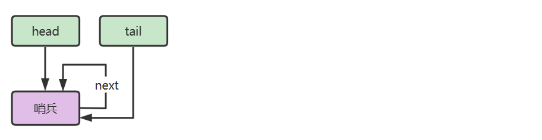
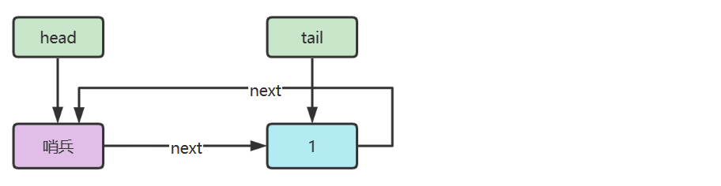
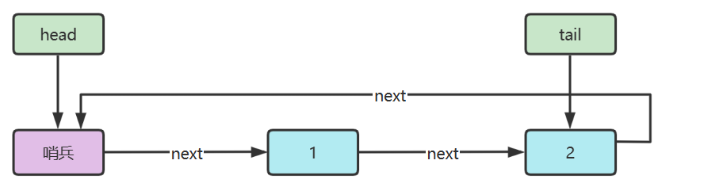
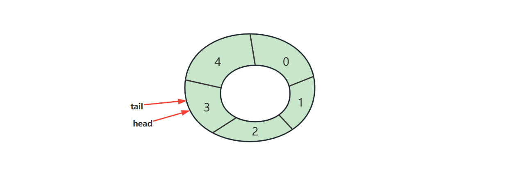
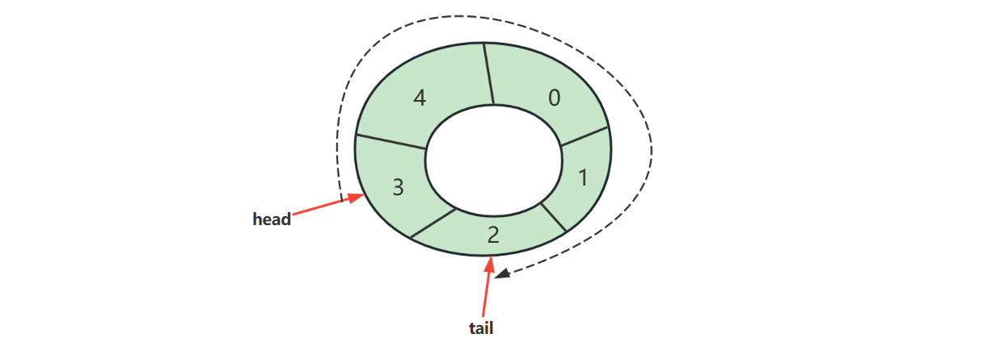

# 概述
计算机科学中，queue 是以顺序的方式维护的一组数据集合，在一端添加数据，从另一端移除数据。

习惯来说，添加的一端称为 **尾**，移除的一端称为 **头**，就如同生活中的排队买商品

> In computer science, a queue is a collection of entities that are maintained in a sequence and can be modified by  the addition of entities at one end of the sequence and the removal of  entities from the other end of the sequence

先定义一个简化的队列接口：

```java
public interface Queue<E> {

    /**
     * 向队列尾插入值
     * @param value 待插入值
     * @return 插入成功返回 true, 插入失败返回 false
     */
    boolean offer(E value);

    /**
     * 从对列头获取值, 并移除
     * @return 如果队列非空返回对头值, 否则返回 null
     */
    E poll();

    /**
     * 从对列头获取值, 不移除
     * @return 如果队列非空返回对头值, 否则返回 null
     */
    E peek();

    /**
     * 检查队列是否为空
     * @return 空返回 true, 否则返回 false
     */
    boolean isEmpty();

    /**
     * 检查队列是否已满
     * @return 满返回 true, 否则返回 false
     */
    boolean isFull();
}
```

# 链表实现

下面使用**單向環形帶哨兵鏈表**來實作隊列。

它同時具備三個特性：

- **單向**：每個節點只有一個 `next` 指針，用來指向下一個節點。
- **環形**：鏈表尾節點的 `next` 不會指向 `null`，而是會回頭指向**哨兵節點**，形成首尾相連的環狀結構。
- **帶哨兵**：鏈表中額外設置一個不存放有效資料的**哨兵節點**，用來統一操作邏輯，從而簡化空隊列、頭節點刪除與尾節點插入等處理。







代码

```java
/**
 * 基于单向环形链表实现
 *
 * @param <E> 队列中元素类型
 */
public class LinkedListQueue<E> implements Queue<E>, Iterable<E> {

  private static class Node<E> {
    E value;
    Node<E> next;

    Node(E value, Node<E> next) {
      this.value = value;
      this.next = next;
    }
  }

  // 哨兵節點，不存放真正資料
  private final Node<E> sentinel = new Node<>(null, null);

  // 空隊列時 tail == sentinel，否則 tail 指向最後一個有效節點
  private Node<E> tail = sentinel;

  // 當前元素個數
  private int size;

  // 隊列容量
  private int capacity = Integer.MAX_VALUE;

  {
    // 初始化成環
    sentinel.next = sentinel;
  }

  public LinkedListQueue() {
  }

  public LinkedListQueue(int capacity) {
    this.capacity = capacity;
  }

  @Override
  public boolean offer(E value) {
    if (isFull()) {
      return false;
    }
    Node<E> added = new Node<>(value, sentinel);
    tail.next = added;
    tail = added;
    size++;
    return true;
  }

  @Override
  public E poll() {
    if (isEmpty()) {
      return null;
    }

    Node<E> first = sentinel.next;
    sentinel.next = first.next;

    // 如果原本只有一個元素，刪除後要恢復空隊列狀態
    if (first == tail) {
      tail = sentinel;
    }

    size--;
    return first.value;
  }

  @Override
  public E peek() {
    if (isEmpty()) {
      return null;
    }
    return sentinel.next.value;
  }

  @Override
  public boolean isEmpty() {
    return tail == sentinel;
  }

  @Override
  public boolean isFull() {
    return size == capacity;
  }

  @Override
  public Iterator<E> iterator() {
    return new Iterator<E>() {
      Node<E> p = sentinel.next;

      @Override
      public boolean hasNext() {
        return p != sentinel;
      }

      @Override
      public E next() {
        E value = p.value;
        p = p.next;
        return value;
      }
    };
  }

  @Override
  public String toString() {
    StringJoiner sj = new StringJoiner(", ", "[", "]");
    for (E e : this) {
      sj.add(String.valueOf(e));
    }
    return sj.toString();
  }
}
```

測試

```java
public class TestLinkedListQueue {

    @Test
    public void offerLimit() {
        LinkedListQueue<Integer> queue =
                new LinkedListQueue<>(3);
        queue.offer(1);
        queue.offer(2);
        queue.offer(3);
        assertFalse(queue.offer(4));
        assertFalse(queue.offer(5));

        assertIterableEquals(List.of(1, 2, 3), queue);
    }

    @Test
    @DisplayName("测试删除只剩一个节点时")
    public void poll1() {
        LinkedListQueue<Integer> queue = new LinkedListQueue<>();
        queue.offer(1);
        assertEquals(1, queue.poll());
        assertTrue(queue.isEmpty());
    }

    @Test
    public void offer() {
        LinkedListQueue<Integer> queue = new LinkedListQueue<>();
        queue.offer(1);
        queue.offer(2);
        queue.offer(3);
        queue.offer(4);
        queue.offer(5);

        assertIterableEquals(List.of(1, 2, 3, 4, 5), queue);
    }

    @Test
    public void peek() {
        LinkedListQueue<Integer> queue = new LinkedListQueue<>();
        assertNull(queue.peek());
        queue.offer(1);
        assertEquals(1, queue.peek());
        queue.offer(2);
        assertEquals(1, queue.peek());
    }

    @Test
    public void poll() {
        LinkedListQueue<Integer> queue = new LinkedListQueue<>();
        queue.offer(1);
        queue.offer(2);
        queue.offer(3);
        queue.offer(4);
        queue.offer(5);

        assertEquals(1, queue.poll());
        assertEquals(2, queue.poll());
        assertEquals(3, queue.poll());
        assertEquals(4, queue.poll());
        assertEquals(5, queue.poll());
        assertNull(queue.poll());
    }
}
```

# 环形数组实现

**環形數組（circular array）** 本質上仍然是線性陣列，只是透過索引運算，讓最後一格的下一個位置回到第一格，看起來像首尾相連的環狀結構。

例如數組長度是 `5`：

```text
索引:  0   1   2   3   4
       └───────────────┘
            視覺上接回來
```

也就是說：

* 往後走到最後一格後
* 再走一步，不是越界
* 而是回到 `0`

所以它非常適合拿來做**隊列**。

## 好处


因為隊列的特性是：

* 從尾巴加入元素
* 從頭部取出元素

如果用普通數組實現隊列，當前面元素被取走後，後面的元素常常要往前搬移，效率不好。

但用環形數組時：

* `head` 只負責指向隊頭
* `tail` 只負責指向下一次插入的位置
* 不需要搬移元素，只要移動指針即可，因此效率更高。

這就是它的核心優勢。

## 下标计算

> 因為它是環形，所以索引移動要用取模 `%`。

```text
(目前位置 + 前進步數) % 數組長度
```

數組長度是 `5`，目前位置是 `3`，往前走 `2` 步：

```text
(3 + 2) % 5 = 0
```

所以新位置會回到索引 `0`。


## 判断空、满方法 1：只用 head、tail
### 判断空

> 當 `head == tail` 時，表示隊列為空。



#### 為什麼？

因為：

* `head` 指向隊頭
* `tail` 指向下一個可插入位置

如果兩者重合，代表目前沒有元素。

### 判断满

這裡是環形數組最容易搞混的地方。

如果只用 `head == tail` 來判斷空，
那當整個數組都放滿時，`tail` 繞一圈回來，也可能再次等於 `head`。

這樣就無法分辨：

* 到底是 **空**
* 還是 **滿**

#### 解法：故意浪費一格

為了解決「空與滿都可能 `head == tail`」的問題，最常見的做法是：

**永遠保留一個位置不存數據。**

也就是說：

* 數組長度如果是 `5`
* 最多只能存 `4` 個元素

這樣就能清楚區分空和滿。

#### 滿的判斷公式

當 `tail` 再往前走一步就會撞到 `head`，表示隊列已滿。

公式是：

```text
(tail + 1) % length == head
```

###### 為什麼？

因為尾指針的下一格如果就是頭指針，代表已經沒有可用空間了。
那一格必須保留，不能再放資料。

#### 用一個例子徹底理解

假設數組長度是 `5`，所以最多只能放 `4` 個元素。

初始狀態：

```text
[ _, _, _, _, _ ]
  ^
  head
  ^
  tail
```

此時：

```text
head = 0
tail = 0
```

因為 `head == tail`，所以是空數組。

###### 加入 a

把 `a` 放到 `tail` 指向的位置，然後 `tail` 往前走一格：

```text
[ a, _, _, _, _ ]
  ^
 head
     ^
    tail
```

###### 加入 b、c、d

```text
[ a, b, c, d, _ ]
  ^
 head
              ^
             tail
```

此時再加一個元素就不行了。

因為：

```text
(tail + 1) % 5 == head
(4 + 1) % 5 == 0
0 == head
```

成立，所以隊列已滿。



满之后的策略可以根据业务需求决定

例如我们要实现的环形 <mark>队列</mark>，满之后就拒绝入队

代码

```java
/**
 * 仅用 head, tail 判断空满, head, tail 即为索引值, tail 停下来的位置不存储元素
 *
 * @param <E> 队列中元素类型
 */
public class ArrayQueue1<E> implements Queue<E>, Iterable<E> {
  private final E[] array;
  private int head = 0;
  private int tail = 0;

  @SuppressWarnings("all")
  public ArrayQueue1(int capacity) {
    array = (E[]) new Object[capacity + 1];
  }

  @Override
  public boolean offer(E value) {
    if (isFull()) {
      return false;
    }
    array[tail] = value;
    tail = (tail + 1) % array.length;
    return true;
  }

  @Override
  public E poll() {
    if (isEmpty()) {
      return null;
    }
    E value = array[head];
    array[head] = null; // help GC
    head = (head + 1) % array.length;
    return value;
  }

  @Override
  public E peek() {
    if (isEmpty()) {
      return null;
    }
    return array[head];
  }

  @Override
  public boolean isEmpty() {
    return head == tail;
  }

  @Override
  public boolean isFull() {
    return (tail + 1) % array.length == head;
  }

  @Override
  public Iterator<E> iterator() {
    return new Iterator<E>() {
      int p = head;

      @Override
      public boolean hasNext() {
        return p != tail;
      }

      @Override
      public E next() {
        E value = array[p];
        p = (p + 1) % array.length;
        return value;
      }
    };
  }
}
```

測試：

```java
package com.practice.dsa.structures.queue;

import org.junit.jupiter.api.DisplayName;
import org.junit.jupiter.api.Test;

import java.util.List;

import static org.junit.jupiter.api.Assertions.*;

public class TestArrayQueue1 {
    @Test
    public void generic() {
        ArrayQueue1<String> queue =
                new ArrayQueue1<>(3);
        queue.offer("a");
        queue.offer("b");
        queue.offer("c");
        assertFalse(queue.offer("d"));
        assertFalse(queue.offer("e"));

        assertIterableEquals(List.of("a", "b", "c"), queue);
    }

    @Test
    public void offerLimit() {
        ArrayQueue1<Integer> queue =
                new ArrayQueue1<>(3);
        queue.offer(1);
        queue.offer(2);
        queue.offer(3);
        assertFalse(queue.offer(4));
        assertFalse(queue.offer(5));

        assertIterableEquals(List.of(1, 2, 3), queue);
    }

    @Test
    @DisplayName("测试删除只剩一个节点时")
    public void poll1() {
        ArrayQueue1<Integer> queue = new ArrayQueue1<>(5);
        queue.offer(1);
        assertEquals(1, queue.poll());
        assertTrue(queue.isEmpty());
    }

    @Test
    public void offer() {
        ArrayQueue1<Integer> queue = new ArrayQueue1<>(5);
        queue.offer(1);
        queue.offer(2);
        queue.offer(3);
        queue.offer(4);
        queue.offer(5);

        assertIterableEquals(List.of(1, 2, 3, 4, 5), queue);
    }

    @Test
    public void peek() {
        ArrayQueue1<Integer> queue = new ArrayQueue1<>(5);
        assertNull(queue.peek());
        queue.offer(1);
        assertEquals(1, queue.peek());
        queue.offer(2);
        assertEquals(1, queue.peek());
    }

    @Test
    public void poll() {
        ArrayQueue1<Integer> queue = new ArrayQueue1<>(5);
        queue.offer(1);
        queue.offer(2);
        queue.offer(3);

        assertEquals(1, queue.poll());
        assertEquals(2, queue.poll());
        assertEquals(3, queue.poll());
        assertNull(queue.poll());

        queue.offer(4);
        queue.offer(5);
        queue.offer(6);
        assertIterableEquals(List.of(4, 5, 6), queue);
    }
}
```

## 判斷空、滿方法 2：用 size 輔助判斷

除了用 `head`、`tail` 判斷空滿，也可以額外引入 `size` 來記錄隊列中的元素個數。

這樣的好處是：
- 不需要像方法 1 那樣刻意空出一格
- 數組容量可以全部使用

此時判斷方式為：
- 隊列為空：`size == 0`
- 隊列已滿：`size == array.length`

操作時要注意：
- 入隊成功後：`size++`
- 出隊成功後：`size--`

因此，這種方法的特點是：
- **優點**：不浪費空間
- **缺點**：需要額外維護 `size`

```java
/**
 * 用 size 辅助判断空满
 *
 * @param <E> 队列中元素类型
 */
public class ArrayQueue2<E> implements Queue<E>, Iterable<E> {

  private final E[] array;
  private int head = 0;
  private int tail = 0;
  private int size = 0; // 元素个数

  @SuppressWarnings("all")
  public ArrayQueue2(int capacity) {
    array = (E[]) new Object[capacity];
  }

  @Override
  public boolean offer(E value) {
    if (isFull()) {
      return false;
    }
    array[tail] = value;
    tail = (tail + 1) % array.length;
    size++;
    return true;
  }

  @Override
  public E poll() {
    if (isEmpty()) {
      return null;
    }
    E value = array[head];
    array[head] = null; // help GC
    head = (head + 1) % array.length;
    size--;
    return value;
  }

  @Override
  public E peek() {
    if (isEmpty()) {
      return null;
    }
    return array[head];
  }

  @Override
  public boolean isEmpty() {
    return size == 0;
  }

  @Override
  public boolean isFull() {
    return size == array.length;
  }

  @Override
  public Iterator<E> iterator() {
    return new Iterator<E>() {
      int p = head;
      int count = 0;

      @Override
      public boolean hasNext() {
        return count < size;
      }

      @Override
      public E next() {
        E value = array[p];
        p = (p + 1) % array.length;
        count++;
        return value;
      }
    };
  }
}
```

測試：

```java
public class TestArrayQueue2 {

    @Test
    public void generic() {
        ArrayQueue2<String> queue =
                new ArrayQueue2<>(3);
        queue.offer("a");
        queue.offer("b");
        queue.offer("c");
        assertFalse(queue.offer("d"));
        assertFalse(queue.offer("e"));

        assertIterableEquals(List.of("a", "b", "c"), queue);
    }

    @Test
    public void offerLimit() {
        ArrayQueue2<Integer> queue =
                new ArrayQueue2<>(3);
        queue.offer(1);
        queue.offer(2);
        queue.offer(3);
        assertFalse(queue.offer(4));
        assertFalse(queue.offer(5));

        assertIterableEquals(List.of(1, 2, 3), queue);
    }

    @Test
    @DisplayName("测试删除只剩一个节点时")
    public void poll1() {
        ArrayQueue2<Integer> queue = new ArrayQueue2<>(5);
        queue.offer(1);
        assertEquals(1, queue.poll());
        assertTrue(queue.isEmpty());
    }

    @Test
    public void offer() {
        ArrayQueue2<Integer> queue = new ArrayQueue2<>(5);
        queue.offer(1);
        queue.offer(2);
        queue.offer(3);
        queue.offer(4);
        queue.offer(5);

        assertIterableEquals(List.of(1, 2, 3, 4, 5), queue);
    }

    @Test
    public void peek() {
        ArrayQueue2<Integer> queue = new ArrayQueue2<>(5);
        assertNull(queue.peek());
        queue.offer(1);
        assertEquals(1, queue.peek());
        queue.offer(2);
        assertEquals(1, queue.peek());
    }

    @Test
    public void poll() {
        ArrayQueue2<Integer> queue = new ArrayQueue2<>(5);
        queue.offer(1);
        queue.offer(2);
        queue.offer(3);

        assertEquals(1, queue.poll());
        assertEquals(2, queue.poll());
        assertEquals(3, queue.poll());
        assertNull(queue.poll());

        queue.offer(4);
        queue.offer(5);
        queue.offer(6);
        assertIterableEquals(List.of(4, 5, 6), queue);
    }
}
```

## 判断空、满方法3

方法一中，head、tail 儲存的是 **數組中的實際索引**，每次移動都要立刻做取模運算：

```java
head = (head + 1) % array.length;
tail = (tail + 1) % array.length;
```

方法三改變了 head、tail 的意義：
- head、tail **不再表示數組索引**
- 它們改為表示 **邏輯位置**，也就是入隊、出隊的累積次數
- 真正要存取陣列時，再臨時計算對應索引

也就是說：
- 入隊一次，`tail++`
- 出隊一次，`head++`
- `head、tail` 只負責一直遞增
- 只有在操作陣列時，才用 `% array.length` 換算成真正索引

**核心公式：**

```text
真正索引 = 指標值 % array.length
```

```java
/**
 * 方法三：
 * head、tail 保存的是邏輯位置，不是數組索引
 * 真正使用數組時，再透過 % array.length 換算索引
 */
public class ArrayQueue3<E> implements Queue<E>, Iterable<E> {
  private final E[] array;
  int head = 0;
  int tail = 0;

  @SuppressWarnings("all")
  public ArrayQueue3(int capacity) {
    array = (E[]) new Object[capacity];
  }

  @Override
  public boolean offer(E value) {
    if (isFull()) {
      return false;
    }
    array[tail % array.length] = value;
    tail++;
    return true;
  }

  @Override
  public E poll() {
    if (isEmpty()) {
      return null;
    }
    E value = array[head % array.length];
    head++;
    return value;
  }

  @Override
  public E peek() {
    if (isEmpty()) {
      return null;
    }
    return array[head % array.length];
  }

  @Override
  public boolean isEmpty() {
    return head == tail;
  }

  @Override
  public boolean isFull() {
    return tail - head == array.length;
  }

  @Override
  public Iterator<E> iterator() {
    return new Iterator<E>() {
      int p = head;

      @Override
      public boolean hasNext() {
        return p != tail;
      }

      @Override
      public E next() {
        E value = array[p % array.length];
        p++;
        return value;
      }
    };
  }
}
```

測試用例：

```java
public class TestArrayQueue3 {
    @Test
    public void generic() {
        ArrayQueue3<String> queue =
                new ArrayQueue3<>(4);
        queue.offer("a");
        queue.offer("b");
        queue.offer("c");
        queue.offer("d");
        assertFalse(queue.offer("e"));

        assertIterableEquals(List.of("a", "b", "c", "d"), queue);
    }

    @Test
    public void offerLimit() {
        ArrayQueue3<Integer> queue =
                new ArrayQueue3<>(4);
        queue.offer(1);
        queue.offer(2);
        queue.offer(3);
        queue.offer(4);
        assertFalse(queue.offer(5));

        assertIterableEquals(List.of(1, 2, 3, 4), queue);
    }

    @Test
    @DisplayName("测试删除只剩一个节点时")
    public void poll1() {
        ArrayQueue3<Integer> queue = new ArrayQueue3<>(8);
        queue.offer(1);
        assertEquals(1, queue.poll());
        assertTrue(queue.isEmpty());
    }

    @Test
    public void offer() {
        ArrayQueue3<Integer> queue = new ArrayQueue3<>(8);
        queue.offer(1);
        queue.offer(2);
        queue.offer(3);
        queue.offer(4);
        queue.offer(5);

        assertIterableEquals(List.of(1, 2, 3, 4, 5), queue);
    }

    @Test
    public void peek() {
        ArrayQueue3<Integer> queue = new ArrayQueue3<>(8);
        assertNull(queue.peek());
        queue.offer(1);
        assertEquals(1, queue.peek());
        queue.offer(2);
        assertEquals(1, queue.peek());
    }

    @Test
    public void poll() {
        ArrayQueue3<Integer> queue = new ArrayQueue3<>(8);
        queue.offer(1);
        queue.offer(2);
        queue.offer(3);

        assertEquals(1, queue.poll());
        assertEquals(2, queue.poll());
        assertEquals(3, queue.poll());
        assertNull(queue.poll());

        queue.offer(4);
        queue.offer(5);
        queue.offer(6);
        assertIterableEquals(List.of(4, 5, 6), queue);
    }
}
```

### 邊界問題：int 溢位

`head、tail` 是 `int`，如果一直遞增，最終會超過 `int` 最大值：

```text
2147483647
```

超過後，Java 的 int 會從正數變成負數。

這時如果還直接寫：

```java
tail % array.length
```

就可能得到負數索引，進而出現陣列越界。

例如：

```java
    @Test
public void boundary() {
    ArrayQueue3<Integer> queue = new ArrayQueue3<>(10);
    // 2147483647 正整数的最大值 int
    queue.head = 2147483640;
    queue.tail = queue.head;
  
    for (int i = 0; i < 16; i++) {
      System.out.println(queue.tail + " " + queue.tail % 10);
      queue.offer(i);
    }
}
```

會出現 `java.lang.ArrayIndexOutOfBoundsException: Index -8 out of bounds for length 10` 異常

> **為什麼會出現負數(-8)索引？**
> - 因為 tail 溢位後變成負數，負數再去做 %，結果仍可能是負數。
> - 這個負數當成陣列索引，就會出錯。

##### 解法：把 int 當成無符號整數來看

C 語言裡面有一個 `unsigend int`，它是無符號的 int 類型，它的存儲範圍為 $0 ~ 2^{32} -1$，當它自增到最大值之後又會回到 `0` 開始，所以不管它再怎麼自增，都是 `0` 和正整數，所以計算出來的索引總會是合法的。

`Java` 沒有 `unsigned int`，但可以用：

```java
Integer.toUnsignedLong(x)
```

把 `int` 轉成對應的無符號 `long` 值。

這樣就算 `head、tail` 在位元層面已經溢位，只要把它們當作無符號值來看，仍然可以得到正確索引。

```java
@Test
public void boundary() {
    ArrayQueue3<Integer> queue = new ArrayQueue3<>(10);
    // 2147483647 正整数的最大值 int
    queue.head = 2147483640;
    queue.tail = queue.head;

    for (int i = 0; i < 10; i++) {
        System.out.println(Integer.toUnsignedLong(queue.tail) + " " + Integer.toUnsignedLong(queue.tail) % 10);
        queue.tail++;
    }
}
```

**換算方式：**

```java
(int) (Integer.toUnsignedLong(pointer) % array.length)
```

```java
/**
 * 方法三：
 * head、tail 保存邏輯位置，真正使用陣列時再換算索引
 * 為了避免 int 溢位後出現負數索引，換算時使用無符號方式處理
 */
public class ArrayQueue3<E> implements Queue<E>, Iterable<E> {
  private final E[] array;
  int head = 0;
  int tail = 0;

  @SuppressWarnings("all")
  public ArrayQueue3(int capacity) {
    array = (E[]) new Object[capacity];
  }

  @Override
  public boolean offer(E value) {
    if (isFull()) {
      return false;
    }
    array[(int) (Integer.toUnsignedLong(tail) % array.length)] = value;
    tail++;
    return true;
  }

  @Override
  public E poll() {
    if (isEmpty()) {
      return null;
    }
    int index = (int) (Integer.toUnsignedLong(head) % array.length);
    E value = array[index];
    head++;
    return value;
  }

  @Override
  public E peek() {
    if (isEmpty()) {
      return null;
    }
    return array[(int) (Integer.toUnsignedLong(head) % array.length)];
  }

  @Override
  public boolean isEmpty() {
    return head == tail;
  }

  @Override
  public boolean isFull() {
    return tail - head == array.length;
  }

  @Override
  public Iterator<E> iterator() {
    return new Iterator<E>() {
      int p = head;

      @Override
      public boolean hasNext() {
        return p != tail;
      }

      @Override
      public E next() {
        E value = array[(int) (Integer.toUnsignedLong(p) % array.length)];
        p++;
        return value;
      }
    };
  }
}
```

```java
@Test
public void boundary() {
    ArrayQueue3<Integer> queue = new ArrayQueue3<>(10);
    // 2147483647 正整数的最大值 int
    queue.head = 2147483640;
    queue.tail = queue.head;

    for (int i = 0; i < 10; i++) {
        queue.offer(i);
    }

    for (Integer value : queue) {
        System.out.println(value);
    }
}
```

#### 額外補充：為什麼 `tail` 溢位後，`isFull()` 仍然可能判斷正確？

在方法 3 中，判滿條件是：

```java
@Override
public boolean isFull() {
    return tail - head == array.length;
}
```

看到這裡，可能會有一個疑問：

如果 `tail` 一直自增，超過 `int` 最大值後就會變成負數，
那麼這時候再做：

```java
tail - head
```

不是會變成「負數減正數」嗎？
這樣會不會導致判滿失敗？

##### 先看例子

```java
@Test
public void test() {
    int head = 2147483640;
    int tail = 2147483647; // int 最大值
    tail += 5;

    System.out.println(tail);        // -2147483644
    System.out.println(tail - head); // 12
}
```

執行後會發現：

* `tail` 的確溢位變成了負數
* 但 `tail - head` 的結果仍然是 `12`

也就是說，**雖然單看 `tail` 已經變成負數，但兩個指標的差值仍然是對的。**

##### 為什麼會這樣？

這裡不要只看 `tail` 是正數還是負數，而要看：

```java
tail - head
```

所表示的**距離**。

只要滿足下面這個前提：

* `head`、`tail` 始終按照隊列規則遞增
* `tail - head` 始終表示真實元素個數
* 元素個數不超過 `array.length`

那麼即使 `tail` 溢位，這個判斷仍然可以成立：

```java
return tail - head == array.length;
```

### 優化：用位運算取代取模運算

在方法 3 中，我們原本是這樣計算陣列索引的：

```java
index = pointer % array.length;
```

如果 `array.length` 剛好是 **2 的 n 次方**，那麼這個取模運算可以改成更快的位運算：

```java
index = pointer & (array.length - 1);
```

#### 先看規律

假設除數是 `8`：

```text
100 / 8 = 12 ... 4
100 -> 0110 0100
  8 -> 0000 1000
  4 -> 0000 0100
```

假設除數也是 `8`：

```text
111 / 8 = 13 ... 7
111 -> 0110 1111
  8 -> 0000 1000
  7 -> 0000 0111
```

假設除數是 `16`：

```text
111 / 16 = 6 ... 15
111 -> 0110 1111
 16 -> 0001 0000
 15 -> 0000 1111
```

可以看出：

* 除數是 `8 = 2³`，餘數就是二進位的**後 3 位**
* 除數是 `16 = 2⁴`，餘數就是二進位的**後 4 位**

#### 核心規律

當除數是 **2 的 n 次方** 時：

```text
x % 2ⁿ = x 的二進位後 n 位
```

而要取出「後 n 位」，只要把 `x` 和 `2ⁿ - 1` 做按位與運算即可：

```text
x % 2ⁿ = x & (2ⁿ - 1)
```

#### 例子

##### 例 1：110 % 8

因為：

* `8 = 2³`
* 所以要取 `110` 的二進位後 3 位

```text
110 -> 0110 1110
  7 -> 0000 0111   // 7 = 8 - 1
```

做按位與：

```text
110 & 7 = 6

    0110 1110
&   0000 0111
-------------
    0000 0110
```

所以：

```text
110 % 8 = 6
110 & 7 = 6
```

##### 例 2：110 % 16

因為：

* `16 = 2⁴`
* 所以要取後 4 位
* `16 - 1 = 15`

```text
110 -> 0110 1110
 15 -> 0000 1111
```

做按位與：

```text
110 & 15 = 14

    0110 1110
&   0000 1111
-------------
    0000 1110
```

所以：

```text
110 % 16 = 14
110 & 15 = 14
```

```java
/**
 * 仅用 head, tail 判断空满, head, tail 需要换算成索引值
 *
 * @param <E> 队列中元素类型
 */
public class ArrayQueue3<E> implements Queue<E>, Iterable<E> {

    /*
        求模运算：
        - 如果除数是 2 的 n 次方
        - 那么被除数的后 n 位即为余数 (模)
        - 求被除数的后 n 位方法： 与 2^n-1 按位与
     */

    private final E[] array;
    int head = 0;
    int tail = 0;

    @SuppressWarnings("all")
    public ArrayQueue3(int capacity) {
      array = (E[]) new Object[capacity];
    }
  
    @Override
    public boolean offer(E value) {
        if (isFull()) {
            return false;
        }
        array[tail &  (array.length - 1)] = value;
        tail++;
        return true;
    }

    @Override
    public E poll() {
      if (isEmpty()) {
        return null;
      }
      E value = array[head &  (array.length - 1)];
      head++;
      return value;
    }

    @Override
    public E peek() {
        if (isEmpty()) {
            return null;
        }
        return array[head & (array.length - 1)];
    }

    @Override
    public boolean isEmpty() {
        return head == tail;
    }

    @Override
    public boolean isFull() {
        return tail - head == array.length;
    }

    @Override
    public Iterator<E> iterator() {
        return new Iterator<E>() {
            int p = head;

            @Override
            public boolean hasNext() {
                return p != tail;
            }

            @Override
            public E next() {
                E value = array[p & (array.length - 1)];
                p++;
                return value;
            }
        };
    }
}
```

#### 當 capacity 不是 2 的 n 次方時怎麼辦？

在「用位運算取代取模運算」這個優化中，我們用了：

```java
array[head & (array.length - 1)];
```

但這個寫法有一個前提：

> **`array.length` 必須是 `2` 的 `n` 次方。**

如果使用者傳進來的 `capacity` 不是 `2` 的 `n` 次方，就不能直接使用這個優化。
此時通常有兩種處理方式：

1. **直接拋出異常**
2. **自動調整成最接近且大於等於它的 `2` 的 `n` 次方**

##### 方案一：直接拋出異常

###### 如何判斷一個數是不是 2 的 n 次方？

可以利用這個規則：

```text
如果 x 是 2 的 n 次方，則 x & (x - 1) == 0
```

####### 為什麼？

因為 `2` 的 `n` 次方在二進位中只有一個 `1`。

例如：

```text
8  = 0000 1000
7  = 0000 0111

8 & 7 = 0
```

```text
16 = 0001 0000
15 = 0000 1111

16 & 15 = 0
```

如果不是 `2` 的 `n` 次方，就不會成立：

```text
14 = 0000 1110
13 = 0000 1101

14 & 13 = 0000 1100
```

所以 `14` 不是 `2` 的 `n` 次方。

**寫法**

```java
@SuppressWarnings("all")
public ArrayQueue3(int capacity) {
    if (capacity <= 0 || (capacity & (capacity - 1)) != 0) {
        throw new IllegalArgumentException("capacity 必須是 2 的冪次方");
    }

    array = (E[]) new Object[capacity];
}
```

**這種方案的特點**

* 好處：邏輯簡單，實作直接
* 缺點：使用者必須自己保證傳入合法容量

##### 方案二：自動調整成 2 的 n 次方

如果不想要求使用者一定傳入 `2` 的 `n` 次方，也可以在構造器中自動調整容量。

例如：

```text
capacity = 30
```

`30` 不是 `2` 的 `n` 次方，但它介於：

```text
2^4 = 16
2^5 = 32
```

之間，所以我們可以把實際容量調整成 `32`。

也就是說：

> **找到最小的、且大於等於 `capacity` 的 `2` 的 `n` 次方。**

###### 用對數的思路理解

如果要知道 `30` 介於哪兩個 `2` 的冪次方之間，可以先求：

```text
log2(30)
```

結果會介於 `4` 和 `5` 之間。
這代表：

```text
2^4 < 30 < 2^5
```

所以只要取整數部分再加 `1`，就能得到目標次方：

```text
(int)log2(30) + 1 = 5
```

最後再算：

```text
2^5 = 32
```

###### Java 中如何計算 log2(x)？

`Math` 沒有直接提供 `log2`，所以通常要用換底公式：

```text
log2(x) = log10(x) / log10(2)
```

程式碼如下：

```java
int capacity = 30;
int n = (int) (Math.log10(capacity) / Math.log10(2)) + 1;
int actualCapacity = 1 << n;
```

此時：

```text
actualCapacity = 32
```

###### 為什麼不能直接對 capacity 求對數？

因為如果 `capacity` 本身已經是 `2` 的 `n` 次方，就會多算一級。

例如：

```java
int capacity = 32;
int n = (int) (Math.log10(capacity) / Math.log10(2)) + 1;
System.out.println(n);        // 6
System.out.println(1 << n);   // 64
```

但 `32` 本來就已經合法了，不應該再擴成 `64`。

所以這種寫法要改成：

```java
int n = (int) (Math.log10(capacity - 1) / Math.log10(2)) + 1;
int actualCapacity = 1 << n;
```

這樣當 `capacity = 32` 時，仍然會得到 `32`。

###### 範例

**`capacity = 30`**

```java
int capacity = 30;
int n = (int) (Math.log10(capacity - 1) / Math.log10(2)) + 1;
System.out.println(n);          // 5
System.out.println(1 << n);     // 32
```

**`capacity = 32`**

```java
int capacity = 32;
int n = (int) (Math.log10(capacity - 1) / Math.log10(2)) + 1;
System.out.println(n);          // 5
System.out.println(1 << n);     // 32
```

# 102. 二叉樹的層序遍歷

題目連結：
[102. 二叉樹的層序遍歷](https://leetcode.cn/problems/binary-tree-level-order-traversal/description/)

## 一、什麼是二叉樹？

**二叉樹** 指的是：
每個節點最多只能有 **2 個子節點**，分別是：

* 左子節點
* 右子節點

## 二、什麼是層序遍歷？

**層序遍歷** 就是按照「一層一層」的順序來遍歷節點：

* 先遍歷第 1 層
* 再遍歷第 2 層
* 再遍歷第 3 層
* 依此類推

例如下面這棵樹：

```text
      1
     / \
    2   3
   / \ / \
  4  5 6  7
```

層序遍歷的結果就是：

```text
第一層：1
第二層：2, 3
第三層：4, 5, 6, 7
```

最後輸出：

```text
[[1], [2,3], [4,5,6,7]]
```

## 三、解題核心思路

層序遍歷最適合使用 **隊列（Queue）** 來做。

原因是：

* 先進入隊列的節點，會先被處理
* 這正好符合「由上到下、由左到右」的遍歷順序

基本做法是：

1. 先把根節點 `root` 放入隊列
2. 每次從隊列中取出當前層的節點
3. 取出節點後，再把它的左、右子節點加入隊列
4. 重複這個過程，直到隊列為空

## 四、遍歷過程示意

對於這棵樹：

```text
      1
     / \
    2   3
   / \ / \
  4  5 6  7
```

### 第一步：先把根節點加入隊列

```text
[1]
```

### 第二步：處理第一層

取出隊列頭節點 `1`：

```text
[]
```

檢查 `1` 是否有左右子節點：

* 有左子節點 `2`
* 有右子節點 `3`

把它們加入隊列：

```text
[2, 3]
```

此時第一層遍歷完成。

### 第三步：處理第二層

先取出 `2`：

```text
[3]
```

`2` 有左右子節點 `4`、`5`，加入隊列：

```text
[3, 4, 5]
```

再取出 `3`：

```text
[4, 5]
```

`3` 有左右子節點 `6`、`7`，加入隊列：

```text
[4, 5, 6, 7]
```

此時第二層遍歷完成。

### 第四步：處理第三層

依次取出：

* `4`
* `5`
* `6`
* `7`

因為這些節點都沒有子節點，所以不需要再加入新節點。

隊列最後變成空：

```text
[]
```

遍歷結束。

## 五、代碼實現

```java
public class Leetcode102 {
    public static void main(String[] args) {
        TreeNode root = new TreeNode(
                new TreeNode(
                        new TreeNode(4),
                        2,
                        new TreeNode(5)
                ),
                1,
                new TreeNode(
                        new TreeNode(6),
                        3,
                        new TreeNode(7)
                )
        );
        // 使用之前以單向環形帶哨兵鏈表實現的隊列
        LinkedListQueue<TreeNode> queue = new LinkedListQueue<>();
        queue.offer(root);

        while (!queue.isEmpty()) {
            TreeNode treeNode = queue.poll();
            System.out.print(treeNode + " ");
            if (treeNode.left != null) {
                queue.offer(treeNode.left);
            }
            if (treeNode.right != null) {
                queue.offer(treeNode.right);
            }
        }
    }
}
```

## 六、如何實現「按層輸出」的效果

先看這棵二叉樹：

```text
      1
     / \
    2   3
   / \ / \
  4  5 6  7
```

前面的程式碼雖然已經完成了層序遍歷，但輸出的結果會是：

```text
1 2 3 4 5 6 7
```

也就是所有節點都被輸出在同一行。

但我們真正想要的是「分層輸出」的效果，也就是：

```text
1
2 3
4 5 6 7
```

### 1. 問題的本質

要做到分層輸出，關鍵不是只有「按照順序遍歷節點」而已，
而是要知道：

> **每一層到底有多少個節點**

只要知道當前層有幾個節點，我們就能：

1. 用內層循環把這一層的節點全部處理完
2. 處理完之後輸出一個換行
3. 接著再處理下一層

### 2. 核心思路

我們可以保留原本的外層 `while` 循環，然後再加上一層 `for` 循環。

* 外層循環：控制整體遍歷過程，只要隊列不為空就繼續
* 內層循環：專門處理「當前層」的所有節點

這樣就能做到：

* 第一層處理完，換行
* 第二層處理完，換行
* 第三層處理完，換行
* 依此類推

### 3. 內層循環要執行幾次？

內層循環的次數，其實就是：

> **當前層的節點數量**

例如這棵樹：

* 第一層有 `1` 個節點，所以內層循環 `1` 次
* 第二層有 `2` 個節點，所以內層循環 `2` 次
* 第三層有 `4` 個節點，所以內層循環 `4` 次

也就是說：

* 每次進入內層循環之前
* 我們必須先知道「這一層有幾個節點」

### 4. 那要怎麼知道下一層有幾個節點？

做法很簡單：

當我們遍歷當前層節點時，只要去統計它們一共有多少個孩子節點，就能知道下一層的節點數量。

#### 例如：

##### 第一層

只有節點 `1`

* `1` 有兩個孩子：`2`、`3`

所以：

* 當前層節點數 = `1`
* 下一層節點數 = `2`

##### 第二層

有節點 `2`、`3`

* `2` 有兩個孩子：`4`、`5`
* `3` 有兩個孩子：`6`、`7`

所以：

* 當前層節點數 = `2`
* 下一層節點數 = `4`

##### 第三層

有節點 `4`、`5`、`6`、`7`

它們都沒有孩子節點，所以：

* 當前層節點數 = `4`
* 下一層節點數 = `0`

此時遍歷結束。

### 5. 變數設計

我們可以用兩個變數來記錄節點數：

* `currentLevelSize`：當前層節點數
* `nextLevelSize`：下一層節點數

#### 初始情況

一開始隊列中只有根節點 `root`，所以：

```java
int currentLevelSize = 1;
```

表示第一層有 1 個節點。

#### 每一輪遍歷時

先把 `nextLevelSize` 設為 `0`，接著遍歷當前層的所有節點：

* 每遇到一個左孩子，`nextLevelSize++`
* 每遇到一個右孩子，`nextLevelSize++`

當前層處理完之後：

* 換行
* 把 `nextLevelSize` 指派給 `currentLevelSize`

表示下一輪要處理的層，就是剛剛統計出來的下一層。

### 6. 代碼實現

```java
public class Leetcode102 {
    public static void main(String[] args) {
        TreeNode root = new TreeNode(
                new TreeNode(
                        new TreeNode(4),
                        2,
                        new TreeNode(5)
                ),
                1,
                new TreeNode(
                        new TreeNode(6),
                        3,
                        new TreeNode(7)
                )
        );

        // 使用之前以單向環形帶哨兵鏈表實現的隊列
        LinkedListQueue<TreeNode> queue = new LinkedListQueue<>();
        queue.offer(root);

        int currentLevelSize = 1; // 當前層節點數，一開始只有 root

        while (!queue.isEmpty()) {
            int nextLevelSize = 0; // 下一層節點數

            for (int i = 0; i < currentLevelSize; i++) {
                TreeNode treeNode = queue.poll();
                System.out.print(treeNode.val + " ");

                if (treeNode.left != null) {
                    queue.offer(treeNode.left);
                    nextLevelSize++;
                }

                if (treeNode.right != null) {
                    queue.offer(treeNode.right);
                    nextLevelSize++;
                }
            }

            System.out.println(); // 當前層處理完後換行
            currentLevelSize = nextLevelSize; // 更新為下一層節點數
        }
    }
}
```

### 7. 執行結果

```text
1
2 3
4 5 6 7
```

這樣就成功實現了「按層輸出」的效果。

### 8. 這段程式碼的執行流程

#### 第一次 while 循環

* `currentLevelSize = 1`
* 表示第一層有 1 個節點
* 內層 `for` 跑 1 次，處理節點 `1`
* 發現它有兩個孩子：`2`、`3`
* 所以 `nextLevelSize = 2`
* 換行後，令 `currentLevelSize = 2`

#### 第二次 while 循環

* `currentLevelSize = 2`
* 表示第二層有 2 個節點
* 內層 `for` 跑 2 次，處理節點 `2`、`3`
* 一共找到四個孩子：`4`、`5`、`6`、`7`
* 所以 `nextLevelSize = 4`
* 換行後，令 `currentLevelSize = 4`

#### 第三次 while 循環

* `currentLevelSize = 4`
* 表示第三層有 4 個節點
* 內層 `for` 跑 4 次，處理節點 `4`、`5`、`6`、`7`
* 它們都沒有孩子
* 所以 `nextLevelSize = 0`
* 換行後，令 `currentLevelSize = 0`

此時隊列為空，遍歷結束。

## 七、如何滿足 LeetCode 題目的要求

前面的做法，是把層序遍歷的結果直接輸出到控制台，例如：

```text
1
2 3
4 5 6 7
```

但 **LeetCode 102** 真正要求的不是「印出來」，而是要把每一層的節點值收集起來，最後回傳一個二維 `List`。

也就是要得到這樣的結果：

```text
[
    [1],
    [2, 3],
    [4, 5, 6, 7]
]
```

### 1. 題目要求的本質

這題的重點不是單純完成層序遍歷，而是：

> **在層序遍歷的過程中，將每一層的節點值分別保存起來。**

因此我們不能只是遍歷節點後直接 `print`，而是要：

1. 每處理完一層，就把這一層的節點值存進一個 `List<Integer>`
2. 再把這個 `List<Integer>` 加入最終結果 `List<List<Integer>>`

### 2. 整體思路

整體流程可以分成兩層：

#### 外層結果 `result`

用來保存所有層的結果：

```java
List<List<Integer>> result = new ArrayList<>();
```

它的作用是：

* 第 1 個 `List` 保存第 1 層
* 第 2 個 `List` 保存第 2 層
* 第 3 個 `List` 保存第 3 層
* 依此類推

#### 每一層結果 `level`

每次開始處理某一層時，都建立一個新的 `level`：

```java
List<Integer> level = new ArrayList<>();
```

這個 `level` 專門用來保存「當前層」的節點值。

例如：

* 第一輪 while：`level = [1]`
* 第二輪 while：`level = [2, 3]`
* 第三輪 while：`level = [4, 5, 6, 7]`

處理完當前層後，再把它加入 `result`：

```java
result.add(level);
```

### 3. 為什麼還要記錄每一層的節點數？

因為題目要求「分層收集」，所以我們必須知道：

> 這一輪到底要處理幾個節點，才能剛好處理完一整層

這裡使用兩個變數：

* `currentLevelSize`：當前層節點數
* `nextLevelSize`：下一層節點數

#### 做法是：

* 先根據 `currentLevelSize`，把當前層全部處理完
* 在處理過程中，順便統計下一層有多少個節點
* 當前層處理完後，把 `nextLevelSize` 指派給 `currentLevelSize`

這樣下一輪就能接著處理下一層。

### 4. 代碼實現

```java
public class Leetcode102 {
    public static void main(String[] args) {
        TreeNode root = new TreeNode(
                new TreeNode(
                        new TreeNode(4),
                        2,
                        new TreeNode(5)
                ),
                1,
                new TreeNode(
                        new TreeNode(6),
                        3,
                        new TreeNode(7)
                )
        );

        List<List<Integer>> lists = new Leetcode102().levelOrder(root);

        for (List<Integer> list : lists) {
            System.out.println(list);
        }
    }

    public List<List<Integer>> levelOrder(TreeNode root) {
        List<List<Integer>> result = new ArrayList<>();

        if (root == null) {
            return result;
        }

        LinkedListQueue<TreeNode> queue = new LinkedListQueue<>();
        queue.offer(root);

        int currentLevelSize = 1; // 當前層節點數

        while (!queue.isEmpty()) {
            List<Integer> level = new ArrayList<>(); // 保存當前層結果
            int nextLevelSize = 0; // 下一層節點數

            for (int i = 0; i < currentLevelSize; i++) {
                TreeNode n = queue.poll();
                level.add(n.val);

                if (n.left != null) {
                    queue.offer(n.left);
                    nextLevelSize++;
                }

                if (n.right != null) {
                    queue.offer(n.right);
                    nextLevelSize++;
                }
            }

            result.add(level);
            currentLevelSize = nextLevelSize;
        }

        return result;
    }
}
```