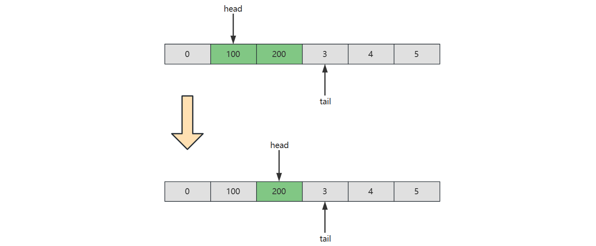
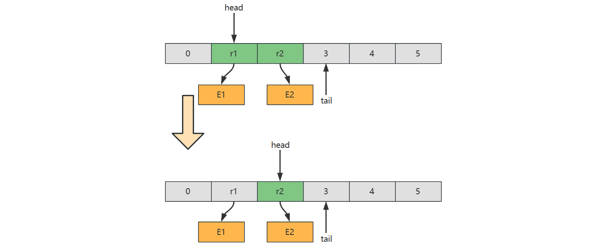

# 概述

双端队列、队列、栈对比

|                | 定义                               | 特点                   |
| -------------- | ---------------------------------- | ---------------------- |
| 队列           | 一端删除（头）另一端添加（尾）     | First In First Out     |
| 栈             | 一端删除和添加（顶）               | Last In First Out      |
| 双端队列       | 两端都可以删除、添加               |                        |
| 优先级队列     |                                    | 优先级高者先出队       |
| 延时队列       |                                    | 根据延时时间确定优先级 |
| 并发非阻塞队列 | 队列空或满时不阻塞                 |                        |
| 并发阻塞队列   | 队列空时删除阻塞、队列满时添加阻塞 |                        |

# 接口定义

```java
/**
 * 双端队列接口
 * @param <E> 队列中元素类型
 */
public interface Deque<E> {

    boolean offerFirst(E e);

    boolean offerLast(E e);

    E pollFirst();

    E pollLast();

    E peekFirst();

    E peekLast();

    boolean isEmpty();

    boolean isFull();
}
```

# 鏈表實現雙端隊列

> 基於**雙向環形鏈表**實現雙端隊列（Deque）

## 先搞懂兩個名詞

### 1. 雙端

「雙端」指的是：
隊列的**兩端都可以操作**。

也就是說，可以：

* 從頭部插入
* 從尾部插入
* 從頭部刪除
* 從尾部刪除

這種結構就叫做**雙端隊列（Deque, Double Ended Queue）**。

### 2. 雙向

「雙向」指的是鏈表中的每個節點都有兩個指標：

* `prev`：指向前一個節點
* `next`：指向下一個節點

這種鏈表叫做**雙向鏈表**。

## 為什麼雙端隊列要用雙向鏈表？

我們先回顧一下：
之前實現普通隊列時，使用的是**單向鏈表**。

原因是普通隊列只需要：

* **尾部新增元素**
* **頭部刪除元素**

這樣的情況下，用單向鏈表就夠了。

## 單向鏈表為什麼能實現普通隊列？

因為普通隊列只需要刪除**頭部節點**。

而在鏈表中，要刪除某個節點，通常需要知道它的**前一個節點**。

那頭部節點的前一個節點是誰？

答案是：**哨兵節點（sentinel）**

也就是說：

* 第一個有效節點的前面固定就是 `sentinel`
* 所以刪除頭部時，不需要額外找前驅節點
* 直接讓 `sentinel.next` 指向下一個節點即可

因此，普通隊列用**單向鏈表 + 哨兵節點**就能高效實現。

## 為什麼單向鏈表不適合雙端隊列？

雙端隊列除了可以刪除頭部，還必須可以刪除**尾部**。

但如果是單向鏈表，尾部節點只有 `next`，沒有 `prev`。
當你想刪除尾部時，會遇到一個問題：

> 你不知道尾部節點的上一個節點是誰。

那怎麼辦？

只能從頭開始一路遍歷，找到尾部的前一個節點。

這樣刪除尾部的時間複雜度就會變成：

* **O(n)**

效率很差。

## 所以要改用雙向鏈表

如果使用雙向鏈表，每個節點都知道自己的前一個節點：

* 刪除頭部很方便
* 刪除尾部也很方便

這樣雙端隊列的兩端操作都可以做到高效。

## 為什麼還要用「環形」？

這裡採用的是**雙向環形鏈表**。

### 好處是：

只需要**一個哨兵節點**，就能同時處理頭尾邊界情況。

例如：

* 空隊列時：`sentinel.next == sentinel`，`sentinel.prev == sentinel`
* 第一個元素插入後，哨兵前後都能正確連接
* 頭尾操作不需要特別判斷 `null`

這樣程式碼會更整齊，也更容易維護。

## 結構示意

假設目前雙端隊列中有三個元素：

```text
sentinel <-> 1 <-> 2 <-> 3 <-> sentinel
```

這是一個環，所以：

* `sentinel.next` 指向第一個節點 `1`
* `sentinel.prev` 指向最後一個節點 `3`

因此：

* 從頭部插入、刪除：操作 `sentinel.next`
* 從尾部插入、刪除：操作 `sentinel.prev`

都非常方便。

## 核心操作思路

### 1. 頭部插入 offerFirst

在 `sentinel` 和原本的第一個節點之間插入新節點。

#### 原本：

```text
sentinel <-> b
```

#### 插入新節點 added 後：

```text
sentinel <-> added <-> b
```

#### 做法：

* `a = sentinel`
* `b = sentinel.next`
* 新建節點 `added(a, value, b)`
* 更新：

    * `a.next = added`
    * `b.prev = added`

### 2. 尾部插入 offerLast

在原本最後一個節點和 `sentinel` 之間插入新節點。

#### 原本：

```text
a <-> sentinel
```

#### 插入後：

```text
a <-> added <-> sentinel
```

#### 做法：

* `a = sentinel.prev`
* `b = sentinel`
* 新建節點 `added(a, value, b)`
* 更新：

    * `a.next = added`
    * `b.prev = added`

### 3. 頭部刪除 pollFirst

刪除 `sentinel.next` 指向的第一個有效節點。

#### 原本：

```text
sentinel <-> removed <-> b
```

#### 刪除後：

```text
sentinel <-> b
```

#### 做法：

* `a = sentinel`
* `removed = sentinel.next`
* `b = removed.next`
* 更新：

    * `a.next = b`
    * `b.prev = a`

### 4. 尾部刪除 pollLast

刪除 `sentinel.prev` 指向的最後一個有效節點。

#### 原本：

```text
a <-> removed <-> sentinel
```

#### 刪除後：

```text
a <-> sentinel
```

#### 做法：

* `b = sentinel`
* `removed = sentinel.prev`
* `a = removed.prev`
* 更新：

    * `a.next = b`
    * `b.prev = a`

## 程式碼實現

```java
/**
 * 基於雙向環形鏈表實現雙端隊列
 *
 * @param <E> 元素型別
 */
public class LinkedListDeque<E> implements Deque<E>, Iterable<E> {

    static class Node<E> {
        Node<E> prev;
        E value;
        Node<E> next;

        public Node(Node<E> prev, E value, Node<E> next) {
            this.prev = prev;
            this.value = value;
            this.next = next;
        }
    }

    private int capacity;
    private int size;
    private final Node<E> sentinel = new Node<>(null, null, null);

    public LinkedListDeque(int capacity) {
        this.capacity = capacity;
        sentinel.next = sentinel;
        sentinel.prev = sentinel;
    }

    @Override
    public boolean offerFirst(E e) {
        if (isFull()) {
            return false;
        }

        Node<E> a = sentinel;
        Node<E> b = sentinel.next;
        Node<E> added = new Node<>(a, e, b);

        a.next = added;
        b.prev = added;
        size++;
        return true;
    }

    @Override
    public boolean offerLast(E e) {
        if (isFull()) {
            return false;
        }

        Node<E> a = sentinel.prev;
        Node<E> b = sentinel;
        Node<E> added = new Node<>(a, e, b);

        a.next = added;
        b.prev = added;
        size++;
        return true;
    }

    @Override
    public E pollFirst() {
        if (isEmpty()) {
            return null;
        }

        Node<E> a = sentinel;
        Node<E> removed = sentinel.next;
        Node<E> b = removed.next;

        a.next = b;
        b.prev = a;
        size--;
        return removed.value;
    }

    @Override
    public E pollLast() {
        if (isEmpty()) {
            return null;
        }

        Node<E> b = sentinel;
        Node<E> removed = sentinel.prev;
        Node<E> a = removed.prev;

        a.next = b;
        b.prev = a;
        size--;
        return removed.value;
    }

    @Override
    public E peekFirst() {
        return isEmpty() ? null : sentinel.next.value;
    }

    @Override
    public E peekLast() {
        return isEmpty() ? null : sentinel.prev.value;
    }

    @Override
    public boolean isEmpty() {
        return size == 0;
    }

    @Override
    public boolean isFull() {
        return size == capacity;
    }

    @Override
    public Iterator<E> iterator() {
        return new Iterator<E>() {
            Node<E> p = sentinel.next;

            @Override
            public boolean hasNext() {
                return p != sentinel;
            }

            @Override
            public E next() {
                E value = p.value;
                p = p.next;
                return value;
            }
        };
    }
}
```

## 測試程式碼在驗證什麼？

### 1. offer() 測試

```java
@Test
public void offer() {
    LinkedListDeque<Integer> deque = new LinkedListDeque<>(5);
    deque.offerFirst(1);
    deque.offerFirst(2);
    deque.offerFirst(3);
    deque.offerLast(4);
    deque.offerLast(5);
    assertFalse(deque.offerLast(6));
    assertIterableEquals(List.of(3, 2, 1, 4, 5), deque);
}
```

#### 執行過程：

* `offerFirst(1)` → `[1]`
* `offerFirst(2)` → `[2, 1]`
* `offerFirst(3)` → `[3, 2, 1]`
* `offerLast(4)` → `[3, 2, 1, 4]`
* `offerLast(5)` → `[3, 2, 1, 4, 5]`

容量是 5，所以再插入 `6` 會失敗。

最終結果應該是：

```text
[3, 2, 1, 4, 5]
```

### 2. poll() 測試

```java
@Test
public void poll() {
    LinkedListDeque<Integer> deque = new LinkedListDeque<>(5);
    deque.offerLast(1);
    deque.offerLast(2);
    deque.offerLast(3);
    deque.offerLast(4);
    deque.offerLast(5);

    assertEquals(1, deque.pollFirst());
    assertEquals(2, deque.pollFirst());
    assertEquals(5, deque.pollLast());
    assertEquals(4, deque.pollLast());
    assertEquals(3, deque.pollLast());
    assertNull(deque.pollLast());
    assertTrue(deque.isEmpty());
}
```

#### 初始狀態：

```text
[1, 2, 3, 4, 5]
```

#### 操作過程：

* `pollFirst()` → 刪除 `1`
* `pollFirst()` → 刪除 `2`
* `pollLast()` → 刪除 `5`
* `pollLast()` → 刪除 `4`
* `pollLast()` → 刪除 `3`

全部刪完後，再刪一次就會得到 `null`，而且隊列應該為空。

# 數組實現雙端隊列

> 基於**循環數組**實現雙端隊列（Deque）

## 核心概念

雙端隊列（Deque）和一般隊列不同的地方在於：

* 可以從**頭部**插入與刪除
* 也可以從**尾部**插入與刪除

為了實現這件事，我們使用**循環數組**，並搭配兩個指針：

* `head`：指向隊列頭部
* `tail`：指向隊列尾部的下一個可插入位置

可以先把它想成這樣：

```text
h
t
0   1   2   3
```

一開始，`head` 和 `tail` 都指向索引 `0`。

## 為什麼要用循環數組？

如果使用一般數組，當我們要在頭部插入元素時，可能會直覺地認為：

> 要把原本的元素全部往後搬，再把新元素放到最前面。

但這樣效率很差。

循環數組的重點是：

> **不移動元素，改移動指針。**

也就是說，數組中的資料位置可以不用真的重排，只要改變 `head` 和 `tail` 的位置，就能表示新的頭和尾。

## 尾部插入 offerLast

假設目前是空隊列：

```text
h
t
0   1   2   3
```

現在執行：

```text
offerLast(a)
```

做法是：

1. 先把 `a` 放到 `tail` 指向的位置
2. 再讓 `tail` 往後移動一格

結果會變成：

```text
h
    t
0   1   2   3
a
```

再執行一次：

```text
offerLast(b)
```

流程一樣：

1. 把 `b` 放到 `tail` 指向的位置
2. `tail` 再往後移動一格

結果：

```text
h
        t
0   1   2   3
a   b
```

## 頭部插入 offerFirst

現在如果要在頭部插入元素 `c`：

```text
offerFirst(c)
```

很多人第一反應可能是：

> 要把 `a` 和 `b` 全部往後移，再把 `c` 放到最前面。

其實不用。

因為這是循環數組，所以我們只需要：

1. 先讓 `head` 往前移動一格
2. 再把元素放到新的 `head` 位置

例如原本：

```text
h
        t
0   1   2   3
a   b
```

如果 `head` 往前減一，會變成 `-1`。
這不是有效索引，所以要把它轉換成數組最後一格，也就是索引 `3`。

然後把 `c` 放到索引 `3`：

```text
            h
        t
0   1   2   3
a   b       c
```

注意：

現在真正的隊列順序，不是照數組索引從 `0` 到 `3` 去讀，
而是要從 `head` 開始讀。

所以目前元素順序是：

```text
c -> a -> b
```

## offerLast 和 offerFirst 的差別

這兩個操作細節上不一樣：

### offerLast

流程是：

1. 先放元素
2. 再讓 `tail++`

### offerFirst

流程是：

1. 先讓 `head--`
2. 再放元素

## 如何判斷隊列是空的還是滿的？

這裡是循環數組中很重要的一個問題。

### 1. 空隊列條件

當：

```text
head == tail
```

表示隊列是空的。

因為此時 `head` 和 `tail` 都在同一個位置，代表沒有任何元素。

### 滿隊列條件

如果只使用 `head` 和 `tail` 來判斷狀態，就必須**浪費一個位置**。

也就是說：

> 當隊列中可用空間只剩 1 格時，就要視為「滿了」。

例如：

```text
            h
        t
0   1   2   3
a   b       c
```

這時候數組長度是 `4`，但只放了 `3` 個元素。
雖然索引 `2` 看起來還空著，但這時已經必須視為滿隊列。

原因是如果再放一個元素，會導致 `tail` 和 `head` 重合：

```text
            h
            t
0   1   2   3
a   b   d   c
```

這樣就會和「空隊列」的條件 `head == tail` 衝突，
程式就無法分辨現在到底是**空**還是**滿**。

所以：

* 如果只靠 `head` 和 `tail` 判斷
* 就必須**保留一個空位**

### 3. 能不能不浪費這一格？

可以。

只要額外多宣告一個 `size` 變數，記錄目前元素個數，就可以精準區分：

* `size == 0` → 空
* `size == capacity` → 滿

這樣就不需要浪費位置。

但如果不想多用 `size`，那就只能保留一格空位來區分空和滿。

## 頭部刪除 pollFirst

假設目前狀態如下：

```text
            h
        t
0   1   2   3
a   b       c
```

目前順序是：

```text
c -> a -> b
```

執行：

```text
pollFirst()
```

頭部刪除的流程是：

1. 先取得 `head` 指向位置的元素
2. 再讓 `head` 往後移動一格

這裡一定要注意：

> **先取值，再移動 `head`**

因為如果先移動 `head`，就會錯過原本要刪除的元素。

例如 `head` 在索引 `3`，刪除 `c` 後，`head` 要加一變成 `4`。
但 `4` 不是有效索引，所以要轉換成 `0`。

刪除後會變成：

```text
h
        t
0   1   2   3
a   b
```

## 尾部刪除 pollLast

再看尾部刪除。

```text
h
        t
0   1   2   3
a   b
```

這裡要注意一件事：

> `tail` 指向的位置本身**不存放有效元素**

也就是說，真正的尾部元素是在 `tail` 的前一格。

所以執行：

```text
pollLast()
```

流程應該是：

1. 先讓 `tail--`
2. 再取得該位置的元素
3. 完成刪除

例如原本 `tail` 在索引 `2`，
真正最後一個元素是索引 `1` 的 `b`。

所以要先把 `tail` 減到 `1`，再取出 `b`。

## 刪除元素時，為什麼還要把位置設為 null？

前面在介紹 `pollFirst` 和 `pollLast` 時，我們提到刪除元素的核心是：

* 先取值
* 再移動指針

不過在實際使用數組實作資料結構時，還有一件事也要考慮：

> **刪除元素後，原本的位置要不要清空？**

這件事和 **元素類型** 有關。

### 1. 如果數組存的是基本型別，通常不用特別處理

例如使用 `int[]` 來存資料：



```java
int[] arr = new int[10];
```

假設某個位置原本存的是 `100`，當我們把它「刪除」時，
其實只要讓指針移開，不再訪問那個位置即可。

也就是說，對於循環數組雙端隊列來說：

* 原本 `head` 指向 `100`
* 刪除後只要把 `head` 往後移動一格
* 之後邏輯上就視為 `100` 已經被移除了

這時候通常 **不需要特地把那個位置改成 `0`**。

原因不是因為 `0` 沒意義，而是因為：

> 對基本型別來說，把值改成 `0`，並不會讓數組少佔任何空間。

例如 `int` 數組中的每個格子，本來就會固定保留存放 `int` 的空間。
即使你把 `100` 改成 `0`，這個格子的空間仍然存在，並不會因此「釋放記憶體」。

所以對基本類型來說：

* 刪除的重點是 **邏輯上不再使用它**
* 不一定要額外清成 `0`

### 2. 如果數組存的是引用類型，就應該設為 null

如果數組裡存的不是基本類型，而是 **引用**，情況就不同了。

例如：



```java
E[] array
```

數組中的每個位置存放的其實不是對象本身，而是：

> **指向對象的引用**

假設現在：

* `array[1]` 存的是引用 `r1`
* `r1` 指向對象 `E1`

如果我們只是把 `head` 往後移動，代表程式邏輯上不再使用這個位置，
但 `array[1]` 裡的引用其實還在。

也就是說：

* 雖然你「用不到」`E1`
* 但數組中的引用仍然指向它
* 垃圾回收器（GC）就會認為這個對象**還有人在用**

結果就是：

> `E1` 不能被回收，造成不必要的記憶體佔用。

所以對於引用類型，刪除元素時應該這樣做：

1. 先取出元素
2. 把原本位置設成 `null`
3. 再移動指針

這樣原本的對象如果沒有其他引用，就能在之後被 GC 回收。

### 3. 為什麼設為 null 能幫助 GC？

因為 Java 的垃圾回收機制判斷一個對象能不能被回收，關鍵在於：

> **還有沒有任何引用指向它**

如果某個位置還保留著引用，即使你程式邏輯上早就不用它了，
GC 仍然會認為這個對象是「可達的」，因此不會回收。

把數組位置設成 `null` 的效果就是：

* 主動切斷這個引用
* 讓該對象有機會被 GC 回收

這種寫法常被稱為：

> **help GC**

也就是「幫助垃圾回收器更早回收無用物件」。

### pollFirst 與 pollLast 的改寫

因此，刪除方法更完整的寫法應該是：

```java
@Override
public E pollFirst() {
    if (isEmpty()) {
        return null;
    }
    E e = array[head];
    array[head] = null; // help GC
    head = inc(head, array.length);
    return e;
}

@Override
public E pollLast() {
    if (isEmpty()) {
        return null;
    }
    tail = dec(tail, array.length);
    E e = array[tail];
    array[tail] = null; // help GC
    return e;
}
```

## 指針為什麼需要 inc 和 dec？

由於這是循環數組，所以指針移動時可能會超出邊界。

例如：

* `3 + 1 = 4`，超出數組範圍
* `0 - 1 = -1`，也不是有效索引

因此需要兩個工具方法，把索引轉回有效範圍。

### 1. inc：指針加一

```java
static int inc(int i, int length) {
    if (i + 1 >= length) {
        return 0;
    }
    return i + 1;
}
```

作用是：

> 讓索引加一後，若超過數組尾端，就回到開頭。

例如：

* `2 -> 3`
* `3 -> 0`

這就是循環的效果。

### 2. dec：指針減一

```java
static int dec(int i, int length) {
    if (i - 1 < 0) {
        return length - 1;
    }
    return i - 1;
}
```

作用是：

> 讓索引減一後，若小於 0，就回到數組最後一格。

例如：

* `1 -> 0`
* `0 -> 3`

這樣頭部往前移動時就不會出現無效索引。

## isFull() 怎麼判斷？

這份程式碼沒有用 `size`，所以採用的是：

> **head 與 tail 之間只差一格時，視為滿**

### 情況 1：tail > head

例如：

```text
h
            t
0   1   2   3
a   b   c
```

此時：

* `head = 0`
* `tail = 3`

因為 `tail > head`，可以直接看兩者差距：

```java
tail - head == array.length - 1
```

如果成立，表示已滿。

### 情況 2：tail < head

例如全部都從頭部插入：

```text
    h
t
0   1   2   3
    c    b    a
```

此時：

* `head = 1`
* `tail = 0`

`tail` 已經繞回前面，所以不能直接用 `tail - head` 判斷。

這時候若 `head - tail == 1`，表示兩者相鄰，且中間沒有保留空間了，
也就是滿隊列。

所以程式碼寫成：

```java
if (tail > head) {
    return tail - head == array.length - 1;
} else if (tail < head) {
    return head - tail == 1;
} else {
    return false;
}
```

## 程式碼

```java
/**
 * 基于循环数组实现, 特点
 * <ul>
 *     <li>tail 停下来的位置不存储, 会浪费一个位置</li>
 * </ul>
 *
 * @param <E> 队列中元素类型
 */
public class ArrayDeque1<E> implements Deque<E>, Iterable<E> {
    static int inc(int i, int length) {
        if (i + 1 >= length) {
            return 0;
        }
        return i + 1;
    }

    static int dec(int i, int length) {
        if (i - 1 < 0) {
            return length - 1;
        }
        return i - 1;
    }

    @Override
    public boolean offerFirst(E e) {
        if (isFull()) {
            return false;
        }
        head = dec(head, array.length);
        array[head] = e;
        return true;
    }

    @Override
    public boolean offerLast(E e) {
        if (isFull()) {
            return false;
        }
        array[tail] = e;
        tail = inc(tail, array.length);
        return true;
    }

    @Override
    public E pollFirst() {
        if (isEmpty()) {
            return null;
        }
        E e = array[head];
        array[head] = null; // help GC
        head = inc(head, array.length);
        return e;
    }

    @Override
    public E pollLast() {
        if (isEmpty()) {
            return null;
        }
        tail = dec(tail, array.length);
        E e = array[tail];
        array[tail] = null; // help GC
        return e;
    }

    @Override
    public E peekFirst() {
        if (isEmpty()) {
            return null;
        }
        return array[head];
    }

    @Override
    public E peekLast() {
        if (isEmpty()) {
            return null;
        }
        return array[dec(tail, array.length)];
    }

    @Override
    public boolean isEmpty() {
        return head == tail;
    }

    @Override
    public boolean isFull() {
        if (tail > head) {
            return tail - head == array.length - 1;
        } else if (tail < head) {
            return head - tail == 1;
        } else {
            return false;
        }
    }

    @Override
    public Iterator<E> iterator() {
        return new Iterator<E>() {
            int p = head;
            @Override
            public boolean hasNext() {
                return p != tail;
            }

            @Override
            public E next() {
                E e = array[p];
                p = inc(p, array.length);
                return e;
            }
        };
    }

    E[] array;
    int head;
    int tail;

    @SuppressWarnings("all")
    public ArrayDeque1(int capacity) {
        array = (E[]) new Object[capacity + 1];
    }
}
```

測試代碼：

```java
public class TestArrayDeque1 {

    @Test
    public void offer() {
        ArrayDeque1<Integer> deque = new ArrayDeque1<>(3);
        // 2 1 3
        deque.offerFirst(1);
        deque.offerFirst(2);
        deque.offerLast(3);
        assertFalse(deque.offerLast(4));
        assertIterableEquals(List.of(2, 1, 3), deque);
    }

    @Test
    public void poll() {
        ArrayDeque1<Integer> deque = new ArrayDeque1<>(7);
        assertTrue(deque.isEmpty());

        deque.offerLast(1);
        deque.offerLast(2);
        deque.offerLast(3);
        deque.offerFirst(4);
        deque.offerFirst(5);
        deque.offerFirst(6);
        deque.offerFirst(7);
        assertIterableEquals(List.of(7, 6, 5, 4, 1, 2, 3), deque);
        assertTrue(deque.isFull());

        assertEquals(7, deque.pollFirst());
        assertEquals(6, deque.pollFirst());
        assertEquals(3, deque.pollLast());
        assertEquals(2, deque.pollLast());
        assertEquals(1, deque.pollLast());
        assertEquals(4, deque.pollLast());
        assertEquals(5, deque.pollLast());
        assertNull(deque.pollLast());
        assertTrue(deque.isEmpty());
    }

    @Test
    public void peek(){
        ArrayDeque1<Integer> deque = new ArrayDeque1<>(7);
        // 3 1 2 4
        deque.offerFirst(1);
        deque.offerLast(2);
        deque.offerFirst(3);
        deque.offerLast(4);
        assertEquals(4, deque.peekLast());
        assertEquals(3, deque.peekFirst());
    }
}
```

# 103. 二叉樹的鋸齒形層序遍歷
> [103. 二叉树的锯齿形层序遍历](https://leetcode.cn/problems/binary-tree-zigzag-level-order-traversal/description/)

## 題目在問什麼？

這題要我們對二叉樹做**層序遍歷**，也就是**一層一層地走訪節點**。

但它和一般層序遍歷不同的地方在於：

* 第 1 層：**從左到右**
* 第 2 層：**從右到左**
* 第 3 層：**從左到右**
* 第 4 層：**從右到左**
* ...依此類推

因為方向會一層一層交替，看起來像 **Z 字形**，所以也叫做 **Z 字層序遍歷** 或 **鋸齒形層序遍歷**。

## 什麼叫做層序遍歷？

層序遍歷就是按照樹的層級，一層一層往下遍歷。

例如下面這棵樹：

```text
    1
   / \
  2   3
 / \ / \
4  5 6  7
```

它的層序遍歷結果是：

* 第 1 層：`1`
* 第 2 層：`2`、`3`
* 第 3 層：`4`、`5`、`6`、`7`

也就是：

```text
[[1], [2,3], [4,5,6,7]]
```

## 什麼是鋸齒形層序遍歷？

如果改成鋸齒形走法，例如：

```text
      1
     / \
    2   3
   / \ / \
  4  5 6  7
 / \
8   9
```

那遍歷順序就會變成：

* 第 1 層：從左到右 → `1`
* 第 2 層：從右到左 → `3`、`2`
* 第 3 層：從左到右 → `4`、`5`、`6`、`7`
* 第 4 層：從右到左 → `9`、`8`

結果如下：

```text
[[1], [3,2], [4,5,6,7], [9,8]]
```

## 這題其實就是「普通層序遍歷」的小變形

先回憶一般的層序遍歷做法：

1. 用**隊列**保存當前要處理的節點
2. 每次取出一整層的節點
3. 把這一層的左右孩子加入隊列
4. 把每一層的結果收集起來

普通層序遍歷程式碼如下：

```java
public List<List<Integer>> levelOrder(TreeNode root) {
    List<List<Integer>> result = new ArrayList<>();

    if (root == null) {
        return result;
    }

    LinkedListQueue<TreeNode> queue = new LinkedListQueue<>();
    queue.offer(root);

    int currentLevelSize = 1; // 當前層節點數

    while (!queue.isEmpty()) {
        List<Integer> level = new ArrayList<>(); // 保存當前層結果
        int nextLevelSize = 0; // 下一層節點數

        for (int i = 0; i < currentLevelSize; i++) {
            TreeNode n = queue.poll();
            level.add(n.val);

            if (n.left != null) {
                queue.offer(n.left);
                nextLevelSize++;
            }

            if (n.right != null) {
                queue.offer(n.right);
                nextLevelSize++;
            }
        }

        result.add(level);
        currentLevelSize = nextLevelSize;
    }

    return result;
}
```

## 這題和普通層序遍歷差在哪？

差別只在於：
**每一層加入 `level` 的方式不同。**

### 普通層序遍歷

無論哪一層，都是從尾部加入：

```java
level.add(n.val);
```

### 鋸齒形層序遍歷

要根據層數決定方向：

* 奇數層：從左到右 → **尾部加入**
* 偶數層：從右到左 → **頭部加入**

也就是說：

* 奇數層使用 `offerLast()`
* 偶數層使用 `offerFirst()`

## 為什麼這裡適合用雙端隊列？

如果我們想在偶數層把元素插到最前面，不能直接用 `ArrayList`，因為：

```java
level.add(0, n.val);
```

這樣雖然能做到頭部插入，但效率不好。

### 原因

`ArrayList` 底層是數組，頭部插入時，後面的元素都要整體往後搬移一格，時間複雜度是 **O(n)**。

而這題更適合使用 **LinkedList** 來保存每層結果，因為它本身可以當作**雙端隊列**使用：

* `offerFirst()`：頭部加入，O(1)
* `offerLast()`：尾部加入，O(1)

所以效率更好。

## 解題思路

整體流程如下：

### 1. 先判斷根節點是否為空

如果 `root == null`，直接回傳空集合。

### 2. 用隊列做層序遍歷

先把根節點放入隊列。

### 3. 用布林變數記錄當前層方向

例如：

```java
boolean odd = true;
```

* `true`：表示奇數層，從左到右
* `false`：表示偶數層，從右到左

### 4. 每次處理一整層節點

建立一個 `LinkedList<Integer>` 來保存這一層的結果。

### 5. 根據層數決定插入方向

* 奇數層：`offerLast(n.val)`
* 偶數層：`offerFirst(n.val)`

### 6. 把左右子節點加入隊列

為下一層做準備。

### 7. 每處理完一層，就切換方向

```java
odd = !odd;
```

## 程式碼

```java
/**
 * 二叉樹 Z 字層序遍歷
 */
public class E01Leetcode103 {
    public List<List<Integer>> zigzagLevelOrder(TreeNode root) {
        List<List<Integer>> result = new ArrayList<>();
        if (root == null) {
            return result;
        }

        LinkedListQueue<TreeNode> queue = new LinkedListQueue<>();
        queue.offer(root);

        int c1 = 1;           // 當前層節點數
        boolean odd = true;   // 是否為奇數層

        while (!queue.isEmpty()) {
            LinkedList<Integer> level = new LinkedList<>(); // 保存當前層結果
            int c2 = 0; // 下一層節點數

            for (int i = 0; i < c1; i++) {
                TreeNode n = queue.poll();

                if (odd) {
                    level.offerLast(n.val);   // 奇數層：尾部加入
                } else {
                    level.offerFirst(n.val);  // 偶數層：頭部加入
                }

                if (n.left != null) {
                    queue.offer(n.left);
                    c2++;
                }

                if (n.right != null) {
                    queue.offer(n.right);
                    c2++;
                }
            }

            result.add(level);
            odd = !odd; // 切換下一層方向
            c1 = c2;    // 更新當前層節點數
        }

        return result;
    }

    public static void main(String[] args) {
        TreeNode root = new TreeNode(
                new TreeNode(
                        new TreeNode(4),
                        2,
                        new TreeNode(5)
                ),
                1,
                new TreeNode(
                        new TreeNode(6),
                        3,
                        new TreeNode(7)
                )
        );

        List<List<Integer>> lists = new E01Leetcode103().zigzagLevelOrder(root);
        for (List<Integer> list : lists) {
            System.out.println(list);
        }
    }
}
```