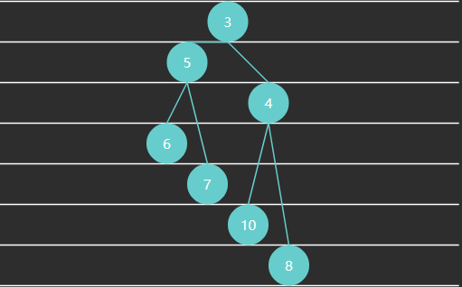
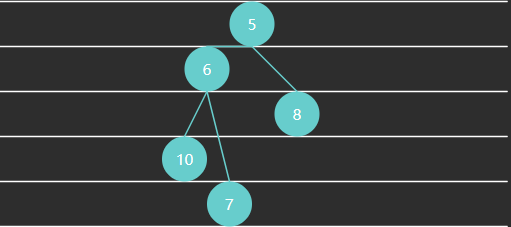
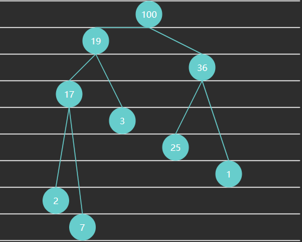
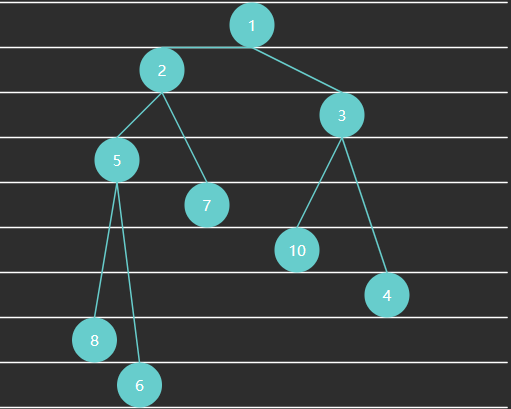
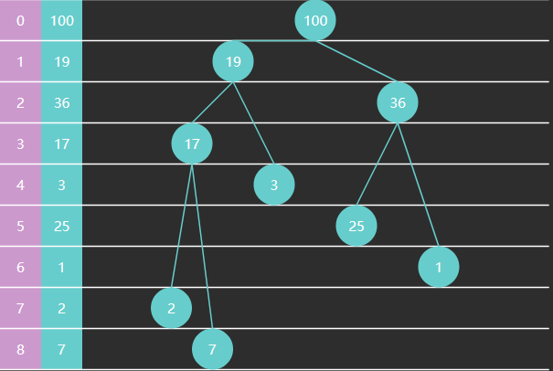

# 概念
- 先级队列的概念
    -  优先级队列是一种特殊的队列，它在入队时会根据元素的优先级进行排序，优先级最高的元素排在队列的前面，出队时会优先出队优先级最高的元素。

- 优先级队列的区别
    - 与普通队列的区别
        - 普通队列是先进先出的，元素按照入队的顺序依次出队。
        - 优先级队列不考虑入队的先后顺序，只根据元素的优先级来决定出队顺序
    - 与栈的区别
        - 栈是后进先出的，最后入栈的元素最先出栈。
        - 优先级队列则根据优先级决定出队顺序，与入队顺序无关。

> 核心特点：元素按优先级排序，每次取出优先级最高（或最低）的元素

# 无序数组实现

## 什麼是「無序數組」實作？

假設目前數組中的資料如下：

```text
索引     數據&優先級
| 5 |   | 7  |
| 4 |   | 10 |
| 3 |   | 5  |
| 2 |   | 1  |
| 1 |   | 2  |
| 0 |   | 4  |
```

可以發現：

* 數組中的元素**並沒有按照優先級排序**
* 優先級高低和索引位置**沒有固定關係**
* 元素只是單純放在數組中

這就是所謂的 **無序數組（Unordered Array）**

也因為它是無序的，所以：

* **入隊很快**
* **出隊比較慢**

## 入隊（offer）的做法

如果現在要加入一個優先級為 `3` 的元素，做法很簡單：

> 直接把新元素放到數組尾端

```text
索引     數據&優先級
| 6 |   | 3  |
| 5 |   | 7  |
| 4 |   | 10 |
| 3 |   | 5  |
| 2 |   | 1  |
| 1 |   | 2  |
| 0 |   | 4  |
```

### 為什麼入隊很快？

因為不需要排序，也不需要比較位置，
只要直接放到尾端即可，所以時間複雜度是：

> **O(1)**

## 出隊（poll）的做法

出隊時不能像一般隊列那樣直接取最前面的元素，因為優先級隊列必須保證：

> **優先級最高的元素先出隊**

因此，出隊時要做兩件事：

1. **遍歷整個數組**
2. **找出優先級最高的元素**

例如上面的資料中，優先級最高的是 `10`，所以它要先出隊。

元素移除後，後面的元素要往前補上，數組可能變成這樣：

```text
索引     數據&優先級
| 5 |   | 3  |
| 4 |   | 7  |
| 3 |   | 5  |
| 2 |   | 1  |
| 1 |   | 2  |
| 0 |   | 4  |
```

### 為什麼出隊比較慢？

因為每次都要先掃描整個數組找最大值，所以時間複雜度是：

> **O(n)**

若再加上移動元素，整體仍然可以視為 **O(n)**。

## 程式碼說明

### 1. `Priority` 介面

這個介面用來規定：
只要想放進優先級隊列的元素，都必須能夠提供自己的優先級。

```java
public interface Priority {
    /**
     * 返回对象的优先级, 约定数字越大, 优先级越高
     * @return 优先级
     */
    int priority();
}
```

#### 重點

* `priority()` 方法用來回傳該對象的優先級
* 這樣隊列就可以統一用這個方法比較大小

### 2. `Entry` 類別

`Entry` 是實際放入隊列的元素類型。

```java
public class Entry implements Priority {

    String value;
    int priority;

    public Entry(int priority) {
        this.priority = priority;
    }

    public Entry(String value, int priority) {
        this.value = value;
        this.priority = priority;
    }

    @Override
    public int priority() {
        return priority;
    }

    @Override
    public String toString() {
        return "(" + value + " priority=" + priority + ")";
    }

    @Override
    public boolean equals(Object o) {
        if (this == o) return true;
        if (o == null || getClass() != o.getClass()) return false;

        Entry entry = (Entry) o;

        return priority == entry.priority;
    }

    @Override
    public int hashCode() {
        return priority;
    }
}
```

### 3. `PriorityQueue1` 類別

這是使用**無序數組**實作的優先級隊列。

```java
@SuppressWarnings("all")
public class PriorityQueue1<E extends Priority> implements Queue<E> {

    Priority[] array;
    int size;

    public PriorityQueue1(int capacity) {
        array = new Priority[capacity];
    }
```

#### 成員說明

* `array`：用來存放元素的數組
* `size`：目前隊列中元素個數
* `capacity`：由數組長度決定最大容量

## 核心方法解析

---

### 1. 入隊：offer

```java
@Override // O(1)
public boolean offer(E e) {
    if (isFull()) {
        return false;
    }
    array[size++] = e;
    return true;
}
```

#### 邏輯

1. 先檢查數組是否已滿
2. 若未滿，直接放到尾端
3. `size` 加 1

#### 時間複雜度

> **O(1)**

因為完全不用排序。

### 2. 找出最大優先級索引：selectMax

```java
private int selectMax() {
    int max = 0;
    for (int i = 1; i < size; i++) {
        if (array[i].priority() > array[max].priority()) {
            max = i;
        }
    }
    return max;
}
```

#### 邏輯

* 預設第 0 個元素優先級最大
* 從第 1 個開始往後比
* 如果發現更大的優先級，就更新 `max`
* 最後回傳最大優先級元素的索引

#### 時間複雜度

> **O(n)**

因為要掃描整個數組。

### 3. 出隊：poll

```java
@Override // O(n)
public E poll() {
    if (isEmpty()) {
        return null;
    }
    int max = selectMax();
    E e = (E) array[max];
    remove(max);
    return e;
}
```

#### 邏輯

1. 如果隊列為空，回傳 `null`
2. 找出最大優先級元素的索引
3. 取出該元素
4. 呼叫 `remove(max)` 將它從數組中刪除
5. 回傳該元素

#### 時間複雜度

> **O(n)**

因為：

* 找最大值要 `O(n)`
* 刪除時可能還要搬移元素

### 4. 移除指定索引元素：remove

```java
private void remove(int index) {
    if (index < size - 1) {
        // 移动
        System.arraycopy(array, index + 1,
                array, index, size - 1 - index);
    }
    array[--size] = null; // help GC
}
```

#### 邏輯

假設要移除中間某個元素：

* 後面的元素必須整體往前移一格
* 這樣才能保持數組資料連續
* 最後將原本最後一格設為 `null`
* `size` 減 1

#### 補充

`array[--size] = null;`

這行的作用是：

* 先讓 `size` 減 1
* 再把最後一個位置設為 `null`
* 方便垃圾回收（GC）

### 5. 查看隊首元素：peek

```java
@Override
public E peek() {
    if (isEmpty()) {
        return null;
    }
    int max = selectMax();
    return (E) array[max];
}
```

#### 功能

* 找出優先級最高的元素
* **只查看，不移除**

#### 時間複雜度

> **O(n)**

因為仍然要掃描整個數組找最大值。

### 6. 判空與判滿

```java
@Override
public boolean isEmpty() {
    return size == 0;
}

@Override
public boolean isFull() {
    return size == array.length;
}
```

很直觀：

* `size == 0`：表示空
* `size == array.length`：表示滿

## 測試程式如下：

```java
public class TestPriorityQueue1 {
    @Test
    public void poll() {
        PriorityQueue1<Entry> queue = new PriorityQueue1<>(5);
        queue.offer(new Entry("task1", 4));
        queue.offer(new Entry("task2", 3));
        queue.offer(new Entry("task3", 2));
        queue.offer(new Entry("task4", 5));
        queue.offer(new Entry("task5", 1));
        assertFalse(queue.offer(new Entry("task6", 7)));

        assertEquals(5, queue.poll().priority());
        assertEquals(4, queue.poll().priority());
        assertEquals(3, queue.poll().priority());
        assertEquals(2, queue.poll().priority());
        assertEquals(1, queue.poll().priority());
    }
}
```

### 測試過程說明

#### 1. 建立容量為 5 的優先級隊列

```java
PriorityQueue1<Entry> queue = new PriorityQueue1<>(5);
```

表示最多只能放 5 個元素。

#### 2. 依序加入元素

```java
queue.offer(new Entry("task1", 4));
queue.offer(new Entry("task2", 3));
queue.offer(new Entry("task3", 2));
queue.offer(new Entry("task4", 5));
queue.offer(new Entry("task5", 1));
```

此時隊列中共有 5 個元素，優先級分別為：

```text
4, 3, 2, 5, 1
```

注意：
雖然加入順序是 `4, 3, 2, 5, 1`，
但出隊時會按照**優先級大小**，不是按照加入順序。

#### 3. 再加入第 6 個元素會失敗

```java
assertFalse(queue.offer(new Entry("task6", 7)));
```

因為容量只有 5，數組已滿，所以回傳 `false`。

#### 4. 出隊順序

```java
assertEquals(5, queue.poll().priority());
assertEquals(4, queue.poll().priority());
assertEquals(3, queue.poll().priority());
assertEquals(2, queue.poll().priority());
assertEquals(1, queue.poll().priority());
```

可以看到出隊順序是：

```text
5 → 4 → 3 → 2 → 1
```

這正符合優先級隊列的特性：

> **優先級越高，越先出隊**

## 時間複雜度總結

| 操作      | 說明        | 時間複雜度  |
| ------- | --------- | ------ |
| `offer` | 直接尾插      | `O(1)` |
| `peek`  | 找最大優先級    | `O(n)` |
| `poll`  | 找最大優先級並刪除 | `O(n)` |

# 有序数组实现
## 什麼是「有序數組」？

先看下面這個數組：

```text
索引     數據&優先級
| 4 |   | 10 |
| 3 |   | 8  |
| 2 |   | 5  |
| 1 |   | 4  |
| 0 |   | 1  |
```

可以看到，數組中的元素已經按照優先級排好了：

* 優先級小的在前面
* 優先級大的在後面
* **尾部永遠放目前優先級最高的元素**

也就是說，這個數組其實是按照 **優先級遞增** 的方式排列。

## 這樣設計有什麼好處？

好處是：

> **出隊會變得非常簡單**

因為優先級最高的元素就在數組尾部，
所以每次出隊時，只要把尾端元素刪掉即可。

但代價是：

> **入隊會比較麻煩**

因為新元素加入時，不能隨便丟到尾端，
而是要插入到正確的位置，才能維持整個數組仍然有序。

## 出隊（poll）的做法

假設目前數組如下：

```text
索引     數據&優先級
| 4 |   | 10 |
| 3 |   | 8  |
| 2 |   | 5  |
| 1 |   | 4  |
| 0 |   | 1  |
```

由於尾部元素 `10` 的優先級最高，
所以 `poll` 時，直接刪除尾部元素即可。

刪除後變成：

```text
索引     數據&優先級
| 3 |   | 8  |
| 2 |   | 5  |
| 1 |   | 4  |
| 0 |   | 1  |
```

### 小結

在有序數組中：

* **出隊不用遍歷**
* **直接刪除尾部元素**
* 所以 `poll` 的時間複雜度是 **O(1)**

## 入隊（offer）的做法

現在假設要插入一個新元素 `3`，也就是優先級為 `3` 的元素。

原本數組是：

```text
索引     數據&優先級
| 3 |   | 8  |   ← 指針 i
| 2 |   | 5  |
| 1 |   | 4  |
| 0 |   | 1  |
```

目標是：
把新元素插入後，數組仍然保持有序。

### 插入的核心思路

做法很像「插入排序」：

1. 從數組尾端開始往前找
2. 只要發現目前元素的優先級 **大於** 新元素，就把它往後移一格
3. 直到找到一個比新元素小或相等的位置
4. 再把新元素放進去

### 插入過程示意

#### 第一步：從尾端往前比較

先看 `8` 和 `3`：

* `8 > 3`
* 所以 `8` 要往後移一格

```text
索引     數據&優先級
| 4 |   | 8  |
| 3 |   | 8  |  ← 指針 i
| 2 |   | 5  |
| 1 |   | 4  |
| 0 |   | 1  |
```

---

#### 第二步：繼續比較 5 和 3

* `5 > 3`
* 所以 `5` 也往後移一格

```text
索引     數據&優先級
| 4 |   | 8  |
| 3 |   | 5  |  
| 2 |   | 5  |  ← 指針 i
| 1 |   | 4  |
| 0 |   | 1  |
```

#### 第三步：繼續比較 4 和 3

* `4 > 3`
* 所以 `4` 再往後移一格

```text
索引     數據&優先級
| 4 |   | 8  |
| 3 |   | 5  |
| 2 |   | 4  |
| 1 |   | 4  |  ← 指針 i
| 0 |   | 1  |
```

#### 第四步：比較 1 和 3

* `1 < 3`
* 表示 `3` 應該放在 `1` 的後面

所以把 `3` 放到索引 `1` 的位置：

```text
索引     數據&優先級
| 4 |   | 8  |
| 3 |   | 5  |
| 2 |   | 4  |
| 1 |   | 3  |
| 0 |   | 1  |  ← 指針 i
```

這樣就完成了一次入隊。

### 入隊的本質

所以在有序數組裡，入隊不是單純追加到尾端，而是：

> **先騰出位置，再把元素插入正確位置**

也因為可能需要搬移很多元素，所以 `offer` 的時間複雜度是：

> **O(n)**

## 這種實作方式的特點

### 優點

* 出隊很快
* 查看最高優先級元素也很快

### 缺點

* 入隊需要搬移元素
* 資料越多，插入成本越高

### 適用情境

這種做法適合：

* **查詢 / 出隊頻繁**
* **插入相對較少**
* 希望隨時快速取出最高優先級元素的場景

## 程式碼解析

### 1. PriorityQueue2 類別

這是使用 **有序數組** 實作的優先級隊列。

```java
@SuppressWarnings("all")
public class PriorityQueue2<E extends Priority> implements Queue<E> {

    Priority[] array;
    int size;

    public PriorityQueue2(int capacity) {
        array = new Priority[capacity];
    }
```

#### 成員說明

* `array`：儲存元素的數組
* `size`：目前已存放的元素個數

### 2. 入隊：offer

```java
@Override
public boolean offer(E e) {
    if (isFull()) {
        return false;
    }
    insert(e);
    size++;
    return true;
}
```

### 邏輯

1. 如果數組已滿，回傳 `false`
2. 呼叫 `insert(e)`，把元素插入正確位置
3. `size++`
4. 回傳 `true`

#### 重點

這裡不是直接放尾端，
而是透過 `insert(e)` 維持數組有序。

### 3. 插入元素：insert

```java
private void insert(E e) {
    int i = size - 1;
    while (i >= 0 && array[i].priority() > e.priority()) {
        array[i + 1] = array[i];
        i--;
    }
    array[i + 1] = e;
}
```

這是整個有序數組實作的核心。

#### 運作方式

* `i = size - 1`：從目前最後一個有效元素開始往前找
* 如果 `array[i]` 的優先級比新元素大，就把它往後挪
* 一直挪到找到合適位置為止
* 最後把新元素放進 `i + 1`

#### 時間複雜度

> **O(n)**

因為最差情況下，所有元素都要搬移。

### 4. 出隊：poll

```java
@Override
public E poll() {
    if (isEmpty()) {
        return null;
    }
    E e = (E) array[size - 1];
    array[--size] = null; // help GC
    return e;
}
```

#### 邏輯

1. 如果隊列為空，回傳 `null`
2. 取出尾部元素（最高優先級）
3. `size--`
4. 把原本尾部位置設為 `null`
5. 回傳元素

#### 為什麼這麼快？

因為數組本來就是有序的，
最高優先級元素固定在尾部，不需要搜尋。

#### 時間複雜度

> **O(1)**

### 5. 查看隊首：peek

```java
@Override
public E peek() {
    if (isEmpty()) {
        return null;
    }
    return (E) array[size - 1];
}
```

#### 功能

* 查看優先級最高的元素
* 不刪除

因為最高優先級元素固定在尾部，所以 `peek` 也非常快。

#### 時間複雜度

> **O(1)**

### 6. 判空與判滿

```java
@Override
public boolean isEmpty() {
    return size == 0;
}

@Override
public boolean isFull() {
    return size == array.length;
}
```

很直觀：

* `size == 0`：表示空
* `size == array.length`：表示滿

## 測試程式解析

```java
public class TestPriorityQueue2 {

    @Test
    public void poll() {
        PriorityQueue2<Entry> queue = new PriorityQueue2<>(5);
        queue.offer(new Entry("task1", 4));
        queue.offer(new Entry("task2", 3));
        queue.offer(new Entry("task3", 2));
        queue.offer(new Entry("task4", 5));
        queue.offer(new Entry("task5", 1));
        assertFalse(queue.offer(new Entry("task6", 7)));

        assertEquals("task4", queue.peek().value);
        assertEquals("task4", queue.poll().value);
        assertEquals("task1", queue.poll().value);
        assertEquals("task2", queue.poll().value);
        assertEquals("task3", queue.poll().value);
        assertEquals("task5", queue.poll().value);
    }
}
```

### 測試流程

加入元素後，各元素優先級為：

```text
task1 -> 4
task2 -> 3
task3 -> 2
task4 -> 5
task5 -> 1
```

由於隊列內部會維持有序，所以實際排列會是：

```text
1, 2, 3, 4, 5
```

也就是尾部會是優先級最高的 `task4`。

### 驗證結果

#### peek()

```java
assertEquals("task4", queue.peek().value);
```

表示目前最高優先級元素是 `task4`，但不移除。

---

#### poll() 順序

```java
assertEquals("task4", queue.poll().value);
assertEquals("task1", queue.poll().value);
assertEquals("task2", queue.poll().value);
assertEquals("task3", queue.poll().value);
assertEquals("task5", queue.poll().value);
```

出隊順序為：

```text
task4(5) -> task1(4) -> task2(3) -> task3(2) -> task5(1)
```

符合「優先級越高越先出隊」的規則。

## 時間複雜度總結

| 操作      | 說明               | 時間複雜度  |
| ------- | ---------------- | ------ |
| `offer` | 插入到正確位置，可能需要搬移元素 | `O(n)` |
| `poll`  | 直接刪除尾部元素         | `O(1)` |
| `peek`  | 直接查看尾部元素         | `O(1)` |

---

## 和「無序數組實作」的比較

| 實作方式 | 入隊     | 出隊     | 特點      |
| ---- | ------ | ------ | ------- |
| 無序數組 | `O(1)` | `O(n)` | 入隊快，出隊慢 |
| 有序數組 | `O(n)` | `O(1)` | 入隊慢，出隊快 |

可以把它理解成：

* **無序數組**：把麻煩留到出隊時處理
* **有序數組**：把麻煩提前到入隊時處理

# 堆实现

> 堆本質上是一種**樹狀結構**，實作時通常會使用**完全二叉樹**。

## 什麼是完全二叉樹？

先拆開來看：

### 1. 二叉樹

二叉樹表示：**每個節點最多只有兩個子節點**。

也就是每個節點最多只能往下分成：

* 左子節點
* 右子節點

### 2. 完全二叉樹

完全二叉樹有兩個重點：

* **除了最後一層以外，每一層都必須是滿的**
* **最後一層的節點必須從左到右連續排列，中間不能有空缺**

也就是說，新增節點時，一定要**優先補左邊的位置**。

### 3. 根節點

最上方、沒有父節點的節點，叫做**根節點（root）**。

### 4. 例子

例1 - 满二叉树（Full Binary Tree）特点：每一层都是填满的



例2 - 完全二叉树（Complete Binary Tree）特点：最后一层可能未填满，靠左对齐



例3 - 大顶堆



例4 - 小顶堆



完全二叉树可以使用数组来表示



## 堆的兩種類型

堆主要分成兩種：

### 1. 大頂堆（Max Heap）

在大頂堆中，**任何父節點的值都要大於等於子節點的值**。

公式表示為：

$$
P.value \geq C.value
$$

其中：

* (P) 表示父節點
* (C) 表示子節點

因此，大頂堆的**根節點一定是整個堆中的最大值**。

### 2. 小頂堆（Min Heap）

在小頂堆中，**任何父節點的值都要小於等於子節點的值**。

公式表示為：

$$
P.value \leq C.value
$$

因此，小頂堆的**根節點一定是整個堆中的最小值**。

## 堆雖然是樹，卻常用數組儲存

這裡很容易搞混，正確說法是：

* **堆在邏輯上是樹**
* **但在實作上，通常使用一維數組來儲存**

原因是：
由於堆通常採用**完全二叉樹**，節點排列非常規律，因此可以直接用數組表示，不需要真的建立一堆節點指標。

## 大頂堆範例

假設現在有一個大頂堆：

```text
索引   元素
| 0 |  | 100 |               100
| 1 |  | 19  |              /    \
| 2 |  | 36  |             19    36
| 3 |  | 17  |            / \    / \
| 4 |  | 3   |           17  3  25  1
| 5 |  | 25  |           / \
| 6 |  | 1   |          2   7
| 7 |  | 2   |
| 8 |  | 7   |
```

對應的數組為：

```text
[100, 19, 36, 17, 3, 25, 1, 2, 7]
```

## 數組中父子節點的位置規律

### 如果數組是從索引 0 開始存放，則：

**已知子節點，找父節點**

節點 `i` 的父節點索引為：

$$
\left\lfloor \frac{i - 1}{2} \right\rfloor
$$

前提是 `i > 0`。

**已知父節點，找子節點**

節點 `i` 的：

* 左子節點索引為：

$$
2i + 1
$$

* 右子節點索引為：

$$
2i + 2
$$

當然，子節點索引必須 `< size` 才表示存在。

### 如果數組從索引 1 開始

則規律變成：

* 父節點索引：

$$
\left\lfloor \frac{i}{2} \right\rfloor
$$

* 左子節點索引：

$$
2i
$$

* 右子節點索引：

$$
2i + 1
$$

## 插入元素（offer / add）

假設現在要往剛剛的大頂堆中加入元素 `4`。

### 第一步：先把元素放到最後一個位置

因為堆一定要維持**完全二叉樹**的形狀，所以新增元素時，必須先放到**最左側可用的位置**。

加入 `4` 後：

```text
索引   元素
| 0 |  | 100 |                  100
| 1 |  | 19  |               /       \
| 2 |  | 36  |              19         36
| 3 |  | 17  |            /    \      /  \
| 4 |  | 3   |           17     3    25   1
| 5 |  | 25  |           / \    /
| 6 |  | 1   |          2   7  4
| 7 |  | 2   |
| 8 |  | 7   |
| 9 |  | 4   |
```

數組變成：

```text
[100, 19, 36, 17, 3, 25, 1, 2, 7, 4]
```

### 第二步：向上調整（上浮）

雖然形狀對了，但現在不一定還符合大頂堆的規則。

新加入的 `4` 的父節點是 `3`，但在大頂堆中應該滿足：

```text
父節點 >= 子節點
```

現在卻是：

```text
3 < 4
```

違反了大頂堆規則，所以要交換。

交換後：

```text
[100, 19, 36, 17, 4, 25, 1, 2, 7, 3]
```

樹形如下：

```text
                 100
               /     \
             19       36
            /  \     /  \
          17    4   25   1
         / \   /
        2   7 3
```

接著再看 `4` 的新父節點 `19`：

```text
19 > 4
```

已經符合大頂堆規則，所以停止。

### 插入元素的核心概念

插入時分成兩件事：

#### 1. 先放到底部最後一個位置

目的是保持**完全二叉樹的形狀**。

#### 2. 再一路向上比較與交換

目的是恢復**堆的性質**。

這個過程叫做：

* 上浮
* sift up
* heapify up

## 刪除堆頂元素（poll）

`poll` 的作用，是**移除優先級最高的元素**。

在大頂堆中，優先級最高的元素顯然就是**堆頂元素**，也就是根節點。

以這個堆為例：

```text
索引   元素
| 0 |  | 100 |               100
| 1 |  | 19  |              /    \
| 2 |  | 36  |             19    36
| 3 |  | 17  |            / \    / \
| 4 |  | 3   |           17  3  25  1
| 5 |  | 25  |           / \
| 6 |  | 1   |          2   7
| 7 |  | 2   |
| 8 |  | 7   |
```

也就是要移除 `100`。

但是移除後，還必須保證剩下的元素依然符合：

* 完全二叉樹的形狀
* 大頂堆的規則

所以 `poll` 通常分成兩步。

### 第一步：交換堆頂和最後一個元素

先把堆頂 `100` 和最後一個元素 `7` 交換：

```text
索引   元素
| 0 |  | 7   |                7
| 1 |  | 19  |              /    \
| 2 |  | 36  |             19    36
| 3 |  | 17  |            / \    / \
| 4 |  | 3   |           17  3  25  1
| 5 |  | 25  |           / \
| 6 |  | 1   |          2   100
| 7 |  | 2   |
| 8 |  | 100 |
```

對應數組：

```text
[7, 19, 36, 17, 3, 25, 1, 2, 100]
```

#### 為什麼要先交換？

因為數組尾端的元素最容易刪除。

如果直接移除數組開頭的元素，後面所有元素都要往前搬，效率很差。
先把堆頂換到最後，再刪除最後一個元素，就能避免大量搬移。

#### 刪除最後一個元素

交換後，把最後一個元素刪掉：

```text
索引   元素
| 0 |  | 7   |                7
| 1 |  | 19  |              /    \
| 2 |  | 36  |             19    36
| 3 |  | 17  |            / \    / \
| 4 |  | 3   |           17  3  25  1
| 5 |  | 25  |           /
| 6 |  | 1   |          2
| 7 |  | 2   |
```

數組變成：

```text
[7, 19, 36, 17, 3, 25, 1, 2]
```

此時 `100` 已經成功移除。

但是現在的根節點是 `7`，它不符合大頂堆的規則，因為它比子節點 `19`、`36` 都小。

### 第二步：向下調整（下沉）

現在要把 `7` 往下移動，直到整個堆重新符合大頂堆規則。

這個過程叫做：

* 下沉
* sift down
* heapify down

#### 第一次下沉

`7` 的左右子節點是：

* 左子節點：`19`
* 右子節點：`36`

在大頂堆中，下沉時要和**較大的子節點**比較，並與它交換。

因為 `36` 比 `19` 大，所以 `7` 和 `36` 交換：

```text
索引   元素
| 0 |  | 36  |                36
| 1 |  | 19  |              /    \
| 2 |  | 7   |             19     7
| 3 |  | 17  |            / \    / \
| 4 |  | 3   |           17  3  25  1
| 5 |  | 25  |
| 6 |  | 1   |
| 7 |  | 2   |
```

數組變成：

```text
[36, 19, 7, 17, 3, 25, 1, 2]
```

#### 第二次下沉

現在 `7` 來到索引 `2`，它的左右子節點是：

* 左子節點：`25`
* 右子節點：`1`

因為 `25` 較大，而且 `25 > 7`，所以交換：

```text
索引   元素
| 0 |  | 36  |                36
| 1 |  | 19  |              /    \
| 2 |  | 25  |             19     25
| 3 |  | 17  |            / \     / \
| 4 |  | 3   |           17  3   7   1
| 5 |  | 7   |
| 6 |  | 1   |
| 7 |  | 2   |
```

數組變成：

```text
[36, 19, 25, 17, 3, 7, 1, 2]
```

### 何時停止下沉？

當出現以下任一情況時，就停止：

#### 1. 它已經沒有子節點

表示已經到葉子節點。

#### 2. 它比兩個子節點都大

表示已經符合大頂堆規則。

在這個例子中，`7` 的子節點已經不比它大，因此調整完成。

### poll 的核心流程

刪除堆頂元素時，可以記成下面兩步：

#### 1. 交換堆頂與最後一個元素，然後刪除最後一個

目的是讓刪除動作更高效。

#### 2. 將新的堆頂元素一路向下調整

目的是恢復大頂堆的性質。

## 程式碼

```java
/**
 * 基于<b>大顶堆</b>实现
 * @param <E> 队列中元素类型, 必须实现 Priority 接口
 */
@SuppressWarnings("all")
public class PriorityQueue4<E extends Priority> implements Queue<E> {

    Priority[] array;
    int size;

    public PriorityQueue4(int capacity) {
        array = new Priority[capacity];
    }

    /*
    1. 入堆新元素, 加入到数组末尾 (索引位置 child)
    2. 不断比较新加元素与它父节点(parent)优先级 (上浮)
        - 如果父节点优先级低, 则向下移动, 并找到下一个 parent
        - 直至父节点优先级更高或 child==0 为止
     */
    @Override
    public boolean offer(E offered) {
        if (isFull()) {
            return false;
        }
        int child = size++;
        int parent = (child - 1) / 2;
        while (child > 0 && offered.priority() > array[parent].priority()) {
            array[child] = array[parent];
            child = parent;
            parent = (child - 1) / 2;
        }
        array[child] = offered;
        return true;
    }

    /*
    1. 交换堆顶和尾部元素, 让尾部元素出队
    2. (下潜)
        - 从堆顶开始, 将父元素与两个孩子较大者交换
        - 直到父元素大于两个孩子, 或没有孩子为止
     */
    @Override
    public E poll() {
        if (isEmpty()) {
            return null;
        }
        swap(0, size - 1);
        size--;
        Priority e = array[size];
        array[size] = null; // help GC

        // 下潜
        down(0);

        return (E) e;
    }

    private void down(int parent) {
        int left = 2 * parent + 1;
        int right = left + 1;
        int max = parent; // 假设父元素优先级最高
        if (left < size && array[left].priority() > array[max].priority()) {
            max = left;
        }
        if (right < size && array[right].priority() > array[max].priority()) {
            max = right;
        }
        if (max != parent) { // 有孩子比父亲大
            swap(max, parent);
            down(max);
        }
    }

    private void swap(int i, int j) {
        Priority t = array[i];
        array[i] = array[j];
        array[j] = t;
    }

    @Override
    public E peek() {
        if (isEmpty()) {
            return null;
        }
        return (E) array[0];
    }

    @Override
    public boolean isEmpty() {
        return size == 0;
    }

    @Override
    public boolean isFull() {
        return size == array.length;
    }
}
```

```java
public class TestPriorityQueue4 {

    @Test
    public void poll() {
        PriorityQueue4<Entry> queue = new PriorityQueue4<>(5);
        queue.offer(new Entry("task1", 4));
        queue.offer(new Entry("task2", 3));
        queue.offer(new Entry("task3", 2));
        queue.offer(new Entry("task4", 5));
        queue.offer(new Entry("task5", 1));
        assertFalse(queue.offer(new Entry("task6", 7)));

        assertEquals(5, queue.peek().priority());
        assertEquals(5, queue.poll().priority());
        assertEquals(4, queue.poll().priority());
        assertEquals(3, queue.poll().priority());
        assertEquals(2, queue.poll().priority());
        assertEquals(1, queue.poll().priority());
    }
}
```

# 23. 合併 K 個升序鏈表
> [23. 合并 K 个升序链表](https://leetcode.cn/problems/merge-k-sorted-lists/description/)

題目：
給你 `k` 個已經排好序的鏈表，請把它們合併成 **一條新的升序鏈表**。

例如：

```text
鏈表1：1 -> 4 -> 5
鏈表2：1 -> 3 -> 4
鏈表3：2 -> 6
```

合併後結果應該是：

```text
1 -> 1 -> 2 -> 3 -> 4 -> 4 -> 5 -> 6
```

## 這題的核心思路

這題最關鍵的地方在於：

> 每次都要從多個鏈表的「當前節點」中，找出最小的那一個。

如果直接每次都去掃描所有鏈表的頭節點，雖然可以做出來，但效率不夠好。

因此這題很適合使用：

* **小頂堆（Min Heap）**
* 或 Java 內建的 `PriorityQueue`

## 為什麼用小頂堆？

小頂堆的特性是：

> **堆頂永遠是目前最小的元素**

所以只要把每條鏈表「目前指向的節點」放進小頂堆，
那麼每次從堆頂取出的，就是所有節點中最小的那個。

這樣就能很自然地把新鏈表一個一個接起來。

## 解題流程

假設有三個鏈表：

```text
p
1 -> 4 -> 5 -> null

p
1 -> 3 -> 4 -> null

p
2 -> 6 -> null
```

### 第一步：先把每個鏈表的頭節點放入小頂堆

一開始放入：

* 第一條鏈表頭節點 `1`
* 第二條鏈表頭節點 `1`
* 第三條鏈表頭節點 `2`

此時小頂堆中是：

```text
小頂堆：1  1  2
```

堆頂最小值是 `1`。

注意：

* 放進堆裡的不是整條鏈表
* 而是 **每條鏈表目前指向的節點**

### 第二步：取出堆頂最小值，接到新鏈表後面

從小頂堆取出最小值 `1`，接到新鏈表尾端。

然後把這個 `1` 所在鏈表的下一個節點 `4` 放回小頂堆。

```text
     p
1 -> 4 -> 5 -> null

p
1 -> 3 -> 4 -> null

p
2 -> 6 -> null

小頂堆：1  2  4
結果鏈表：1
```

### 第三步：重複這個過程

再取出最小值 `1`，接到結果鏈表後面。

然後把這個 `1` 的下一個節點 `3` 放回堆。

```text
     p
1 -> 4 -> 5 -> null

     p
1 -> 3 -> 4 -> null

p
2 -> 6 -> null

小頂堆：2  3  4
結果鏈表：1 -> 1
```

取出 `2`，接到結果鏈表後面。

再把 `2` 的下一個節點 `6` 放入堆中。

```text
     p
1 -> 4 -> 5 -> null

     p
1 -> 3 -> 4 -> null

     p
2 -> 6 -> null

小頂堆：3  4  6
結果鏈表：1 -> 1 -> 2
```

取出 `3`，接到結果鏈表後面。

再把 `3` 的下一個節點 `4` 放入堆中。

```text
     p
1 -> 4 -> 5 -> null

          p
1 -> 3 -> 4 -> null

     p
2 -> 6 -> null

小頂堆：4  4  6
結果鏈表：1 -> 1 -> 2 -> 3
```

每次都做兩件事：

1. 從堆中取出最小節點，接到結果鏈表尾端
2. 把這個節點的下一個節點放進堆裡

最後會得到：

```text
1 -> 1 -> 2 -> 3 -> 4 -> 4 -> 5 -> 6 -> null
```

## 程式碼思路解析

### 1. 主流程 mergeKLists

```java
public ListNode mergeKLists(ListNode[] lists) {
    MinHeap heap = new MinHeap(lists.length);

    // 1. 將每條鏈表的頭節點加入小頂堆
    for (ListNode h : lists) {
        if (h != null) {
            heap.offer(h);
        }
    }

    // 2. 建立一個虛擬頭節點，方便組裝答案鏈表
    ListNode s = new ListNode(-1, null);
    ListNode t = s;

    // 3. 不斷從堆頂取出最小節點
    while (!heap.isEmpty()) {
        ListNode min = heap.poll();
        t.next = min;
        t = min;

        // 4. 把該節點的下一個節點放入堆中
        if (min.next != null) {
            heap.offer(min.next);
        }
    }

    return s.next;
}
```

### 2. 為什麼要用哨兵節點？

這段：

```java
ListNode s = new ListNode(-1, null);
ListNode t = s;
```

這裡的 `s` 是**哨兵節點**，作用是方便操作鏈表。

因為如果沒有哨兵節點，第一個節點的處理會比較麻煩。
有了它之後，我們只要一直把新節點接到 `t.next` 就可以了。

最後回傳時，真正的答案是：

```java
return s.next;
```

## 為什麼小頂堆容量只需要 lists.length？

這是一個很重要的觀念。

```java
MinHeap heap = new MinHeap(lists.length);
```

很多人看到這裡會疑惑：

> 為什麼堆的容量不是所有節點總數？

原因是：

> 任意時刻，堆裡最多只會有 **k 個節點**

因為堆中放的不是所有節點，
而是**每條鏈表目前還沒處理的那個最前面節點**。

假設有 `k` 條鏈表，那麼每條鏈表最多只會貢獻 1 個節點到堆中，
所以堆大小最多就是 `k`。

## 小頂堆的 offer 與 poll

### 1. offer：加入元素

```java
public boolean offer(ListNode offered) {
    if (isFull()) {
        return false;
    }
    int child = size++;
    int parent = (child - 1) / 2;

    while (child > 0 && offered.val < array[parent].val) {
        array[child] = array[parent];
        child = parent;
        parent = (child - 1) / 2;
    }
    array[child] = offered;
    return true;
}
```

這段是在做：

* 把新節點先放到陣列最後面
* 再一路往上比較
* 如果比父節點小，就往上移動

這個過程叫做：

* **上浮**
* `heapify up`
* `sift up`

因為這是**小頂堆**，所以值越小，位置越應該往上。

### 2. poll：移除堆頂元素

```java
public ListNode poll() {
    if (isEmpty()) {
        return null;
    }
    swap(0, size - 1);
    size--;
    ListNode e = array[size];
    array[size] = null; // help GC

    down(0);

    return e;
}
```

這段是在做：

1. 把堆頂和最後一個元素交換
2. 移除最後一個元素
3. 讓新的堆頂往下調整

因為真正最小的元素一定在堆頂，
所以 `poll()` 取出的就是目前最小節點。

### 3. down：下沉

```java
private void down(int parent) {
    int left = 2 * parent + 1;
    int right = left + 1;
    int min = parent;

    if (left < size && array[left].val < array[min].val) {
        min = left;
    }
    if (right < size && array[right].val < array[min].val) {
        min = right;
    }
    if (min != parent) {
        swap(min, parent);
        down(min);
    }
}
```

這段邏輯是：

* 看父節點、左子節點、右子節點
* 找出三者中最小的那個
* 如果最小的不是父節點，就交換
* 然後繼續往下調整

這個過程叫做：

* **下沉**
* `heapify down`
* `sift down`