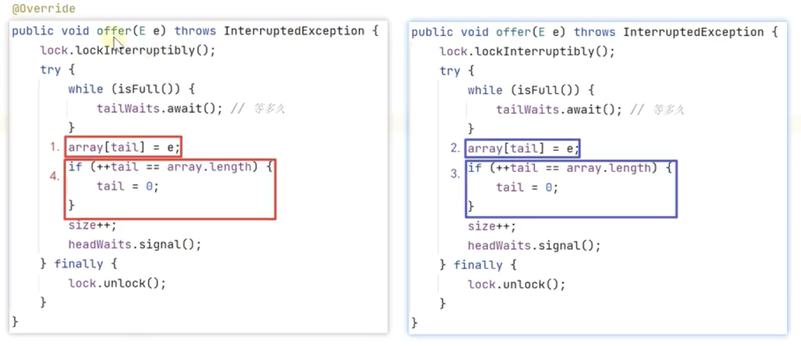

# 為什麼原本的隊列不夠用？

我們前面實作的普通隊列，在單線程、簡單場景下沒有問題；但一旦放到真實系統中，就會遇到很多限制。

最常見的問題有三個：

## 1. 沒有考慮線程安全

在很多實際場景中，隊列通常不是只給一個人用，而是會分成兩種角色：

* **生產者（Producer）**：負責把元素放進隊列，主要呼叫 `offer`
* **消費者（Consumer）**：負責從隊列取出元素，主要呼叫 `poll`

當我們把使用者分成這兩種角色後，就代表：

* 生產者可能由某個線程執行
* 消費者可能由另一個線程執行
* 甚至可能有**多個生產者、多个消費者**同時操作同一個隊列

問題是：我們之前的隊列實作，**完全沒有考慮多線程同時操作**。
一旦多個線程同時修改隊列，就可能出現資料覆蓋、狀態錯亂等問題，這就是**線程安全問題**。

## 2. 隊列為空時，只會返回 null

我們之前的 `poll` 方法在隊列為空時，會直接返回 `null`，表示目前拿不到元素。

但有些場景不是「拿不到就算了」，而是：

> 我就是要拿到一個元素，拿不到就等，直到拿到為止。

如果沿用之前的設計，那就只能這樣做：

```java
while (true) {
    String e = queue.poll();
    if (e != null) {
        break;
    }
}
```

這樣雖然能達到目的，但有個很大的問題：

* 到底要重試幾次才會拿到元素？不知道
* 執行緒會一直空轉
* CPU 會被白白浪費掉

這種不停檢查、反覆重試的方式，稱為**忙等（busy waiting）**，效率很差。

## 3. 隊列已滿時，只會返回 false

同樣地，之前的 `offer` 方法在隊列滿了之後，會返回 `false`。

但有些場景的需求是：

> 我就是要把這個元素塞進去，塞不進去我就等，直到有空間為止。

如果用之前的實作，也只能不斷重試：

```java
while (!queue.offer("e")) {
}
```

這和前面的問題一樣，本質上也是忙等：

* 一直重試
* 一直消耗 CPU
* 效率低且不優雅

# 一個線程不安全的例子

下面這段程式碼看起來很簡單，但在多執行緒環境下其實是有問題的：

```java
public class TestThreadUnsafe {
    private final String[] array = new String[10];
    private int tail = 0;

    public void offer(String e) {
        array[tail] = e;
        tail++;
    }

    @Override
    public String toString() {
        return Arrays.toString(array);
    }

    public static void main(String[] args) {
        TestThreadUnsafe queue = new TestThreadUnsafe();
        new Thread(() -> queue.offer("e1"), "t1").start();
        new Thread(() -> queue.offer("e2"), "t2").start();
    }
}
```

這段程式的入隊邏輯只有兩步：

1. 把元素放到 `array[tail]`
2. 然後 `tail++`

表面上看沒問題，但在多線程下，**這兩步不是原子的**，也就是說它們可能被別的線程插進來。

## 為什麼會出錯？

假設一開始：

```text
tail
[null null null null null null null null null null]
  0    1    2    3    4    5    6    7    8    9
```

現在有兩個線程：

* `t1` 要放入 `e1`
* `t2` 要放入 `e2`

它們都執行同樣的 `offer` 方法。

### 第一步：t1 先執行一半

`t1` 先執行到：

```java
array[tail] = e1;
```

這時陣列變成：

```text
tail
[e1 null null null null null null null null null]
  0   1    2    3    4    5    6    7    8    9
```

注意，此時 `tail` 還是 `0`，因為 `tail++` 還沒執行。

### 第二步：CPU 切換到 t2

這時 CPU 剛好把執行權切給 `t2`。

由於 `tail` 還是 `0`，所以 `t2` 執行：

```java
array[tail] = e2;
tail++;
```

實際效果是：

* `array[0] = e2`
* `tail` 變成 `1`

此時狀態變成：

```text
     tail
[e2 null null null null null null null null null]
  0   1    2    3    4    5    6    7    8    9
```

原本 `t1` 放進去的 `e1`，就這樣被 `e2` 覆蓋掉了。

### 第三步：CPU 再切回 t1

接著 `t1` 繼續執行剛剛還沒做完的：

```java
tail++;
```

所以 `tail` 變成 `2`：

```text
          tail
[e2 null null null null null null null null null]
  0   1    2    3    4    5    6    7    8    9
```

## 問題出在哪裡？

最後的結果是：

* 隊列裡只有 `e2`
* `e1` 不見了
* 但 `tail` 卻變成了 `2`

也就是說，**隊列狀態和實際資料已經不一致了**。

這就是典型的多線程交錯執行造成的問題。

## 為什麼會發生這種事？

因為這段程式：

```java
array[tail] = e;
tail++;
```

雖然看起來只有兩行，但在 CPU 看來，它不是「一次做完」的不可分割操作。
兩個線程可能在任意時刻互相穿插，導致：

* 同一個位置被重複寫入
* 指標更新錯亂
* 資料遺失

所以只要有多個線程同時操作共享資料，就必須考慮同步控制。

# 單鎖實現阻塞隊列

前面我們已經知道，普通隊列在多線程環境下會有兩個核心問題：

1. **線程安全問題**：多個線程同時操作隊列時，可能造成資料覆蓋或狀態錯亂。
2. **等待問題**：

    * 隊列為空時，消費者不應該一直重試拿元素
    * 隊列已滿時，生產者也不應該一直重試塞元素

因此，我們需要一種能同時解決這兩個問題的實作方式，這就是 **阻塞隊列（BlockingQueue）**。

## 先用鎖解決線程安全問題

在 Java 中，要避免多個線程交錯執行某段關鍵程式碼，通常有兩種做法：

1. `synchronized`
2. `ReentrantLock`

兩者都能保護臨界區，但 `ReentrantLock` 功能更完整，例如：

* 可中斷等待鎖
* 可搭配多個條件變數
* 可做更細緻的控制

所以這裡選擇 `ReentrantLock` 來實作。

### 1. 最基本的加鎖方式

```java
public class TestThreadUnsafe {
    private final String[] array = new String[10];
    private int tail = 0;
    ReentrantLock lock = new ReentrantLock(); // 鎖對象

    public void offer(String e) {
        lock.lock(); // 加鎖
        try {
            array[tail] = e;
            tail++;
        } finally {
            lock.unlock(); // 釋放鎖
        }
    }
}
```

這段程式碼的重點是：

* 進入 `offer` 後先加鎖
* 修改共享資料（`array`、`tail`）時，其他線程不能同時進來
* 最後一定要在 `finally` 裡解鎖，避免異常時鎖無法釋放

### 2. 為什麼這樣就安全了？

假設有兩個線程：

* `t1` 呼叫 `offer("e1")`
* `t2` 呼叫 `offer("e2")`

因為它們用的是**同一把鎖**，所以同一時間只會有一個線程進入 `try` 區塊。

可能的執行過程如下：

| 線程1               | 線程2               | 說明                           |
| ------------------ | ------------------ | ---------------------------- |
| `lock.lock()`      |                    | `t1` 先取得鎖                    |
| `array[tail] = e1` |                    | `t1` 進入臨界區修改資料               |
|                    | `lock.lock()`      | `t2` 想加鎖，但因為鎖被 `t1` 持有，所以被阻塞 |
| `tail++`           |                    | `t1` 繼續執行                    |
| `lock.unlock()`    |                    | `t1` 釋放鎖                     |
|                    | `array[tail] = e2` | `t2` 取得鎖後才能繼續                |
|                    | `tail++`           | `t2` 完成操作                    |

也就是說，**加鎖之後，臨界區內的程式碼不會被其他線程插進來**，就避免了交錯執行的問題。

---

## 線程在等鎖時，能不能提前放棄？

用 `lock()` 加鎖時，如果拿不到鎖，線程就只能一直等，直到別人解鎖。

但有時候我們希望：

> 這個線程等太久了，不想再等了，可以中途放棄嗎？

可以，這時就不能用 `lock()`，而要改成：

```java
lock.lockInterruptibly();
```

它的意思是：

* 如果鎖拿到了，就正常執行
* 如果還在等待鎖時被中斷，會直接拋出 `InterruptedException`
* 表示：**我不等了**

例如：

```java
public void offer(String e) throws InterruptedException {
    lock.lockInterruptibly(); // 可中斷地等待鎖
    try {
        array[tail] = e;
        tail++;
    } finally {
        lock.unlock();
    }
}
```

這樣設計的好處是：
線程不一定要無限等待鎖，可以在必要時中止等待。

但要注意：

**`lock.lockInterruptibly()` 本身不會自動中斷等待中的線程。**
它只是提供一種「可以被中斷」的等待方式。

如果你真的想讓它提前放棄，還需要由**其他線程**去呼叫：

```java
thread.interrupt();
```

### 那要怎麼提前中斷？

假設有一個線程正在等待鎖：

```java
Thread t = new Thread(() -> {
    try {
        queue.offer("A");
        System.out.println("放入成功");
    } catch (InterruptedException e) {
        System.out.println("等待鎖時被中斷，放棄操作");
    }
});
```

如果這個線程一直拿不到鎖，另一個線程就可以這樣中斷它：

```java
t.interrupt();
```

一旦它正在 `lock.lockInterruptibly()` 那裡等待鎖，就會立刻停止等待，並拋出 `InterruptedException`。

### 完整示例

```java
import java.util.concurrent.locks.ReentrantLock;

public class Demo {
    private static final ReentrantLock lock = new ReentrantLock();

    public static void main(String[] args) throws InterruptedException {
        // 主線程先拿到鎖，不釋放
        lock.lock();

        Thread t = new Thread(() -> {
            try {
                System.out.println("子線程：準備拿鎖...");
                lock.lockInterruptibly(); // 等鎖時可被中斷
                try {
                    System.out.println("子線程：拿到鎖了");
                } finally {
                    lock.unlock();
                }
            } catch (InterruptedException e) {
                System.out.println("子線程：等待鎖時被中斷，放棄等待");
            }
        });

        t.start();

        Thread.sleep(2000); // 讓子線程進入等待鎖狀態

        System.out.println("主線程：中斷子線程");
        t.interrupt();

        lock.unlock();
    }
}
```

執行流程是：

1. 主線程先把鎖拿住
2. 子線程執行到 `lock.lockInterruptibly()`，但拿不到鎖，所以進入等待
3. 主線程過 2 秒後呼叫 `t.interrupt()`
4. 子線程立刻結束等待，拋出 `InterruptedException`
5. 子線程輸出：`等待鎖時被中斷，放棄等待`

## 只有加鎖還不夠，還要解決「滿了怎麼辦？」

前面只是解決了**多線程安全修改資料**的問題。
但阻塞隊列還有另一個需求：

> 隊列滿了時，生產者不要立刻失敗，而是應該等待，直到隊列有空位。

先看下面這段程式：

```java
ReentrantLock lock = new ReentrantLock();
int size = 0;

public void offer(String e) throws InterruptedException {
    lock.lockInterruptibly();
    try {
        if (isFull()) {
            // 滿了怎麼辦？
        }
        array[tail] = e;
        if (++tail == array.length) {
            tail = 0;
        }
        size++;
    } finally {
        lock.unlock();
    }
}

private boolean isFull() {
    return size == array.length;
}
```

這裡的 `isFull()` 只能判斷「隊列滿了沒有」，
但滿了之後不能只是返回失敗，因為阻塞隊列的設計目標是：

* **滿了就等待**
* **等到不滿時再繼續執行**

### 用條件變數讓線程等待

`ReentrantLock` 可以搭配 **Condition（條件變數）** 來完成這件事。

例如：

```java
ReentrantLock lock = new ReentrantLock();
Condition tailWaits = lock.newCondition(); // 等待「隊列不滿」的條件
int size = 0;

public void offer(String e) throws InterruptedException {
    lock.lockInterruptibly();
    try {
        if (isFull()) {
            tailWaits.await(); // 隊列滿了，進入等待
        }
        array[tail] = e;
        if (++tail == array.length) {
            tail = 0;
        }
        size++;
    } finally {
        lock.unlock();
    }
}
```

#### 1. await() 做了什麼事？

當線程執行到：

```java
tailWaits.await();
```

代表：

1. 當前線程進入 `tailWaits` 這個條件佇列等待
2. **暫時釋放鎖**
3. 等待其他線程在未來喚醒它

這很重要，因為如果它不釋放鎖，其他線程就進不來，自然也沒人能改變隊列狀態。

#### 2. 什麼時候喚醒它？

當將來有消費者執行 `poll()`，從隊列中拿走元素後，隊列就有空位了。
這時就可以呼叫：

```java
tailWaits.signal();
```

意思是：

* 喚醒一個等待「隊列不滿」的線程
* 被喚醒後，它不是立刻往下跑，而是要**先重新競爭鎖**
* 搶到鎖之後，才會從 `await()` 之後繼續執行

## 為什麼不能用 if，而要用 while？

這是阻塞隊列實作中非常重要的一點。

原本的寫法是：

```java
if (isFull()) {
    tailWaits.await();
}
```

表面上看起來沒問題，但其實有漏洞。

### 問題場景

假設隊列容量是 3，初始狀態：

```text
[1 2 3]
```

此時隊列已滿。

#### 第一步：offer(4) 進來，發現隊列滿了

所以它執行：

```java
tailWaits.await();
```

然後進入等待。

#### 第二步：某個 poll() 取走了一個元素

隊列變成：

```text
[2 3]
```

此時隊列不滿了，所以 `poll()` 喚醒等待中的線程。

#### 第三步：另一個 offer(5) 搶先拿到鎖

它比原本等待的 `offer(4)` 更早拿到鎖，於是先把 `5` 放進去：

```text
[2 3 5]
```

隊列又滿了。

#### 第四步：原本等待的 offer(4) 被喚醒後繼續執行

如果用的是 `if`，它被喚醒後會**直接往下執行**，不會再重新檢查隊列是否已滿。

這時就會出現：

* 明明隊列又滿了
* 卻還是繼續插入元素
* 導致資料錯亂

### 這種現象叫做什麼？

這種情況通常稱為：

**虛假喚醒（Spurious Wakeup）**

更準確地說，在並發程式裡，**被喚醒不代表條件一定仍然成立**。
所以喚醒後一定要重新檢查條件。

### 正確寫法：用 while

```java
while (isFull()) {
    tailWaits.await();
}
```

意思是：

* 只要隊列還是滿的，就繼續等待
* 被喚醒後，先重新判斷一次
* 條件真的成立了，才往下執行

這是使用 `Condition.await()` 的標準寫法。

## 完整的單鎖阻塞隊列設計

這裡的阻塞隊列有三個基本操作：

```java
public interface BlockingQueue<E> {
    void offer(E e) throws InterruptedException;

    boolean offer(E e, long timeout) throws InterruptedException;

    E poll() throws InterruptedException;
}
```

### 完整實作

```java
public class BlockingQueue1<E> implements BlockingQueue<E> {
    private final E[] array;
    private int head = 0;
    private int tail = 0;
    private int size = 0;

    @SuppressWarnings("all")
    public BlockingQueue1(int capacity) {
        array = (E[]) new Object[capacity];
    }

    private final ReentrantLock lock = new ReentrantLock();

    // 等待「隊列不滿」的生產者
    private final Condition tailWaits = lock.newCondition();

    // 等待「隊列非空」的消費者
    private final Condition headWaits = lock.newCondition();

    @Override
    public void offer(E e) throws InterruptedException {
        lock.lockInterruptibly();
        try {
            while (isFull()) {
                tailWaits.await();
            }

            array[tail] = e;
            if (++tail == array.length) {
                tail = 0;
            }
            size++;

            // 放入成功後，隊列變成非空，喚醒等待取元素的線程
            headWaits.signal();
        } finally {
            lock.unlock();
        }
    }

    @Override
    public boolean offer(E e, long timeout) throws InterruptedException {
        lock.lockInterruptibly();
        try {
            long nanos = TimeUnit.MILLISECONDS.toNanos(timeout);

            while (isFull()) {
                if (nanos <= 0) {
                    return false;
                }
                nanos = tailWaits.awaitNanos(nanos);
            }

            array[tail] = e;
            if (++tail == array.length) {
                tail = 0;
            }
            size++;

            headWaits.signal();
            return true;
        } finally {
            lock.unlock();
        }
    }

    @Override
    public E poll() throws InterruptedException {
        lock.lockInterruptibly();
        try {
            while (isEmpty()) {
                headWaits.await();
            }

            E e = array[head];
            array[head] = null; // 幫助 GC
            if (++head == array.length) {
                head = 0;
            }
            size--;

            // 取出成功後，隊列變成不滿，喚醒等待放入元素的線程
            tailWaits.signal();
            return e;
        } finally {
            lock.unlock();
        }
    }

    private boolean isEmpty() {
        return size == 0;
    }

    private boolean isFull() {
        return size == array.length;
    }
}
```

## 設計重點

### 1. 為什麼只有一把鎖？

這個版本叫做 **單鎖實現**，因為：

* `offer`
* `poll`
* `size/head/tail/array`

都由 **同一把 `ReentrantLock`** 保護。

好處是：

* 邏輯簡單
* 容易理解
* 不容易寫錯

缺點是：

* 生產者和消費者不能高度並行
* 效能通常不如更進階的雙鎖設計

### 2. 為什麼要兩個 Condition？

雖然只有一把鎖，但我們用了兩個條件變數：

* `tailWaits`：給**等待隊列不滿**的生產者使用
* `headWaits`：給**等待隊列非空**的消費者使用

這樣做比只用一個條件變數更清楚，也更有效率，因為可以精準喚醒真正需要被喚醒的那一類線程。

### 3. signal() 為什麼也要在加鎖狀態下呼叫？

因為 `Condition` 是綁定在某把鎖上的。
無論是 `await()` 還是 `signal()`，都必須在持有對應鎖的前提下使用，否則會拋出異常。

所以這種寫法才是正確的：

```java
lock.lock();
try {
    condition.signal();
} finally {
    lock.unlock();
}
```

## 超時版本的 offer

這個方法：

```java
boolean offer(E e, long timeout)
```

表示：

* 願意等待一段時間
* 在時間內等到空位，就放入成功
* 超過時間還沒等到，就返回 `false`

核心程式碼是：

```java
long nanos = TimeUnit.MILLISECONDS.toNanos(timeout);

while (isFull()) {
    if (nanos <= 0) {
        return false;
    }
    nanos = tailWaits.awaitNanos(nanos);
}
```

這裡的 `awaitNanos()` 會返回**剩餘等待時間**，所以可以反覆更新，直到：

* 條件成立
* 或時間耗盡

這比永遠等待更靈活。

## poll() 的阻塞邏輯

`poll()` 的邏輯和 `offer()` 剛好相反：

* 隊列為空時，消費者等待
* 等到有元素後再取出
* 取出後喚醒等待中的生產者

```java
while (isEmpty()) {
    headWaits.await();
}
```

這表示：

> 只要隊列還是空的，就持續等待。

成功取出元素後：

```java
tailWaits.signal();
```

代表：

> 現在隊列不滿了，可以通知某個生產者繼續放資料。

# 雙鎖實現阻塞隊列

在單鎖版本中，`offer` 和 `poll` 都共用同一把鎖。
這樣雖然能保證線程安全，但也帶來一個問題：

* `offer` 要往隊列尾部放元素
* `poll` 要從隊列頭部取元素

它們操作的位置其實不同，理論上可以同時進行。
但因為用了同一把鎖，只要其中一個方法持有鎖，另一個方法就只能等待，造成不必要的互相阻塞。

所以我們會進一步思考：

> 能不能把「隊頭」和「隊尾」分開保護，讓 `offer` 和 `poll` 盡量互不干擾？

這就是**雙鎖實現**的核心想法。

## 一、為什麼單鎖還能再優化？

先看 `offer` 方法為什麼一定要加鎖。

因為在多線程環境中，如果不加鎖，兩個線程可能同時修改 `tail` 和陣列內容，導致指令交錯，最終結果錯誤。

例如兩個線程同時執行 `offer`：



1. 紅色線程先執行 `array[tail] = e`
2. 還沒來得及更新 `tail`，CPU 切到藍色線程
3. 藍色線程也往同一個位置寫入元素，並更新 `tail`
4. 再切回紅色線程，紅色線程繼續更新 `tail`

這樣就可能出現：

* 元素被覆蓋
* `tail` 指標錯亂
* 隊列狀態與實際內容不一致

所以加鎖的目的，就是要讓 `offer` 裡那幾行程式碼變成一個不可被插隊的整體。

## 二、單鎖的問題在哪裡？

雖然加鎖能保證安全，但如果 `offer` 和 `poll` 都共用同一把鎖，會有新的問題。

假設現在有兩個線程：

* 一個執行 `offer`，往尾部放資料
* 一個執行 `poll`，從頭部取資料

照理來說：

* `offer` 主要改動 `tail`
* `poll` 主要改動 `head`

兩者操作區域不同，不一定要彼此阻塞。

但在單鎖設計中，只要 `offer` 拿到鎖，`poll` 就只能等；反過來也一樣。
這就讓並行能力被白白浪費掉。

所以更好的做法是：

* **用一把鎖保護尾部操作**
* **用另一把鎖保護頭部操作**

這樣 `offer` 和 `poll` 就能有更高機率同時進行。

## 三、雙鎖的基本設計

我們可以這樣拆分：

```java
ReentrantLock headLock = new ReentrantLock();  // 保護 head
Condition headWaits = headLock.newCondition(); // 隊列為空時，poll 線程等待

ReentrantLock tailLock = new ReentrantLock();  // 保護 tail
Condition tailWaits = tailLock.newCondition(); // 隊列已滿時，offer 線程等待
```

含義如下：

* `tailLock` 只負責保護入隊相關操作
* `headLock` 只負責保護出隊相關操作
* `tailWaits` 用來管理「等待隊列不滿」的生產者
* `headWaits` 用來管理「等待隊列非空」的消費者

這樣設計之後：

* `offer` 不再和 `poll` 永遠搶同一把鎖
* 隊列的頭尾操作可以更好地並行

## 四、初步雙鎖實作

先看一個簡化版本的邏輯：

```java
@SuppressWarnings("all")
public class BlockingQueue2<E> implements BlockingQueue<E> {

    private final E[] array;
    private int head;
    private int tail;
    private int size;

    private ReentrantLock tailLock = new ReentrantLock();
    private Condition tailWaits = tailLock.newCondition();

    private ReentrantLock headLock = new ReentrantLock();
    private Condition headWaits = headLock.newCondition();

    public BlockingQueue2(int capacity) {
        this.array = (E[]) new Object[capacity];
    }

    private boolean isEmpty() {
        return size == 0;
    }

    private boolean isFull() {
        return size == array.length;
    }

    @Override
    public String toString() {
        return Arrays.toString(array);
    }

    @Override
    public void offer(E e) throws InterruptedException {
        tailLock.lockInterruptibly();
        try {
            // 1. 队列满等待
            while (isFull()) {
                tailWaits.await();
            }
            
            // 2. 不满则入队
            array[tail] = e;
            if (++tail == array.length) {
                tail = 0;
            }
            
            // 3. 修改 size （有问题）
            size++;
        } finally {
            tailLock.unlock();
        }
    }

    @Override
    public E poll() throws InterruptedException {
        headLock.lockInterruptibly();
        try {
            // 1. 队列空则等待
            while (isEmpty()) {
                headWaits.await();
            }

            // 2. 非空则出队
            E e = array[head];
            array[head] = null; // help GC
            if (++head == array.length) {
                head = 0;
            }

            // 3. 修改 size
            size--;
            return e;
        } finally {
            headLock.unlock();
        }
    }

    @Override
    public boolean offer(E e, long timeout) throws InterruptedException {
        return false;
    }

    public static void main(String[] args) throws InterruptedException {
        BlockingQueue2<String> queue = new BlockingQueue2<>(3);
        queue.offer("任務1");

        new Thread(()->{
            try {
                queue.offer("任務2");
            } catch (InterruptedException e) {
                throw new RuntimeException(e);
            }
        }, "offer").start();

        new Thread(()->{
            try {
                System.out.println(queue.poll());
            } catch (InterruptedException e) {
                throw new RuntimeException(e);
            }
        }, "poll").start();
    }
}
```

### offer

1. 先拿 `tailLock`
2. 如果隊列滿了，就在 `tailWaits` 等待
3. 隊列不滿時，把元素放到尾部
4. 更新 `tail`
5. 更新 `size`

### poll

1. 先拿 `headLock`
2. 如果隊列為空，就在 `headWaits` 等待
3. 隊列非空時，從頭部取出元素
4. 更新 `head`
5. 更新 `size`

表面上看起來很合理，但其實這個版本有一個很重要的漏洞。

## 五、雙鎖下最大的問題：size 不是安全的

雖然 `head` 和 `tail` 各自有自己的鎖保護，但 `size` 同時會被兩邊修改：

* `offer` 會做 `size++`
* `poll` 會做 `size--`

問題是：

* `size++` 受到 `tailLock` 保護
* `size--` 受到 `headLock` 保護

也就是說，這兩個操作其實 **不是由同一把鎖保護**，因此仍然可能發生競爭。

### 為什麼 size++ / size-- 不安全？

因為 `size++` 並不是一步完成，而是三步：

1. 讀取 `size`
2. 加 1
3. 寫回去

`size--` 也是同樣道理。

假設現在：

* `offer` 線程讀到 `size = 5`
* 還沒寫回，CPU 切到 `poll`
* `poll` 也讀到 `size = 5`
* `poll` 做完 `size--`，寫回 `4`
* 再切回 `offer`
* `offer` 接著在原本讀到的 `5` 上做 `+1`，寫回 `6`

結果就錯了。

正常情況應該是：

* 一個加一個減，最後還是 `5`

但因為交錯執行，最後變成 `6`。

## 六、怎麼解決 size 問題？

解法是把 `size` 改成 **原子變量**：

```java
private AtomicInteger size = new AtomicInteger();
```

之後：

* 入隊時用 `size.getAndIncrement()`
* 出隊時用 `size.getAndDecrement()`

這樣就能保證 `size` 的遞增與遞減是原子操作，不會因為不同鎖保護而出錯。

```java
@SuppressWarnings("all")
public class BlockingQueue2<E> implements BlockingQueue<E> {

    private final E[] array;
    private int head;
    private int tail;
    private AtomicInteger size = new AtomicInteger();

    private ReentrantLock tailLock = new ReentrantLock();
    private Condition tailWaits = tailLock.newCondition();

    private ReentrantLock headLock = new ReentrantLock();
    private Condition headWaits = headLock.newCondition();

    public BlockingQueue2(int capacity) {
        this.array = (E[]) new Object[capacity];
    }

    private boolean isEmpty() {
        return size.get() == 0;
    }

    private boolean isFull() {
        return size.get() == array.length;
    }

    @Override
    public String toString() {
        return Arrays.toString(array);
    }

    @Override
    public void offer(E e) throws InterruptedException {
        tailLock.lockInterruptibly();
        try {
            // 1. 队列满等待
            while (isFull()) {
                tailWaits.await();
            }
            
            // 2. 不满则入队
            array[tail] = e;
            if (++tail == array.length) {
                tail = 0;
            }
            
            // 3. 修改 size
            size.getAndIncrement();
        } finally {
            tailLock.unlock();
        }
    }

    @Override
    public E poll() throws InterruptedException {
        headLock.lockInterruptibly();
        try {
            // 1. 队列空则等待
            while (isEmpty()) {
                headWaits.await();
            }

            // 2. 非空则出队
            E e = array[head];
            array[head] = null; // help GC
            if (++head == array.length) {
                head = 0;
            }

            // 3. 修改 size
            size.getAndDecrement();
            return e;
        } finally {
            headLock.unlock();
        }
    }

    @Override
    public boolean offer(E e, long timeout) throws InterruptedException {
        return false;
    }

    public static void main(String[] args) throws InterruptedException {
        BlockingQueue2<String> queue = new BlockingQueue2<>(3);
        queue.offer("任務1");

        new Thread(()->{
            try {
                queue.offer("任務2");
            } catch (InterruptedException e) {
                throw new RuntimeException(e);
            }
        }, "offer").start();

        new Thread(()->{
            try {
                System.out.println(queue.poll());
            } catch (InterruptedException e) {
                throw new RuntimeException(e);
            }
        }, "poll").start();
    }
}
```

## 七、喚醒等待線程時，還有一個坑

現在再來思考等待與喚醒。

假設隊列一開始是空的，兩個 `poll` 線程都來取元素：

* `poll_1` 發現隊列空，進入 `headWaits.await()`
* `poll_2` 也發現隊列空，進入 `headWaits.await()`

之後有一個 `offer` 線程放入元素。
直覺上我們會想：

> 那我在 `offer` 裡直接呼叫 `headWaits.signal()` 不就好了？

例如：

```java
@Override
public void offer(E e) throws InterruptedException {
    tailLock.lockInterruptibly();
    try {
        // 1. 队列满等待
        while (isFull()) {
            tailWaits.await();
        }
        
        // 2. 不满则入队
        array[tail] = e;
        if (++tail == array.length) {
            tail = 0;
        }
        
        // 3. 修改 size
        size.getAndIncrement();
        headWaits.signal(); // 唤醒一个等待的 poll 线程
    } finally {
        tailLock.unlock();
    }
}
```

```java
public static void main(String[] args) throws InterruptedException {
    BlockingQueue2<String> queue = new BlockingQueue2<>(3);
    new Thread(()->{
        try {
            String poll = queue.poll();
            System.out.println(poll);
        } catch (InterruptedException e) {
            throw new RuntimeException(e);
        }
    }, "poll_1").start();
    new Thread(()->{
        try {
            String poll = queue.poll();
            System.out.println(poll);
        } catch (InterruptedException e) {
            throw new RuntimeException(e);
        }
    }, "poll_2").start();
    new Thread(()->{
        try {
            queue.offer("元素");
        } catch (InterruptedException e) {
            throw new RuntimeException(e);
        }
    }, "offer").start();
}
```

但這樣做會報錯：

```java
java.lang.IllegalMonitorStateException
```

## 八、為什麼 signal() 會報錯？

因為 `Condition` 必須和它所屬的鎖一起使用。

也就是說：

* `headWaits.await()` / `headWaits.signal()` 必須搭配 `headLock`
* `tailWaits.await()` / `tailWaits.signal()` 必須搭配 `tailLock`

不能拿著 `tailLock` 去操作 `headWaits`，也不能拿著 `headLock` 去操作 `tailWaits`。

所以在 `offer` 裡想喚醒等待中的 `poll` 線程時，必須先拿到 `headLock`，才能呼叫：

```java
@Override
public void offer(E e) throws InterruptedException {
    tailLock.lockInterruptibly();
    try {
        // 1. 队列满等待
        while (isFull()) {
            tailWaits.await();
        }
        
        // 2. 不满则入队
        array[tail] = e;
        if (++tail == array.length) {
            tail = 0;
        }
        
        // 3. 修改 size
        size.getAndIncrement();

        // 4. 唤醒一个等待非空的 poll 线程
        headLock.lockInterruptibly();
        try {
            headWaits.signal(); // 唤醒一个等待的 poll 线程
        } finally {
            headLock.unlock();
        }
    } finally {
        tailLock.unlock();
    }
}
```

同理，在 `poll` 裡想喚醒等待中的 `offer` 線程時，也必須先拿到 `tailLock`，才能呼叫：

```java
@Override
public E poll() throws InterruptedException {
    headLock.lockInterruptibly();
    try {
        // 1. 队列空则等待
        while (isEmpty()) {
            headWaits.await();
        }

        // 2. 非空则出队
        E e = array[head];
        array[head] = null; // help GC
        if (++head == array.length) {
            head = 0;
        }

        // 3. 修改 size
        size.getAndDecrement();

        // 4. 唤醒一个等待非满的 offer 线程
        tailLock.lockInterruptibly();
        try {
            tailWaits.signal(); // 唤醒一个等待的 offer 线程
        } finally {
            tailLock.unlock();
        }

        return e;
    } finally {
        headLock.unlock();
    }
}
```

## 九、如果寫成巢狀加鎖，會有死鎖風險

最直接的寫法可能是這樣：

* `offer` 先拿 `tailLock`
* 放完元素後，再去拿 `headLock` 喚醒 `poll`

而 `poll` 則是：

* 先拿 `headLock`
* 取完元素後，再去拿 `tailLock` 喚醒 `offer`

這樣就可能出現：

* `offer` 已拿到 `tailLock`，正在等 `headLock`
* `poll` 已拿到 `headLock`，正在等 `tailLock`

雙方互等，就形成死鎖。

## 十、如何避免死鎖？

避免死鎖的方法很簡單：

> 不要把兩把鎖寫成巢狀取得。

也就是說：

* 先完成本方法自己那一段邏輯
* 釋放目前持有的鎖
* 再去拿另一把鎖做喚醒

例如 `offer`：

1. 先拿 `tailLock`
2. 入隊、更新 `tail`、更新 `size`
3. 釋放 `tailLock`
4. 再拿 `headLock`
5. 喚醒等待中的 `poll` 線程
6. 釋放 `headLock`

`poll` 也是相同思路。

這樣就不會出現「手上拿著一把鎖，還要再去等另一把鎖」的死鎖情況。

```java
@Override
public void offer(E e) throws InterruptedException {
    tailLock.lockInterruptibly();
    try {
        // 1. 队列满等待
        while (isFull()) {
            tailWaits.await();
        }
        
        // 2. 不满则入队
        array[tail] = e;
        if (++tail == array.length) {
            tail = 0;
        }
        
        // 3. 修改 size
        size.getAndIncrement();
    } finally {
        tailLock.unlock();
    }

    // 4. 唤醒一个等待非空的 poll 线程
    headLock.lockInterruptibly();
    try {
        headWaits.signal(); // 唤醒一个等待的 poll 线程
    } finally {
        headLock.unlock();
    }
}
```

```java
@Override
public E poll() throws InterruptedException {
    E e;
    headLock.lockInterruptibly();
    try {
        // 1. 队列空则等待
        while (isEmpty()) {
            headWaits.await();
        }

        // 2. 非空则出队
        e = array[head];
        array[head] = null; // help GC
        if (++head == array.length) {
            head = 0;
        }

        // 3. 修改 size
        size.getAndDecrement();
    } finally {
        headLock.unlock();
    }

    // 4. 唤醒一个等待非满的 offer 线程
    tailLock.lockInterruptibly();
    try {
        tailWaits.signal(); // 唤醒一个等待的 offer 线程
    } finally {
        tailLock.unlock();
    }

    return e;
}
```

## 十一、但這樣還能再優化嗎？

可以。

雖然我們避免了死鎖，但還有一個性能問題：

每次 `offer` 完成後，都要額外再拿一次 `headLock` 來喚醒 `poll`；
每次 `poll` 完成後，也要額外再拿一次 `tailLock` 來喚醒 `offer`。

這樣加鎖次數還是偏多。

所以接下來就要引入一個更聰明的策略：

> **不是每個線程都負責喚醒，只有特定情況下才喚醒。**

這就是所謂的 **級聯通知**（也可理解成 **鏈式喚醒**）。

## 十二、級聯通知（鏈式喚醒）的核心思想

假設一開始隊列是空的，有三個 `poll` 線程在等：

* `poll_1`
* `poll_2`
* `poll_3`

接著有三個 `offer` 線程放入三個元素。

最直觀的做法是：

* `offer_1` 放完一個元素，喚醒一個 `poll`
* `offer_2` 再放一個元素，再喚醒一個 `poll`
* `offer_3` 再放一個元素，再喚醒一個 `poll`

但這代表三個 `offer` 都要額外拿 `headLock`，成本比較高。

更好的做法是：

* 只有第一個把隊列從 **空變成非空** 的 `offer` 去喚醒 `poll`
* 被喚醒的 `poll` 取完元素後，如果發現隊列裡還有元素，就再去喚醒下一個 `poll`
* 下一個 `poll` 再檢查，如果還有元素，就繼續喚醒下一個

這樣就形成一條喚醒鏈。

也就是說：

* `offer` 只負責「打開第一道門」
* 後續的喚醒由同類型線程自己接力完成

這樣能減少跨鎖喚醒的次數。

## 十三、offer 端怎麼做級聯通知？

在 `offer` 中，我們先記錄「添加前」的元素個數：

```java
c = size.getAndIncrement();
```

這裡的 `c` 表示：

* 入隊前有幾個元素

那麼：

* 如果 `c == 0`，表示這次入隊前隊列是空的
* 也就是說，這個 `offer` 是第一個把隊列從 **空 → 非空** 的線程

只有這種情況，才需要去喚醒等待中的 `poll` 線程。

因此：

```java
if (c == 0) {
    // 喚醒一個等待非空的 poll
}
```

其他 `offer` 線程就不用每次都去喚醒 `poll` 了。

## 十四、poll 端怎麼接力喚醒？

在 `poll` 中，我們記錄「取走前」的元素個數：

```java
c = size.getAndDecrement();
```

這裡的 `c` 表示：

* 出隊前有幾個元素

如果 `c > 1`，表示：

* 取走一個之後，隊列裡還有元素

那就代表：

* 還有其他等待中的 `poll` 線程可以被喚醒

所以：

```java
if (c > 1) {
    headWaits.signal();
}
```

這就形成了鏈式喚醒：

* 第一個 `offer` 喚醒第一個 `poll`
* 第一個 `poll` 再喚醒第二個 `poll`
* 第二個 `poll` 再喚醒第三個 `poll`

## 十五、offer 等待隊列不滿的喚醒也能做同樣優化

對 `tailWaits` 的喚醒也能用類似思路。

有兩種情況會讓等待中的 `offer` 被喚醒：

### 情況 1：poll 把隊列從滿變成不滿

如果 `poll` 出隊前，隊列是滿的：

```java
if (c == array.length)
```

表示這次 `poll` 是把隊列從 **滿 → 不滿**。
這時就應該喚醒一個等待中的 `offer`。

### 情況 2：隊列本來就不滿，offer 自己接力喚醒其他 offer

如果某個 `offer` 成功放入元素後，隊列仍然沒有滿：

```java
if (c + 1 < array.length)
```

表示入隊後還有空位。
這時就可以由當前這個 `offer` 再去喚醒另一個等待中的 `offer`，形成鏈式喚醒。