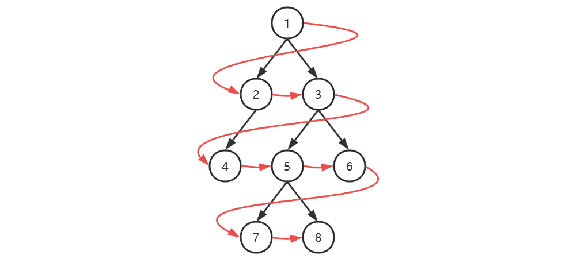

# 二叉樹概述

**二叉樹（Binary Tree）** 是一種樹狀資料結構。
它的特點是：**每個節點最多只能有兩個子節點**，分別稱為：

* 左子節點（left child）
* 右子節點（right child）

例如：

```text
     1
    / \
   2   3
  /   / \
 4   5   6
```

在這棵樹中：

* `1` 是根節點
* `4`、`5`、`6` 沒有子節點，所以是葉子節點
* `2` 只有一個孩子，所以是單子節點
* `3` 有兩個孩子，所以是雙子節點

## 節點名稱

在二叉樹中，常見的節點類型如下：

* **根節點（root）**：沒有父節點的節點
* **葉子節點（leaf）**：沒有任何孩子的節點
* **單子節點**：只有一個孩子的節點
* **雙子節點**：有兩個孩子的節點

## 常見的二叉樹結構

### 1. 完全二叉樹

**完全二叉樹（Complete Binary Tree）** 的特點是：

* 除了最後一層之外，其餘每一層都必須填滿
* 最後一層的節點必須按照 **從左到右** 的順序排列

也就是說，節點不能跳空，必須先左後右地填入。

### 2. 平衡二叉樹

**平衡二叉樹（Balanced Binary Tree）** 的特點是：

* 對於每一個節點來說
* 它的左子樹與右子樹的高度差 **不超過 1**

這種結構可以避免樹過度傾斜，讓查找、插入、刪除等操作效率更穩定。

# 二叉樹的存儲方式

二叉樹通常有兩種常見的表示方法：

## 1. 用節點類別表示

這是最常見的方式，每個節點都保存：

* 自己的值 `val`
* 左子節點 `left`
* 右子節點 `right`

```java
public class TreeNode {
    public int val;
    public TreeNode left;
    public TreeNode right;

    public TreeNode(int val) {
        this.val = val;
    }

    public TreeNode(TreeNode left, int val, TreeNode right) {
        this.left = left;
        this.val = val;
        this.right = right;
    }

    @Override
    public String toString() {
        return String.valueOf(this.val);
    }
}
```

這種方式的優點是結構清楚，特別適合表示一般二叉樹。

## 2. 用數組表示

二叉樹也可以用數組來表示，例如：

```text
[7, 5, 6, 4, 2, 1, 3]
```

對應的樹結構如下：

```text
        7
      /   \
     5     6
    / \   / \
   4   2 1   3
```

### 數組與節點的位置關係

* 根節點在索引 `0`
* 某個節點若在索引 `i`

    * 左孩子在索引 `2i + 1`
    * 右孩子在索引 `2i + 2`

例如：

* 索引 `0` 的元素 `7`

    * 左孩子是索引 `1` 的 `5`
    * 右孩子是索引 `2` 的 `6`

* 索引 `1` 的元素 `5`

    * 左孩子是索引 `3` 的 `4`
    * 右孩子是索引 `4` 的 `2`

* 索引 `2` 的元素 `6`

    * 左孩子是索引 `5` 的 `1`
    * 右孩子是索引 `6` 的 `3`

### 若節點缺少孩子

如果某個位置缺少孩子，可以用 `null` 佔位：

```text
[7, 5, 6, 4, 2, null, 3]
```

這樣仍然可以維持索引對應關係。

# 二叉樹的遍歷

遍歷就是按照某種規則，把樹中的節點依序訪問一遍。
二叉樹的遍歷主要分成兩大類：

* 廣度優先遍歷（BFS）
* 深度優先遍歷（DFS）


## 廣度優先遍歷

**廣度優先遍歷（Breadth-First Search, BFS）**
又稱為 **層序遍歷**。

它的核心概念是：

> 先訪問離根節點最近的節點，再一層一層往下訪問。

例如下面這棵樹：



| 本轮开始时队列 | 本轮访问节点 |
| -------------- | ------------ |
| [1]            | 1            |
| [2, 3]         | 2            |
| [3, 4]         | 3            |
| [4, 5, 6]      | 4            |
| [5, 6]         | 5            |
| [6, 7, 8]      | 6            |
| [7, 8]         | 7            |
| [8]            | 8            |
| []             |              |


1. 初始化，將根節點加入隊列
2. 循環處理隊列中每個節點，直至隊列為空
3. 每次循環內處理節點後，將它的孩子節點（即下一層的節點）加入隊列

### BFS 的做法

通常會搭配 **隊列（Queue）** 來實作。

#### 步驟

1. 先把根節點加入隊列
2. 只要隊列不為空，就持續重複：

    * 取出隊首節點並訪問
    * 再把它的左孩子、右孩子加入隊列（如果存在）

#### 為什麼要用隊列？

因為隊列是 **先進先出（FIFO）** 的結構，能保證節點按照層級順序被處理。

**補充說明**

* 如果二叉樹是用 `TreeNode` 表示，通常用隊列做層序遍歷
* 如果二叉樹本身就是用數組表示，那麼**直接從前往後遍歷數組**，本質上就是層序遍歷

## 深度優先遍歷

**深度優先遍歷（Depth-First Search, DFS）**
是指在遍歷二叉樹時，會先沿著某一條路徑一路往下走，走到底之後，再回頭處理其他分支。

對於二叉樹來說，深度優先遍歷可以分成三種：

1. 前序遍歷（Pre-order）
2. 中序遍歷（In-order）
3. 後序遍歷（Post-order）

以下都使用這棵二叉樹來說明：

```text
        1
       / \
      2   3
     /   / \
    4   5   6
```

### 1. 前序遍歷（Pre-order）

#### 規則

對於每一棵子樹，都按照以下順序：

1. 先訪問目前節點
2. 再訪問左子樹
3. 最後訪問右子樹

也就是：

```text
根 → 左 → 右
```

**遍歷結果**

這棵樹的前序遍歷結果是：

```text
1 2 4 3 5 6
```

#### 理解過程

##### 第一步：先從根節點開始

先訪問根節點 `1`，所以先輸出：

```text
1
```

##### 第二步：處理 1 的左子樹

`1` 的左子節點是 `2`，依照前序規則，先訪問 `2`：

```text
1 2
```

接著繼續處理 `2` 的左子樹，也就是節點 `4`：

```text
1 2 4
```

`4` 沒有左子樹，也沒有右子樹，因此返回上一層。

##### 第三步：處理 2 的右子樹

`2` 的右子樹是空的，所以不做任何事，回到根節點 `1`。

##### 第四步：處理 1 的右子樹

接著處理 `1` 的右子樹，也就是節點 `3`：

```text
1 2 4 3
```

先處理 `3` 的左子樹，也就是 `5`：

```text
1 2 4 3 5
```

`5` 沒有子節點，返回。

再處理 `3` 的右子樹，也就是 `6`：

```text
1 2 4 3 5 6
```

`6` 也沒有子節點，遍歷結束。

### 2. 中序遍歷（In-order）

#### 規則

對於每一棵子樹，都按照以下順序：

1. 先訪問左子樹
2. 再訪問目前節點
3. 最後訪問右子樹

也就是：

```text
左 → 根 → 右
```

**遍歷結果**

這棵樹的中序遍歷結果是：

```text
4 2 1 5 3 6
```

#### 理解過程

##### 第一步：從根節點 1 開始

中序遍歷不會立刻輸出 `1`，而是先去處理 `1` 的左子樹。

##### 第二步：處理 1 的左子樹，也就是 2

到了 `2`，仍然不能立刻輸出，因為中序規則是先左後根再右。
所以繼續處理 `2` 的左子樹，也就是 `4`。

##### 第三步：處理 4

`4` 的左子樹是空的，所以先返回。
這時可以輸出 `4`：

```text
4
```

接著 `4` 的右子樹也是空的，再返回到 `2`。

##### 第四步：回到 2

`2` 的左子樹已經處理完了，所以現在輸出 `2`：

```text
4 2
```

`2` 的右子樹是空的，因此返回到 `1`。

##### 第五步：回到 1

`1` 的左子樹已經處理完，所以現在輸出 `1`：

```text
4 2 1
```

接著處理 `1` 的右子樹，也就是 `3`。

##### 第六步：處理 3

先處理 `3` 的左子樹，也就是 `5`。

`5` 的左子樹是空的，所以先返回；
接著輸出 `5`：

```text
4 2 1 5
```

`5` 的右子樹也是空的，因此返回到 `3`。

##### 第七步：回到 3

`3` 的左子樹已經處理完，所以輸出 `3`：

```text
4 2 1 5 3
```

接著處理 `3` 的右子樹，也就是 `6`。

##### 第八步：處理 6

`6` 的左子樹是空的，先返回；
然後輸出 `6`：

```text
4 2 1 5 3 6
```

`6` 的右子樹也是空的，整個遍歷完成。

### 3. 後序遍歷（Post-order）

#### 規則

對於每一棵子樹，都按照以下順序：

1. 先訪問左子樹
2. 再訪問右子樹
3. 最後訪問目前節點

也就是：

```text
左 → 右 → 根
```

**遍歷結果**

這棵樹的後序遍歷結果是：

```text
4 2 5 6 3 1
```

#### 理解過程

##### 第一步：從根節點 1 開始

後序遍歷不會立刻輸出 `1`，而是先處理左子樹。

##### 第二步：處理 1 的左子樹，也就是 2

到了 `2` 也不能立刻輸出，因為後序規則是左、右、根。
所以先處理 `2` 的左子樹，也就是 `4`。

##### 第三步：處理 4

`4` 的左子樹是空的，右子樹也是空的。
左右子樹都處理完後，才能輸出 `4`：

```text
4
```

然後返回到 `2`。

##### 第四步：回到 2

接著處理 `2` 的右子樹，但它是空的。
因此現在可以輸出 `2`：

```text
4 2
```

然後返回到 `1`。

##### 第五步：處理 1 的右子樹，也就是 3

到了 `3` 之後，先處理左子樹 `5`。

`5` 沒有左右子樹，因此先輸出 `5`：

```text
4 2 5
```

再回到 `3`，接著處理右子樹 `6`。

`6` 也沒有左右子樹，因此輸出 `6`：

```text
4 2 5 6
```

##### 第六步：回到 3

`3` 的左子樹和右子樹都已經處理完，所以現在輸出 `3`：

```text
4 2 5 6 3
```

##### 第七步：回到 1

最後，`1` 的左右子樹都已處理完成，因此輸出 `1`：

```text
4 2 5 6 3 1
```

遍歷結束。

### 三種 DFS 的比較

同樣一棵樹：

```text
        1
       / \
      2   3
     /   / \
    4   5   6
```

三種深度優先遍歷結果如下：

* **前序遍歷**：`1 2 4 3 5 6`
* **中序遍歷**：`4 2 1 5 3 6`
* **後序遍歷**：`4 2 5 6 3 1`

**快速記憶法**

可以直接記成下面三種順序：

* **前序**：根 → 左 → 右
* **中序**：左 → 根 → 右
* **後序**：左 → 右 → 根